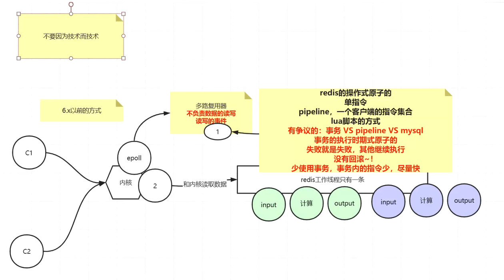
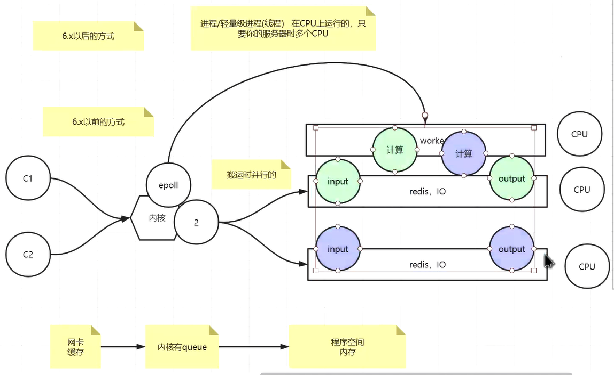

## 02.redis是单线程还是多线程

1, 无论什么版本,工作线程就是一个

2, 6.x高版本出现了IO多线程

3,使用上来说,没有变化

------------

4, [去学一下系统IO课],你要真正的理解面向IO模型编程的时候,有内核的事,从内核把数据搬运到程序里这是第一步,然后,搬运回来的数据做的计算是第二步,netty

5,单线程,满足redis的串行原子,只不过IO多线程后,把输入/输出放到更多的线程里去并行,好处如下: 1,执行时间短,更快; 2,更好的压榨系统及硬件的资源(网卡能够高效的使用);

*,客户端被读取的顺序不能被保障
哪个顺序是可以被保障的: 在一个连接里,socket里

6.x以前

缓存不严谨,尽量去分片

 6.x以后

