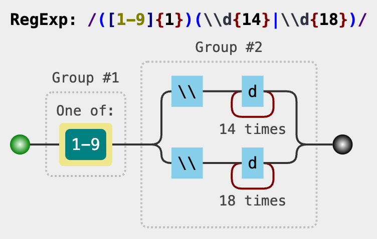

# Java 正则表达式

我们可能有如下的需求：

- 从一个文章里找到所有的邮箱；
- 看看输入的手机号是不是符合手机号的规则；
- 检查输入的是不是身份证号。

对于这种需要，都要求对字符串进行特定【模式或规则】的匹配。本章学习的正则表达式可以帮助我们实现这样的功能。

## 第一章 概述

**正则表达式**，又称规则表达式**,**（Regular Expression，在代码中常简写为regex、regexp或RE），是一种【文本模式(Pattern)】。

正则表达式使用单个字符串来描述、匹配具有相同规则的字符串，通常被用来检索、替换那些符合某个模式（规则）的文本。正则表达式的核心功能就是处理文本。

正则表达式并不仅限于某一种语言，但是在每种语言中有细微的差别。

## 第二章 正则表达式基础语法

每一个字符串都可以被视为一个简单的正则表达式，例如 **Hello World** 正则表达式匹配 "Hello World" 字符串。

有的人可能觉得这不是废话么。但是有些【特殊的字符】或者【特殊的表达式】，比如.它可以匹配任何一个字符，如："a" 或 "b"；比如+可以代表一个或多个；比如\d可以代表任意数字等等。

### 一、元字符

元字符是构造正则表达式的一种基本元素。

- . ：匹配除换行符以外的任意字符
- \w：匹配字母或数字或下划线或汉字
- \s：匹配任意的空白符
- \d：匹配数字
- \b：匹配单词的开始或结束
- ^：匹配字符串的开始
- $：匹配字符串的结束

**案例：**

- 匹配8位数字的QQ号码：`^\d\d\d\d\d\d\d\d$`
- 匹配1开头11位数字的手机号码：`^1\d\d\d\d\d\d\d\d\d\d$`

### 二、重复限定符

正则表达式提供了对重复字符进行简写的方式：

- *：重复零次或更多次
- +：重复一次或更多次
- ?：重复零次或一次
- {n}：重复n次
- {n,}：重复n次或更多次
- {n,m}：重复n到m次

有了这些限定符之后，我们就可以对之前的正则表达式进行改造了，比如：

- 匹配8位数字的QQ号码：`^\d{8}$`
- 匹配1开头11位数字的手机号码：`^1\d{10}$`
- 匹配银行卡号是14~18位的数字：`^\d{14,18}$`
- 匹配以a开头的，0个或多个b结尾的字符串:`^ab*$`

### 三、分组

限定符是作用在与他相邻的最左边的一个字符，那么问题来了，如果我想要ab同时被限定那怎么办呢？

正则表达式中用小括号()来做分组，也就是括号中的内容会作为一个整体。

如匹配字符串中包含0到多个ab开头：`^(ab)*`

### 四、转义

正则提供了转义的方式，也就是要把这些元字符、限定符或者关键字转义成普通的字符，做法很简答，就是在要转义的字符前面加个斜杠，也就是\即可。

匹配字符串中包含0到多个(ab)开头：`^(\(ab\))*`

匹配一个字符*：`\*`

### 五、条件

回到我们刚才的手机号匹配，我们都知道：国内号码都来自三大运营商，它们都有属于自己的号段。

比如联通有130/131/132/155/156/185/186/145/176等号段，假如让我们匹配一个联通的号码，那按照我们目前所学到的正则，应该无从下手的，因为这里包含了一些并列的条件，也就是“或”，那么在正则中是如何表示“或”的呢？

正则用符号 | 来表示或，也叫做分支条件，当满足正则里的分支条件的任何一种条件时，都会当成是匹配成功。

那么我们就可以用或条件来处理这个问题：

`^(130|131|132|155|156|185|186|145|176)\d{8}$`

### 六、区间

正则提供一个元字符中括号 [] 来表示区间条件。

- 限定0到9 可以写成`[0-9]`
- 限定A-Z 写成`[A-Z]`
- 限定某些数字 `[165]`

那上面的正则我们还改成这样：

`^((13[0-2])|(15[56])|(18[5-6])|145|176)\d{8}$`

### 七、反义

前面说到元字符的都是要匹配什么什么，当然如果你想反着来，不想匹配某些字符，正则也提供了一些常用的反义元字符：

| 元字符   | 解释                                       |
| -------- | ------------------------------------------ |
| \W       | 匹配任意不是字母，数字，下划线，汉字的字符 |
| \S       | 匹配任意不是空白符的字符                   |
| \D       | 匹配任意非数字的字符                       |
| \B       | 匹配不是单词开头或结束的位置               |
| [^x]     | 匹配除了x以外的任意字符                    |
| [^aeiou] | 匹配除了aeiou这几个字母以外的任意字符      |

### 八、常见的正则表达式

- 匹配中文字符的正则表达式：`[\u4e00-\u9fa5]`

  匹配形式：My name is 徐乐！

- 匹配Email地址的正则表达式：`^[a-zA-Z0-9_-]+@[a-zA-Z0-9_-]+(\.[a-zA-Z0-9_-]+)+$`
  匹配形式： [51012324@qq.com](mailto:51012324@qq.com) 、ydlclass@163.com，ydl-class[@126.com]()

- 匹配国内电话号码：`\d{3}-\d{8}|\d{4}-\d{7}`
  匹配形式：匹配形式如 0511-4405222 或 021-87888822

- 匹配腾讯QQ号：`[1-9][0-9]{4,}`
  匹配形式：510180222

- 匹配身份证：`(^\d{15}$)|(^\d{18}$)|(^\d{17}(\d|X|x)$`
  匹配形式：142228199108252125

- 匹配ip地址：`\d{1,3}\.\d{1,3}\.\d{1,3}\.\d{1,3}`
  匹配形式：127.0.0.1

- 匹配国内的手机号：`^(13[0-9]|14[01456879]|15[0-35-9]|16[2567]|17[0-8]|18[0-9]|19[0-35-9])\d{8}$`

  匹配形式：1388888888


## 第三章 正则表达式进阶语法

### 一、零宽断言

【断言】就是说正则可以【断定】在指定内容的前面或后面会出现满足指定规则的内容。

【零宽】 断言部分只确定位置不匹配任何内容，只是一种模式。内容宽度为零。

我们来举个栗子：假设我们要用爬虫抓取csdn里的文章阅读量。通过查看源代码可以看到文章阅读量这个内容是这样的结构：

`"<span class="read-count">阅读数：641</span>"`

其中也就【641】这个是变量，也就是说不同文章不同的值，当我们拿到这个字符串时，需要获得这里边的【641】有很多种办法，但如果正则应该怎么匹配呢？下面先来讲几种类型的断言：

几个概念：

| 概念      | 功能                             |
| --------- | -------------------------------- |
| 预测/先行 | （模式在前），要求后面的符合匹配 |
| 回顾/后发 | （模式在后），要求前面的符合匹配 |
| 正        | 符合匹配                         |
| 负        | 不符合匹配                       |

#### 1、正向先行断言

零宽度正预测先行断言

- 语法：`（?=pattern）`
- 作用：匹配pattern表达式的前面内容，不返回本身。

【正向先行断言】可以匹配表达式前面的内容，那意思就是(?=) 就可以匹配到前面的内容了。

如果我们要匹配所有内容那就是：

```java
@Test
public void testAssert1(){
    String regex = ".+(?=</span>)";
    String context = "<span class=\"read-count\">阅读数：641</span>";
    Pattern pattern = Pattern.compile(regex);
    Matcher matcher = pattern.matcher(context);
    while (matcher.find()){
        System.out.println(matcher.group());
    }
}

//匹配结果：<span class="read-count">阅读数：641
//可是我们要的只是前面的数字呀，那也简单咯，匹配数字 \d,那可以改成：

@Test
public void testAssert2(){
    String regex = "\\d+(?=</span>)";
    String context = "<span class=\"read-count\">阅读数：641</span>";
    Pattern pattern = Pattern.compile(regex);
    Matcher matcher = pattern.matcher(context);
    while (matcher.find()){
        System.out.println(matcher.group());
    }
}

//匹配结果：
//641
```

#### 2、正向后行断言

零宽度正回顾后发断言，断言在前，模式在后

- 语法：`（?<=pattern）`
- 作用：匹配pattern表达式的后面的内容，不返回本身。

有先行就有后行，先行是匹配前面的内容，那后行就是匹配后面的内容啦。

上面的例子，我们也可以用后行断言来处理：

```plain
@Test
public void testAssert3(){
    String regex = "(?<=<span class=\"read-count\">阅读数：)\\d+";
    String context = "<span class=\"read-count\">阅读数：641</span>";
    Pattern pattern = Pattern.compile(regex);
    Matcher matcher = pattern.matcher(context);
    while (matcher.find()){
        System.out.println(matcher.group());
    }
}
```

#### 3、负向先行断言

零宽度负预测先行断言

- 语法：`(?!pattern)`
- 作用：匹配非pattern表达式的前面内容，不返回本身。

有正向也有负向，负向在这里其实就是非的意思。

举个栗子：比如有一句 “我爱祖国，我是祖国的花朵”。现在要找到不是'的花朵'前面的祖国。

用正则就可以这样写：祖国(?!的花朵)

#### 4、负向后行断言

零宽度负回顾后发断言

- 语法：`(?<!pattern)`
- 作用：匹配非pattern表达式的后面内容，不返回本身。

举个例子：比如有一句 “我爱祖国，我是祖国的花朵”。现在要找到不是'我爱'后面的祖国。

用正则就可以这样写：(?<!我爱)祖国

### 二、捕获和非捕获

**捕获组：**我们匹配子表达式的内容，并把匹配结果【以数字编号或组名的方式】保存到内存中，之后可以通过序号或名称来使用这些匹配结果。

而根据命名方式的不同，又可以分为两种组：

#### 1、数字编号捕获组：

语法：`(exp)`

解释：从表达式左侧开始，每出现一个左括号和它对应的右括号之间的内容为一个分组，在分组中，第0组为整个表达式，第一组开始为分组。

- 比如固定电话的：020-85653333
- 正则表达式为：`(0\d{2})-(\d{8})`

按照左括号的顺序，这个表达式有如下分组：

| 序号 | 编号 | 分组             | 内容         |
| ---- | ---- | ---------------- | ------------ |
| 0    | 0    | (0\d{2})-(\d{8}) | 020-85653333 |
| 1    | 1    | (0\d{2})         | 020          |
| 2    | 0    | (\d{8})          | 85653333     |

```java
String test = "020-85653333";
String reg="(0\\d{2})-(\\d{8})";
Pattern pattern = Pattern.compile(reg);
Matcher mc= pattern.matcher(test);
if(mc.find()){
    System.out.println("分组的个数有："+mc.groupCount());
    for(int i=0;i<=mc.groupCount();i++){
        System.out.println("第"+i+"个分组为："+mc.group(i));
    }
}
输出结果：

分组的个数有：2
第0个分组为：020-85653333
第1个分组为：020
第2个分组为：85653333
```

可见，分组个数是2，但是因为第0个为整个表达式本身，因此也一起输出了。

#### 2、命名编号捕获组：

语法：`(?exp)`

解释：分组的命名由表达式中的name指定，比如区号也可以这样写:

```plain
(?<quhao>0\\d{2})-(?<haoma>\\d{8})
```

按照左括号的顺序，这个表达式有如下分组：

| 序号 | 名称  | 分组             | 内容         |
| ---- | ----- | ---------------- | ------------ |
| 0    | 0     | (0\d{2})-(\d{8}) | 020-85653333 |
| 1    | quhao | (0\d{2})         | 020          |
| 2    | haoma | (\d{8})          | 85653333     |

用代码来验证一下：

```java
String test = "020-85653333";
String reg="(?<quhao>0\\d{2})-(?<haoma>\\d{8})";
Pattern pattern = Pattern.compile(reg);
Matcher mc= pattern.matcher(test);
if(mc.find()){
    System.out.println("分组的个数有："+mc.groupCount());
    System.out.println(mc.group("quhao"));
    System.out.println(mc.group("haoma"));
}
输出结果：

分组的个数有：2
分组名称为:quhao,匹配内容为：020
分组名称为:haoma,匹配内容为：85653333
```

#### 3、非捕获组：

- 语法：`(?:exp)`
- 解释：和捕获组刚好相反，它用来标识那些不需要捕获的分组。

比如上面的正则表达式，程序不需要用到第一个分组，那就可以这样写：(?:0\\d{2})-(\\d{8})

| 序号 | 名称 | 分组             | 内容         |
| ---- | ---- | ---------------- | ------------ |
| 0    | 0    | (0\d{2})-(\d{8}) | 020-85653333 |
| 1    | 1    | (\d{8})          | 85653333     |

```java
String test = "020-85653333";
String reg="(?:0\\d{2})-(\\d{8})";
Pattern pattern = Pattern.compile(reg);
Matcher mc= pattern.matcher(test);
if(mc.find()){
    System.out.println("分组的个数有："+mc.groupCount());
    for(int i=0;i<=mc.groupCount();i++){
        System.out.println("第"+i+"个分组为："+mc.group(i));
    }
}
输出结果：

分组的个数有：1
第0个分组为：020-85653333
第1个分组为：85653333
```

### 三、反向引用

我们知道：捕获会返回一个捕获组，这个分组是保存在内存中，不仅可以在正则表达式外部通过程序进行引用，也可以【在正则表达式内部进行引用】，这种引用方式就是【反向引用】。

根据捕获组的命名规则，反向引用可分为：

- 普通捕获组反向引用：`\k<number>`，通常简写为`\number`
- 命名捕获组反向引用：`\k<name>`，或者`\k'name'`

我们可以举一个例子：

比如要查找一串字母"aabbbbgbddesddfiid"里成对的字母，如果按照我们之前学到的正则，什么区间啊限定啊断言啊可能是办不到的。

现在我们先用程序思维理一下思路：

1）匹配到一个字母

2）匹配第下一个字母，检查是否和上一个字母是否一样

3）如果一样，则匹配成功，否则失败

这里的思路中，在匹配下一个字母时，需要用到上一个字母进行比较，但是目前的知识实在办不到。

这下子捕获就有用处啦，我们可以利用捕获把上一个匹配成功的内容用来作为本次匹配的条件即可。

1. 首先匹配一个字母：`\w`。我们需要做成分组才能捕获，因此写成这样：`(\w)`
2. 那这个表达式就有一个捕获组：`（\w）`
3. 然后我们要用这个捕获组作为条件，那就可以：`(\w)\1`

这里的\1是什么意思呢？根据反向引用的数字命名规则,就需要\k<1>或者\1，当然，通常都是是后者。

我们来测试一下：

```java
@Test
public void testRef(){
    String context = "aabbxxccdddsksdhfhshh";
    String regex = "(\\w)\\1";
    Pattern pattern = Pattern.compile(regex);
    Matcher matcher = pattern.matcher(context);
    while (matcher.find()){
        System.out.println(matcher.group());
    }
}
输出结果：

aa
bb
xx
cc
dd
hh
```

嗯，这就是我们想要的了。
再举个替换的例子，假如想要把字符串中abc换成a

```java
@Test
public void testReplaceAll(){
    String context = "abc aabc bc xxx mm";
    String regex = "(a*)(b)(c)";
    String res = context.replaceAll(regex, "$1");
    System.out.println(res);
}
输出结果：

a aa  xxx mm
```

### 四、贪婪和非贪婪

#### 1、贪婪匹配

**贪婪匹配：**当正则表达式中包含能接受重复的限定符时，该方式会匹配尽可能多的字符，这匹配方式叫做贪婪匹配。

前面我们讲过重复限定符，其实这些限定符就是贪婪量词，比如表达式：`\d{3,6}`。

用来匹配3到6位数字，在这种情况下，它是一种贪婪模式的匹配，也就是假如字符串里有6个数字可以匹配，那它就是全部匹配到。

```java
@Test
public void testGreed(){
    String regex = "\\d{3,6}";
    String context ="61762828 176 2991 871";
    System.out.println("文本：" + context);
    System.out.println("贪婪模式："+ regex);
    Pattern pattern =Pattern.compile(regex);
    Matcher matcher = pattern.matcher(context);
    while(matcher.find()){
        System.out.println("匹配结果：" + matcher.group(0));
    }
}
输出结果：

文本：61762828 176 2991 44 871
贪婪模式：\d{3,6}
匹配结果：617628
匹配结果：176
匹配结果：2991
匹配结果：871
```

由结果可见：本来字符串中的“61762828”这一段，其实只需要出现3个（617）就已经匹配成功了的，但是他并不满足，而是匹配到了最大能匹配的字符，也就是6个。

多个贪婪量词在一起时，如果字符串能满足他们各自最大程度的匹配时，就互不干扰，但如果不能满足时，会优先满足最大数量的匹配，剩余再分配下一个量词匹配。

```java
@Test
public void testGreed2(){
    String regex = "\\d{1,2}\\d{3,5}";
    String context ="61762828 176 2991 871";
    System.out.println("文本：" + context);
    System.out.println("贪婪模式："+ regex);
    Pattern pattern =Pattern.compile(regex);
    Matcher matcher = pattern.matcher(context);
    while(matcher.find()){
        System.out.println("匹配结果：" + matcher.group(0));
    }
}
输出结果：

文本：61762828 176 2991 871
贪婪模式：\d{1,2}\d{3,5}
匹配结果：6176282
匹配结果：2991
```

#### 2、懒惰匹配

懒惰匹配：当正则表达式中包含能接受重复的限定符时，会匹配尽可能少的字符，这匹配方式叫做懒惰匹配。

懒惰量词是在贪婪量词后面加个“？”

| 代码   | 说明                            |
| ------ | ------------------------------- |
| *?     | 重复任意次，但尽可能少重复      |
| +?     | 重复1次或更多次，但尽可能少重复 |
| ??     | 重复0次或1次，但尽可能少重复    |
| {n,m}? | 重复n到m次，但尽可能少重复      |
| {n,}?  | 重复n次以上，但尽可能少重复     |

```java
@Test
public void testNotGreed(){
    String reg="(\\d{1,2}?)(\\d{3,4})";
    String test="61762828 176 2991 87321";
    System.out.println("文本："+test);
    System.out.println("贪婪模式："+reg);
    Pattern p1 =Pattern.compile(reg);
    Matcher m1 = p1.matcher(test);
    while(m1.find()){
        System.out.println("匹配结果："+m1.group(0));
    }
}
输出结果：

文本：61762828 176 2991 87321
懒惰匹配：(\d{1,2}?)(\d{3,4})
匹配结果：61762
匹配结果：2991
匹配结果：87321
```

- “61762” 是左边的懒惰匹配出6，右边的贪婪匹配出1762。
- "2991" 是左边的懒惰匹配出2，右边的贪婪匹配出991。
- "87321" 左边的懒惰匹配出8，右边的贪婪匹配出7321。

### 案例分析：

卡中心的正则：

1. 银行卡号正则：`([1-9]{1})(\\d{14}|\\d{18})`

* 1. `([1-9]{1})`:匹配第一个字符为1-9中的任意一个数字
* 2. `(\\d{14}|\\d{18})`:匹配后续14位或18位数字（\d等价于[0-9]）

​     表达式用于匹配 ‌以非零数字开头，后接14位或18位数字‌ 的字符串，总长度为15位或19位



2. 手机号正则：`(?:13[0-9]|14[01456879]|15[0-35-9]|16[2567]|17[0-8]|18[0-9]|19[0-35-9]\\d{8})`

* 1. `((?: ... ))`:这是一个非捕获组，用小括号包裹起来的内容表示这一部分作为一个整体进行匹配。非捕获组的意思是，虽然它会匹配内容，但是不会单独提取这部分作为结果（捕获组会提取）。
* 2. `15[0-35-9]`:这里匹配以15开头的号码
         [0-35-9]是一个字符集合，表示匹配0、1、2、3、5、6、7、8、9中的任意一个。
         所以，15[0-35-9]可以匹配150, 151, 152, 153, 155, 156, 157, 158, 159。


3. 电子邮箱正则： `(\\w([-+.]\\w+)*@\\w+([-.]\\w+)*\\.\\w+([-.]\\w+)*)`

* 1. `\\w`:它等价于 `[a-zA-Z0-9_]`，即字母（大小写）、数字或下划线。
* 2. `([-+.]\\w+)\*`:表示匹配一个或多个字符，这些字符可以是字母、数字、下划线、连字符 `-`、加号 `+` 或点 `.` ,`*` 表示前面的内容可以重复零次或多次
* 3. `@`: 是电子邮件地址中的分隔符，用于分隔用户名和域名部分
* 4. `\\w+` :这一部分匹配域名的第一部分,`\\w+` 表示匹配一个或多个单词字符
* 5. `([-.]\\w+)\*`:这一部分匹配域名中的子域名部分
* 6. `\\.` 匹配点 `.` 字符，它是域名层级之间的分隔符
* 7. 用例：user@example.com
          user.name@example.co.uk
          user+name@example.sub-domain.org
          它涵盖了常见的电子邮件格式，并且允许一些特殊字符（如 -, +, .）出现在用户名和域名中。


4. 客户号正则（7开头老客户号—香港和澳门）:`(7(?:([A-Za-z]\\d{6}[A-Za-z0-9])|([1578]\\d{6}([0-9A]))))`

- 1.  `外层括号 (7...)` 匹配以 `7` 开头的内容。

- 2. 后面的内容必须满足以下两种情况之一：

     `[A-Za-z]\d{6}[A-Za-z0-9]`: 一个字母 + 6 个数字 + 一个字母或数字。

  ​       `[1578]\d{6}([0-9A])`:一个特殊数字（`1`、`5`、`7` 或 `8`） + 6 个数字 + 一个数字或字母。


5. 客户号正则（老18位客户号和新客户号）: `(?:((1|7)[1-9]\\d{5}\\d{2}(?:(?:0[1-9])|(?:1[0-2]))(?:(?:[0-2][1-9])|10|20|30|31)\\d{3})"|(\\w\\d{2}(?:0[1-9]|1[0-2])(?:(?:0|1|2)[1-9]|3[0-1])(?:(?:0|1)[0-9]|2[0-3])(?:([0-5][0-9]))\\d{5}))|(1(?:[1-6][1-9]|50)\\d{4}\\d{2}(?:(?:0[1-9])|10|11|12)(?:(?:[0-2][1-9])|10|20|30|31)\\d{3})`


```java
// 银行卡号正则
  public static final String BANK_CARD_NUMBER_REGEX= "([1-9]{1})(\\d{14}|\\d{18})";

// 手机号正则
public static final String PHONE_NUMBER_REGEX= "(?:13[0-9]|14[01456879]|15[0-35-9]|16[2567]|17[0-8]|18[0-9]|19[0-35-9]\\d{8})"；
  
// 电子邮箱正则
 public static final String EMAIL_REGEX = "(\\w([-+.]\\w+)*@\\w+([-.]\\w+)*\\.\\w+([-.]\\w+)*)";

// 身份证号码正则(包括大陆，港澳和台湾)
 public static final String ID_CARD_NUMBER_REGEX = "([1-9]\\d{5}(?:18|19|20|(?:3\\d))\\d{2}(?:(?:0[1-9])|(?:1[0-2]))(?:(?:[0-2][1-9])|10|20|30]31)\\d{3}[0-9Xx])";

// 客户号正则（7开头老客户号—香港和澳门）
 public static final String CUSTOMER_NUMBER_REGEX_1 = "(7(?:([A-Za-z]\\d{6}[A-Za-z0-9])|([1578]\\d{6}([0-9A]))))";

// 客户号正则（老18位客户号和新客户号）
ublic static final String CUSTOMER_NUMBER_REGEX =
  "(?:((1|7)[1-9]\\d{5}\\d{2}(?:(?:0[1-9])|(?:1[0-2]))(?:(?:[0-2][1-9])|10|20|30|31)\\d{3})"+
  "|(\\w\\d{2}(?:0[1-9]|1[0-2])(?:(?:0|1|2)[1-9]|3[0-1])(?:(?:0|1)[0-9]|2[0-3])(?:([0-5][0-9]))\\d{5}))" +
  "|(1(?:[1-6][1-9]|50)\\d{4}\\d{2}(?:(?:0[1-9])|10|11|12)(?:(?:[0-2][1-9])|10|20|30|31)\\d{3})";
```

电子邮箱正则:`(\\w([-+.]\\w+)*@\\w+([-.]\\w+)*\\.\\w+([-.]\\w+)*)`

#### **第一部分：`\\w`**

- `\\w` 表示匹配一个“单词字符”，在大多数正则表达式中，它等价于 `[a-zA-Z0-9_]`，即字母（大小写）、数字或下划线。
- 在电子邮件地址中，这是用户名部分的第一个字符。例如，在 `example.user@example.com` 中，`example` 是用户名的一部分。

#### **第二部分：`([-+.]\\w+)\*`**

- 这一部分匹配用户名的后续部分。
- `-`, `+`, 和 `.` 是特殊字符，它们需要通过反斜杠 `\` 转义才能被识别为普通字符。
- `[-+.\\w]+` 表示匹配一个或多个字符，这些字符可以是字母、数字、下划线、连字符 `-`、加号 `+` 或点 `.`。
- `*` 表示前面的内容可以重复零次或多次。
- 例如，在 `example.user+test@example.com` 中，`+test` 就是由这部分匹配出来的。

#### **第三部分：`@`**

- `@` 是电子邮件地址中的分隔符，用于分隔用户名和域名部分。
- 例如，在 `example.user@example.com` 中，`@` 将 `example.user` 和 `example.com` 分开。

#### **第四部分：`\\w+`**

- 这一部分匹配域名的第一部分。
- 例如，在 `example.user@example.com` 中，`example` 是域名的第一部分。
- `\\w+` 表示匹配一个或多个单词字符。

#### **第五部分：`([-.]\\w+)\*`**

- 这一部分匹配域名中的子域名部分。
- `[-.]` 表示匹配连字符 `-` 或点 `.`。
- `\\w+` 表示匹配一个或多个单词字符。
- `*` 表示这部分可以重复零次或多次。
- 例如，在 `sub-domain.example.user@example.com` 中，`sub-domain` 就是由这部分匹配出来的。

#### **第六部分：`\\.`**

- `\\.` 匹配点 `.` 字符，它是域名层级之间的分隔符。
- 例如，在 `example.user@example.com` 中，`.` 将 `example` 和 `com` 分开。

#### **第七部分：`\\w+`**

- 这一部分匹配顶级域名部分（如 `.com`, `.org`, `.net` 等）。
- 例如，在 `example.user@example.com` 中，`com` 是顶级域名。

#### **第八部分：`([-.]\\w+)\*`**

- 这一部分允许顶级域名后面有额外的子域名（可选）。
- 例如，在 `example.user@example.co.uk` 中，`.co.uk` 就是由这部分匹配出来的。

------

### 4. **完整的例子**

假设我们有一个电子邮件地址：

```
user-name+test.sub-domain@example.co.uk
```

- ```
  user-name+test.sub-domain
  ```

   

  是用户名部分，由以下几部分组成：

  - `user-name`: 由 `\\w` 和 `[-+.\\w]*` 匹配。
  - `+test.sub-domain`: 由 `[-+.\\w]*` 匹配。

- `@` 是分隔符。

- ```
  example.co.uk
  ```

   

  是域名部分，由以下几部分组成：

  - `example`: 由 `\\w+` 匹配。
  - `.co`: 由 `\\.` 和 `[-.]\\w+` 匹配。
  - `.uk`: 由 `\\.` 和 `[-.]\\w+` 匹配。

------

### 5. **总结**

这个正则表达式的核心是匹配电子邮件地址的通用格式。它包括以下几点：

1. 用户名部分：可以包含字母、数字、下划线、连字符 `-`、加号 `+` 和点 `.`。
2. 域名部分：可以包含字母、数字、连字符 `-` 和点 `.`。
3. 支持多级域名（如 `.co.uk`）。


## 一、Java 正则性能核心问题：回溯爆炸

Java 使用 `java.util.regex` 包提供的正则引擎（传统 NFA 模型），在处理复杂正则时易因‌**回溯**‌导致性能骤降。以下通过代码示例解析优化方法。

------

## 二、测试环境准备

### 测试工具类

```java
import java.util.regex.Pattern;

public class RegexBenchmark {

    public static void benchmark(String regex, String input, int iterations) {
        Pattern pattern = Pattern.compile(regex);
        long startTime = System.nanoTime();
        
        for (int i = 0; i < iterations; i++) {
            pattern.matcher(input).matches();
        }
        
        long duration = (System.nanoTime() - startTime) / 1_000_000;
        System.out.printf("正则: %-30s 耗时: %4d ms%n", regex, duration);
    }
}
```

------

## 三、回溯爆炸案例与优化

### 1. 未优化正则：指数级回溯

```java
public class BacktrackingDemo {
    public static void main(String[] args) {
        // 构造一个易引发回溯的输入（末尾的 X 导致匹配失败）
        String input = "aaaaaaaaaaaaaaaaaaaaX";
        int iterations = 1000; // 测试次数

        // 危险正则: (a+)+ 导致回溯爆炸
        RegexBenchmark.benchmark("(a+)+", input, iterations);
    }
}
```

‌**输出**‌：

```text
正则: (a+)+                       耗时: 3725 ms
```

------

### 2. 优化方案 1：使用占有量词（Possessive Quantifier）

在量词后添加 `+`，禁止回溯到子表达式内部。

```java
RegexBenchmark.benchmark("(a++)+", input, iterations);
```

‌**输出**‌：

```text
正则: (a++)+                      耗时:    3 ms
```

------

### 3. 优化方案 2：原子组（Atomic Group）

通过 `(?>...)` 锁定组内匹配结果。

```java
RegexBenchmark.benchmark("(?>(a+))+", input, iterations);
```

‌**输出**‌：

```text
正则: (?>(a+))+                   耗时:    2 ms
```

------

## 四、贪婪匹配优化：精确限定范围

### 1. 未优化：贪婪量词吞并内容

```java
String html = "<div>Hello</div><div>World</div>";

// 错误：贪婪匹配吞掉所有内容
RegexBenchmark.benchmark("<div>.*</div>", html, 1000);
```

‌**输出**‌：

```text
正则: <div>.*</div>               耗时:  125 ms
```

------

### 2. 优化：非贪婪匹配或精确排除

```java
// 方案 1: 非贪婪量词
RegexBenchmark.benchmark("<div>.*?</div>", html, 1000);

// 方案 2: 排除 < 字符
RegexBenchmark.benchmark("<div>[^<]*</div>", html, 1000);
```

‌**输出**‌：

```java
正则: <div>.*?</div>              耗时:   45 ms  
正则: <div>[^<]*</div>            耗时:    8 ms
```

------

## 五、分支结构优化：高频分支前置

### 1. 未优化：低频分支在前

```java
// 匹配协议（假设 http 请求占 90%）
String url = "http://example.com";
RegexBenchmark.benchmark("^(ftp|https?):\\/\\/", url, 1000);
```

------

### 2. 优化：高频分支优先

```java
RegexBenchmark.benchmark("^(https?|ftp):\\/\\/", url, 1000);
```

‌**性能提升**‌：高频分支前置可减少平均匹配路径长度。

------

## 六、实战案例：邮箱验证优化

### 1. 未优化正则（易回溯）

```java
String email = "user.name@example.com";
String badEmail = "user@name@example.com";

// 松散正则，允许无效字符
String regexLoose = "^[\\w.-]+@[\\w-]+(\\.[\\w-]+)+$";
RegexBenchmark.benchmark(regexLoose, badEmail, 1000);
```

------

### 2. 优化后正则

```java
// 严格正则 + 原子组
String regexStrict = "^[a-z0-9](?>[\\w.-]*[\\w-])@(?>[a-z0-9-]+\\.)+[a-z]{2,6}$";
RegexBenchmark.benchmark(regexStrict, badEmail, 1000);
```

‌**优化点**‌：

- 使用原子组 `(?>[\\w.-]*[\\w-])` 锁定用户名格式
- 明确域名部分结构 `(?>[a-z0-9-]+\\.)+`

------

## 七、Java 正则优化总结表

| 问题类型     | 优化手段                    | Java 代码示例        |           |
| ------------ | --------------------------- | -------------------- | --------- |
| 回溯爆炸     | 占有量词 `++`               | `"(a++)+"`           |           |
| 动态内容匹配 | 原子组 `(?>...)`            | `"(?>(a+))+"`        |           |
| 贪婪匹配     | 非贪婪量词 `.*?` 或精确排除 | `"<div>[^<]*</div>"` |           |
| 分支顺序     | 高频分支前置                | `"^(https?           | ftp)://"` |

------

## 八、最佳实践

1. ‌**优先使用占有量词或原子组**‌处理重复结构。
2. ‌**避免嵌套量词**‌（如 `(a+)+`），改用 `a++`。
3. ‌**测试边缘用例**‌：构造超长字符串和无效输入验证性能。
4. ‌**利用预编译**‌：频繁使用的正则通过 `Pattern.compile()` 预编译。

```java
// 预编译提升性能
private static final Pattern EMAIL_PATTERN = Pattern.compile("^[a-z0-9]+@[a-z0-9]+\\.[a-z]{2,6}$");

public boolean validateEmail(String email) {
    return EMAIL_PATTERN.matcher(email).matches();
}
```

通过以上策略，可显著提升 Java 正则表达式的执行效率，避免因回溯导致的性能瓶颈。


## 