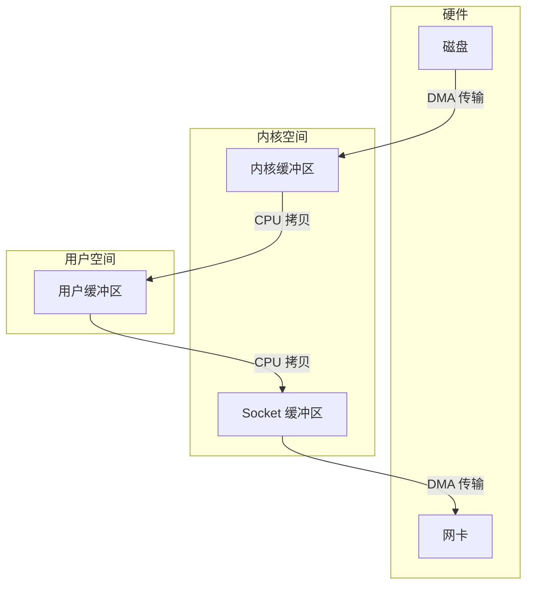
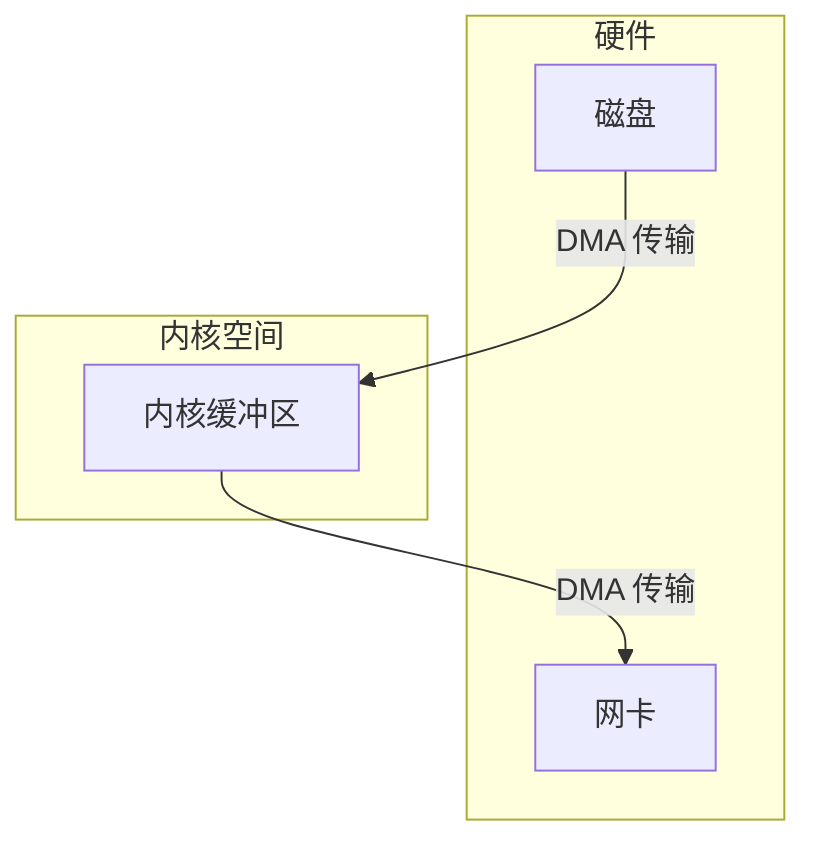

## **Kafka为什么适用零拷贝，其他存储结构不适用？**

Kafka 采用的是**日志存储模型**，数据通常是**顺序写入、顺序读取**，并且它的消费模式是 **“读完即走”（一次性读取并发送给消费者）**，这与零拷贝的特性完美匹配：

1. **顺序读写场景**：Kafka 主要是**顺序追加写**和**顺序读**，避免了随机读写的高开销。
2. **大块数据传输**：Kafka 传输的是**完整的消息批次**，适合 sendfile() 直接搬运，不需要 CPU 处理内容。
3. **不需要修改数据**：Kafka 的数据是写入后**不可修改的**，不会有复杂的随机访问或事务更新。

Kafka 主要使用 **sendfile()** 和 **mmap + write()** 两种方式实现零拷贝，减少 CPU 负担，提高吞吐量。

------

## **为什么其他存储结构不一定适用？**

虽然零拷贝很快，但它**并不适用于所有存储系统**，主要有以下限制：

| **限制点**          | **解释**                                                     | **影响场景**                           |
| ------------------- | ------------------------------------------------------------ | -------------------------------------- |
| **1. 数据修改**     | 零拷贝适用于**直接搬运数据**，但如果需要修改数据（如数据库更新），就必须先拷贝到用户态处理，零拷贝就失去意义。 | **数据库（如 MySQL）、文件系统**       |
| **2. 随机读写**     | 零拷贝最适合**顺序读写**，但对于**随机访问**（如 B+ 树索引查找），传统读写方式更高效。 | **数据库、Key-Value 存储（如 Redis）** |
| **3. 数据格式解析** | 数据如果需要**解析、转换**，就不能直接用 sendfile()，因为数据在内核态，不经过用户态处理。 | **JSON/XML 解析、数据库 SQL 计算**     |
| **4. 网络协议兼容** | sendfile() 主要适用于 **TCP 传输**，如果是其他协议（如 HTTP 处理、TLS 加密），就难以使用零拷贝。 | **Web 服务器（如 Nginx）、安全协议**   |
| **5. 操作系统支持** | 不同操作系统对零拷贝的**支持程度不同**，某些旧系统（如 Windows 早期版本）可能不完全支持 sendfile()。 | **跨平台存储**                         |

------

## **总结**

🔹 **Kafka 适用于零拷贝**，因为它是**顺序读写的日志型存储**，并且**数据不会修改**，天然符合零拷贝的特性。  
🔹 **其他存储系统（如数据库）不常用零拷贝**，因为它们需要**随机读写、事务更新、数据解析**，这会破坏零拷贝的高效性。  
🔹 **零拷贝并不是万能的**，适用于**大块数据的顺序传输（如 Kafka、Nginx 文件传输）**，但不适用于需要频繁修改、解析的小数据存储（如 MySQL、Redis）。  

📌 **高效回答：**

> Kafka 采用零拷贝（sendfile + mmap），减少数据在内核态和用户态的拷贝，提高吞吐量。但零拷贝适用于**顺序读写、不可变数据、大块传输**的场景，不适用于**需要数据修改、随机访问、复杂计算**的存储系统，因此数据库等系统很少直接使用零拷贝。

这样回答面试官，会让你显得思路清晰且有深度！💡😃

### **适用于零拷贝的场景 ✅**

零拷贝（Zero Copy）适用于**顺序读写、大块数据传输、无需修改的数据**，主要体现在以下场景：

| **适用场景**                            | **原因**                              | **常见技术**       |
| --------------------------------------- | ------------------------------------- | ------------------ |
| **日志存储（Kafka、RocketMQ）**         | **顺序追加写**，数据不修改，批量传输  | sendfile()、mmap() |
| **文件传输（Nginx、FTP、Samba）**       | **完整文件传输**，数据不需要解析      | sendfile()         |
| **视频/音频流媒体（YouTube、Netflix）** | **大文件流式传输**，避免 CPU 复制开销 | mmap()、sendfile() |
| **磁盘备份（HDFS、FastDFS）**           | **大块文件传输**，不需要用户态处理    | sendfile()、mmap() |
| **数据库物理备份（MySQL binlog 复制）** | **顺序读取 binlog 并传输**            | mmap()、direct I/O |
| **大规模分布式存储（Ceph、GlusterFS）** | 传输大块数据，不需要 CPU 处理         | sendfile()、RDMA   |

------

### **不适用于零拷贝的场景 ❌**

零拷贝不适用于**需要随机读写、数据修改、复杂计算**的场景，例如：

| **不适用场景**                       | **原因**                                                | **常见技术**        |
| ------------------------------------ | ------------------------------------------------------- | ------------------- |
| **数据库（MySQL、PostgreSQL）**      | **需要事务、随机读写、索引查找**，无法直接用 sendfile() | B+ 树、Buffer Pool  |
| **键值存储（Redis、RocksDB）**       | **随机访问、数据更新、内存计算多**                      | LSM-Tree、内存拷贝  |
| **搜索引擎（Elasticsearch、Solr）**  | **全文检索，数据需要预处理**，无法直接传输              | 倒排索引、Lucene    |
| **API 服务器（Spring Boot、Flask）** | **数据需要 JSON/XML 解析**，sendfile() 无法处理         | JSON 解析器、序列化 |
| **流数据计算（Flink、Spark）**       | **需要数据转换、聚合计算**                              | 内存计算、ETL       |
| **安全通信（TLS、SSL 传输）**        | **数据需要加解密**，不能直接用 sendfile()               | OpenSSL、TLS        |

------

### **总结**

✅ **适用于零拷贝：** **顺序读写、大块数据传输、数据不修改**（Kafka、Nginx、视频流）。  
❌ **不适用于零拷贝：** **随机访问、数据修改、解析计算**（数据库、Redis、搜索引擎）。

📌 **高效回答：**

> **零拷贝适用于顺序传输、不修改的数据**，如 Kafka、Nginx、大文件传输，提高吞吐量。
> **不适用于需要随机读写、数据修改、计算的场景**，如数据库、Redis、流计算，因为它们依赖 CPU 处理数据，无法直接使用 sendfile()。

这样回答，面试官会觉得你既掌握了技术原理，又懂得实际应用！💡😃

**传统拷贝流程说明：**

1. **磁盘到内核缓冲区：** 数据从磁盘通过 DMA（直接内存访问）传输到内核缓冲区。
2. **内核缓冲区到用户缓冲区：** CPU 将数据从内核缓冲区拷贝到用户缓冲区。
3. **用户缓冲区到 Socket 缓冲区：** CPU 再将数据从用户缓冲区拷贝到 Socket 缓冲区。
4. **Socket 缓冲区到网卡：** 数据从 Socket 缓冲区通过 DMA 传输到网卡，准备发送。

在此过程中，数据在内核空间和用户空间之间经历了多次拷贝，增加了 CPU 负载和上下文切换次数，影响了数据传输性能。

**零拷贝流程说明：**

1. **磁盘到内核缓冲区：** 数据从磁盘通过 DMA 传输到内核缓冲区。  
2. **内核缓冲区到网卡：** 数据从内核缓冲区直接通过 DMA 传输到网卡，准备发送。

在零拷贝过程中，数据未经过用户空间，避免了不必要的数据拷贝和上下文切换，提高了传输效率。

通过上述对比，可以看出零拷贝技术减少了数据在内核空间和用户空间之间的拷贝次数，从而降低了 CPU 负载，提高了数据传输性能。

