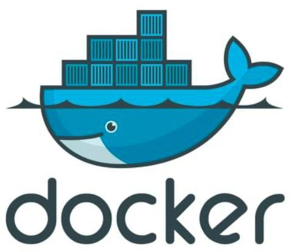
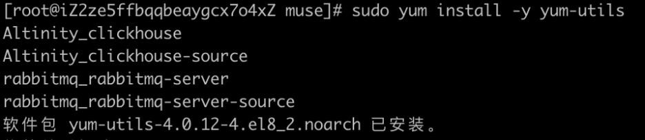
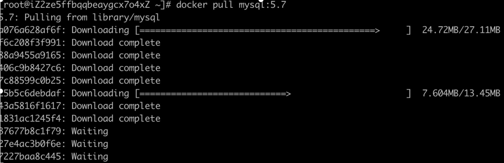
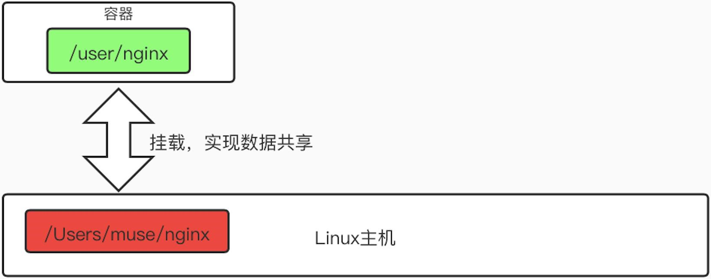

#  docker概述

>   概 述



docker是go语言开发的

-   docker官方文档：

https://docs.docker.com/get-started/

-   docker hub:   

    https://hub.docker.com/
    

Docker的思想就如它的logo一样：
    docker就是大鲸鱼，而每个镜像container就是对应的集装箱。


> 那么docker的核心思想是什么呢？答案就是——隔离！！
>
> 通过隔离机制，既可以保障每个"集装箱里面的东西"是互不影响的，也可以将服务器的资源压榨到最大程度。

#  docker能干嘛？

docker的 出 现 改 变 了 什 么 ？


#  docker与VM有啥区别？

与 虚 拟 机 的 区 别


#  安装docker

安 装 前 的 准 备 阶 段 **—— **卸 载 老 版 本

>   官方安装步骤：https://docs.docker.com/get-started/overview/

```shell
    sudo yum remove docker \
    docker-client \      
    docker-client-latest \       
    docker-common \
    docker-latest \
    docker-latest-logrotate \     
    docker-logrotate \
    docker-engine
```


使 用 仓 库 进 行 安 装

>   sudo yum install -y yum-utils



>   sudo yum-config-manager \
>
>   --add-repo \
>
>   https://download.docker.com/linux/centos/docker-ce.repo


安 装 d o c k e r 引 擎

>   sudo yum install docker-ce docker-ce-cli containerd.io


启动docker

>   sudo systemctl start docker


验 证 d o c k e r 引 擎 是 否 安 装 完 毕 sudo docker run hello-world

d o c k e r 启 动 相 关 指 令

```shell
# 查看下载的镜像列表

docker images

# 重新加载docker

sudo systemctl daemon-reload

# 重启docker

sudo systemctl restart docker  # 配置docker国内镜像地址（加快镜像下载速度）

sudo mkdir -p /etc/docker

sudo tee /etc/docker/daemon.json <<-'EOF'

{

"registry-mirrors":

["https://aa25jngun.mirror.aliyuncs.com"]

}

EOF

sudo systemctl daemon-reload sudo systemctl restart docker
```


#  docker基础命令

>   可 以 通 过 官 网 查 看 相 关 命 令

>   官网文档链接：

>   https://docs.docker.com/reference/


常 用 基 础 命 令


#  docker镜像命令

常 用 镜 像 命 令


#  docker容器命令

常 用 容 器 命 令


D o c k e r 命 令 大 全  


#  docker镜像原理

什 么 是 镜 像

>   镜像是一种轻量级、可执行的独立软件包。包含代码、运行时、库、环境变量和配置文件。所有应用，直接打包docker镜像，就可以直接跑起来。

>   获得镜像的方式：

* 1\> 从远程仓库下载

* 2\> 通过传输拷贝方式获得

* 3\> 自己通过DockerFile制作镜像

镜 像 拉 取



>   我们下载的时候，看到的一层层下载，这个就是联合文件系统——UnionFS。
>
>   联合文件系统是一种分层、轻量级、高性能的文件系统。它支持对文件系统的修改作为一次提交来一层层的叠加。
>
>   联合文件系统是Docker镜像的基础。

联 合 文 件 系 统


镜 像 加 载 原 理


提 交 镜 像

>   \# 提交容器，成为一个新的副本。

>   docker commit [OPTIONS] CONTAINER [REPOSITORY[:TAG]]


#  容器数据卷

什 么 是 容 器 数 据 卷

>   如前面介绍的，docker是将应用和环境进行了打包。那么如果删掉容器的话，数据也会同时被删除掉。那么，如果我们有数据持久化的需求，或者容器之间数据共享的需求，那么就用到了容器数据卷。



挂 载 操 作

>   \# 执行挂载（把本机路径/home/muse/test，挂在到centos容器的/bin/bash目录下）
>
>   docker run -it -v /home/muse/test:/home centos /bin/bash


>   \# 查看挂载内容（上面run的容器id就是da6268d8ac0a）
>
>   docker inspect da6268d8ac0a


具 名 挂 载 与 匿 名 挂 载

-   匿名挂载

    通过-v 指定容器内路径

    docker run -d -P --name nginx1 -v :/etc/nginx nginx

    

-   具名挂载（常用方式）

    通过-v 卷名:容器内路径，指定具名挂载

    docker run -d -P --name nginx2 -v nginx2:/etc/nginx nginx

    

挂 载 常 用 相 关 命 令

-   查看挂载列表

    docker volume ls

    

-   查看挂载信息

    docker volume inspect [VOLUME]

    

数 据 卷 容 器


>   我们发现，删除了museCentOS03之后，museCentOS02里的muse01目录下依然有a.txt文件，这就表明了， museCentOS01\~museCentOS03这三个容器中a.txt文件是互相同步复制备份的。而并不是同享了某个目录，大家都去查看一个备份。


#  DockerFile初探

编 写 一 个 简 单 的 D o c k e r F i le

-   在/home/muse下构造dockerfiles文件夹和dockerfile01文件

-   编写DockerFile（命令大写）

    FROM centos

    VOLUME ["muse01","muse02"]

    CMD echo "------finish------"   CMD /bin/bash

-   构造镜像

    docker build -f /home/muse/dockerfiles/dockerfile01 -t muse/centos:1.0 .

-   启动自己构建的镜像（通过docker images查询出IMAGE ID为eb78333356a6 ）
    docker run -it eb78333356a6 /bin/bash


# Springboot打包为Docker镜像并部署的实现


## 一、Springboot项目运行正常

打包前，Springbooot项目在本地必须是运行正常的。我们这里使用本专栏写起来的项目，如下所示：


## 二、Maven打包项目

执行如下命令即可：

> // 先清空再打包
> mvn clean package

打包成功之后如下所示，提示`BUILD SUCCESS`，target目录下会有打好的jar包：


## 三、打包镜像前准备

### 1、创建一个文件夹

> mkdir dockerFile

### 2、进入文件夹，创建文件：Dockerfile（必须是这个文件名）

> cd dockerFile
> touch Dockerfile

### 3、将我们Springboot打包成的jar包也放在这个文件夹

> ls
> Dockerfile    hello_springboot.jar

## 四、关键一步：编写Dockerfile

Dockerfile的详解请阅读本专栏上一篇文章！

一个极简的例子：

```dockerfile
# 拉取基础镜像
FROM java:8

# 设置作者信息
MAINTAINER suiyi "suiyi@666.com"

# 把hello_springboot.jar添加到容器里，并重命名为app.jar
# 因为hello_springboot.jar和Dockerfile在同一个目录下，所以只写文件名即可
ADD hello_springboot.jar app.jar

# 设置端口号，此处只开放一个端口8083
EXPOSE 8083

# 执行命令，此处运行app.jar
RUN bash -c 'touch /app.jar'
ENTRYPOINT ["java","-jar","app.jar"]
```

## 五、打包Docker镜像

运行一条命令即可（注意最后有个`.`号）：

> docker build -f Dockerfile -t hello_spring:v1.0 .

`-f`：指定Dockerfile文件
`-t`：指定镜像的标签信息

可以使用如下命令查看具体参数的作用：

docker build --help

执行成功后如下所示：


## 六、运行镜像

先看看有没有我们的docker镜像：

> docker images

运行我们的镜像：

> -p后面有两个端口，分别是：宿主机端口:容器端口
>
> docker run -p 8083:8083 --name=hello_spring hello_spring:v1.0


以上是没有后台运行的情况，如果要后台运行，则添加`-d`参数即可：

> // -p后面有两个端口，分别是：宿主机端口:容器端口
>
> docker run -d -p 8083:8083 --name=hello_spring hello_spring:v1.0


非后台运行之后效果如下：


## 七、验证部署的项目

我们来访问一下我们接口，做连通性测试：

注意这里的地址是部署Docker机器的地址，可见我们已经成功将我们的Springboot项目打包成Docker并部署运行了！


 

验证结束，程序运行成功

 


