#  kubernetes概述

-   Kubernetes又称作k8s，是Google在2014年发布的一个开源项目。

-   最初Google开发了一个叫Borg的系统（现在命名为Omega），来调度近20多亿个容器。

    在积累了数十年的经验后，Google决定重写这个容器管理系统，并贡献给开源社区，而这个系统就是Kubernetes。它也是Omega的开源版本。

-   从2014年第一个版本发布以来，迅速得到了开源社区的追捧，目前，k8s已经成为了发展最快、市场占有率最高的容器编排引擎产品。

-   Kubernetes中文社区 \| 中文文档 https://www.kubernetes.org.cn/k8s

#  安装minikube

## **1.安装minikube**

-   设置阿里云镜像

    vim /etc/yum.repos.d/kubernetes.repo

    [kubernetes]    name=Kubernetes

    baseurl=http://mirrors.aliyun.com/kubernetes/yum/repos/kubernetes-el7-x86_64/
    enabled=1   gpgcheck=0

-   安装minikube

    curl -LO
    https://storage.googleapis.com/minikube/releases/latest/minikube-linux-amd64
    sudo install minikube-linux-amd64 /usr/local/bin/minikube

-   安装kubectl

    curl -LO https://dl.k8s.io/release/v1.20.0/bin/linux/amd64/kubectl   sudo
    install -o root -g root -m 0755 kubectl /usr/local/bin/kubectl

-   安装conntrack

    yum install conntrack

## **2.相关操作**

-   启动minikube

    minikube start --vm-driver=none --image-mirror-country='cn'

-   停止minikube

    minikube stop

-   查看节点	

kubectl get nodes	  

```
[root@zhaowa-edu-01 ~]# kubectl get nodes
NAME STATUS ROLES AGE VERSION
zhaowa-edu-01 Ready control-plane,master 21h v1.20.2
```


【解释】

> node是⽤于承载运⾏中的容器的。
> 有⼀个node，这个node的⻆⾊是master。
> k8s也有集群的概念，即：cluster，包含master和node，该节点即是master节点，⼜是node节点。


- 创建nginx的deployment

  kubectl create deployment my-nginx --image nginx:latest

  ```
  [root@zhaowa-edu-01 ~]# kubectl create deployment my-nginx --image nginx:latest
  deployment.apps/my-nginx created
  ```

  【解释】

  > 创建deployment其实有两种⽅式
  > 1> 基于命令⾏配置运⾏
  >
  > * kubectl create
  > * kubectl run
  >   2> 基于yaml配置⽂件的
  >   kubectl apply -f xxx.yml

      查看所有查看所有kubectl get deploymentdeploymentpod    kubectl scale
  

- 查看所有pod信息以及ip和port

  kubectl get pods -o wide

  ```
  [root@zhaowa-edu-01 ~]# kubectl get pods -o wide
  NAME READY STATUS RESTARTS AGE IP NODE 
   NOMINATED NODE READINESS GATES
  my-nginx-b7d7bc74d-jgfks 1/1 Running 0 7m35s 172.18.0.3 
  zhaowa-edu-01 <none> <none>
  ```

  

- 查看所有service

kubectl get services

```
[root@zhaowa-edu-01 ~]# kubectl get service
NAME TYPE CLUSTER-IP EXTERNAL-IP PORT(S) AGE
kubernetes ClusterIP 10.96.0.1 <none> 443/TCP 21h
```

【解释】

> * pod是不稳定的。服务可以保证稳定。
>
> *  双⼗⼀之前，订单系统需要20个服务实例，双⼗⼀促销阶段，扩容⾄100个服务实例。双⼀之后，
>   对服务缩容⾄30个服务实例。
>
> * 我们是⼀个稳定的请求⽅式，统⼀个ip的。这个就是service的作⽤。


-    查询所有命名空间

    kubectl get namespace
    
    ```
    [root@zhaowa-edu-01 ~]# kubectl get namespace
    NAME STATUS AGE
    default Active 21h
    kube-node-lease Active 21h
    kube-public Active 21h
    kube-system Active 21h
    ```

【解释】

>  默认的就是defalut。
> 其它kube-*的都是k8s系统⾃⼰的命名空间。

* 将副本数从一个改成3个

deployments/my-nginx --replicas=3将副本数修改为3个   kubectl get pods

```
[root@zhaowa-edu-01 ~]# kubectl scale deployments/my-nginx --replicas=3
deployment.apps/my-nginx scaled
[root@zhaowa-edu-01 ~]# kubectl get deploy
NAME READY UP-TO-DATE AVAILABLE AGE
my-nginx 1/3 3 1 19m
[root@zhaowa-edu-01 ~]# kubectl get pods
NAME READY STATUS RESTARTS AGE
my-nginx-b7d7bc74d-jgfks 1/1 Running 0 19m
my-nginx-b7d7bc74d-r9gsg 0/1 ContainerCreating 0 17s
my-nginx-b7d7bc74d-vr958 0/1 ContainerCreating 0 17s
```


【解释】

> * 什么是副本个数？
> * pod的个数
> * 如果我们不指定副本个数的话，那么默认就是⼀个pod


* 将副本数从3个修改为2个

```
[root@zhaowa-edu-01 ~]# kubectl scale deployments/my-nginx --replicas=2
deployment.apps/my-nginx scaled
[root@zhaowa-edu-01 ~]# kubectl get deploy
NAME READY UP-TO-DATE AVAILABLE AGE
my-nginx 2/2 2 2 22m
[root@zhaowa-edu-01 ~]# kubectl get pod
NAME READY STATUS RESTARTS AGE
my-nginx-b7d7bc74d-jgfks 1/1 Running 0 22m
my-nginx-b7d7bc74d-r9gsg 1/1 Running 0 2m39s
```


#  k8s重要概念介绍

## **1.重要概念**

-   Cluster——是计算、存储和网络资源的集合

> 资源的集合。我们的k8s利⽤这些资源运⾏各种基于容器的应⽤。

-   Master——Cluster的大脑，决定将应用放在哪里运行

> Cluster的⼤脑。司令部。主要的任务就是⽤来调度的。决定我们的应⽤应该放到哪⾥去执⾏。
>
> 为了⾼可⽤，也可以运⾏多个master。

-   Node——职责是运行容器应用

> 来负责运⾏容器应⽤。
> Node是由Master去管理的，负责监控和容器状态的汇报。

-   Pod——k8s的最小工作单元，包含1orN个容器。

> 是k8s的最⼩的⼯作单元。包含1orN个容器。
> Pod的使⽤⽅式：
>
> * ⼀个pod运⾏⼀个容器
>   最常⽤的就是这种情况。
> * ⼀个pod运⾏多个容器
>   ⼀定是⾮常紧密相关的⼀组容器，并且需要资源的共享。⼀起启动、⼀起停⽌。

- Controller——k8s通过它来管理Pod

  > 针对不同的业务场景，k8s提供了多种Controller，其中包含：Deployment、ReplicaSet、DaemonSet、StatefulSet、Job

  * Deployment

  > 就是我们最常⽤的Controller。它可以管理Pod的多个副本。（即：--replicas=3），并且可以确保
  > Pod按照期望的状态去运⾏。

  * ReplicaSet

  > 它也是管理Pod的多个副本。
  > 我们使⽤deployment的时候，会⾃动的创建ReplicaSet，最终是有ReplicaSet去创建的pod，⽽
  > 我们并不是去直接的使⽤它。

  * DaemonSet

  > ⽤于每个Node最多只运⾏⼀个Pod副本的创建。

  * ​	StatefulSet

  > 保证副本按照固定的顺序启动、更新、删除。

- Service——为Pod提供了负载均衡、固定的IP和Port

> pod是不稳定的，ip会变化的。所以我们需要⼀个固定的ip或port。
> 区别：
>
> * Controller ——> 负责k8s运⾏容器的
> * Service ——> 负责k8s访问容器的

-   Namespace——解决同一个Cluster中，如何区别分开Controller、Pod等资源的问题

> 主要目的资源隔离！

#  kubernetes架构

## **1.kubernetes 架 构 图**

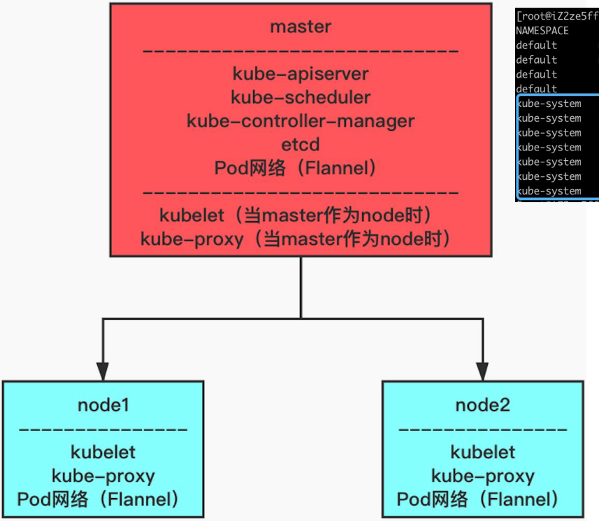


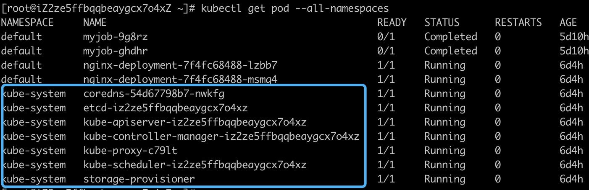

## **2.重要概念**

- 当我们执行部署应用并指定两个副本的时候，执行流程如下所示：

  1\> Kuberctl发送部署请求到API Server。

  2\> API Server通知Controller Manager创建一个deployment资源。

  3\> Scheduler执行调度任务，将两个副本Pod分发到node1和node2上。 

  4\>node1和node2上的kubelet在各自的节点上创建并运行Pod。

- k8s架构中，主要是由Master和Node组成的。下面我们来针对这两部分进行详细的介绍。

## **3.Master**

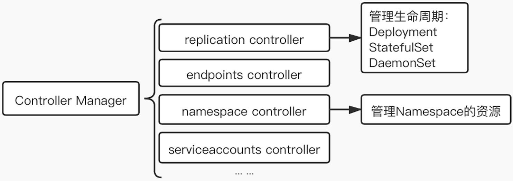

* API-Server

> 属于前端交互接⼝。提供基于Http/https RESTful API。
> 接收对应的指令。

-   Scheduler

> 负责决定将pod放到那个Node上去运⾏的。

-   Controller Manager

> ⾮常关键的组件。管理Cluster中的各种资源。

-   etcd

> 负责保存k8s的配置信息和各种资源的状态信息。
> 如果数据发⽣了变化，etcd会快速通知相关的组件。

- Pod网络

  > 待补充

  

## **4.Node**

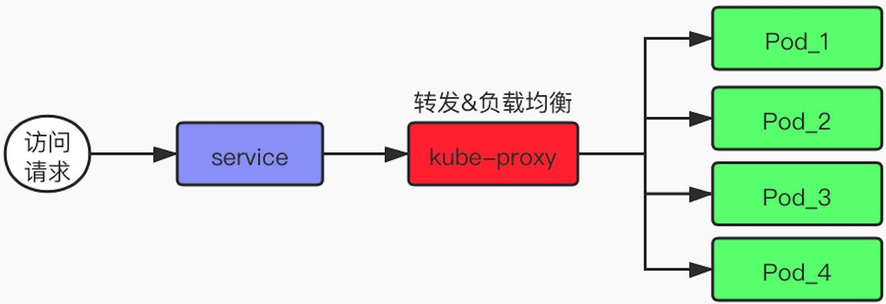

* kubelet

>  创建和运⾏容器。

-   kube-proxy

> 负责我们请求的转发。
> 如果对于多个副本，它会实现负载均衡。

-   Pod网络

> 待补充

#  Deployment

## **1.创建资源的方式**

-   方式一

    用kubectl命令直接创建。

比如：kubectl run nginx-deployment--image=nginx:1.7.9--replicas=2

>   在命令行中通过参数指定资源的属性。（但是，在K8S v1.18.0以后，–replicas已弃用 ,推荐用 kubectl apply 创建 pods）

-   方式二

    通过配置文件和kubectl apply创建（推荐方式）。   

    步骤：
    
    1\> 编写yml配置文件。（下一页有书写样例，nginx.yml）

​        2\> 执行命令：kubectl apply -f /home/muse/nginx.yml

>   nginx.yml配置文件

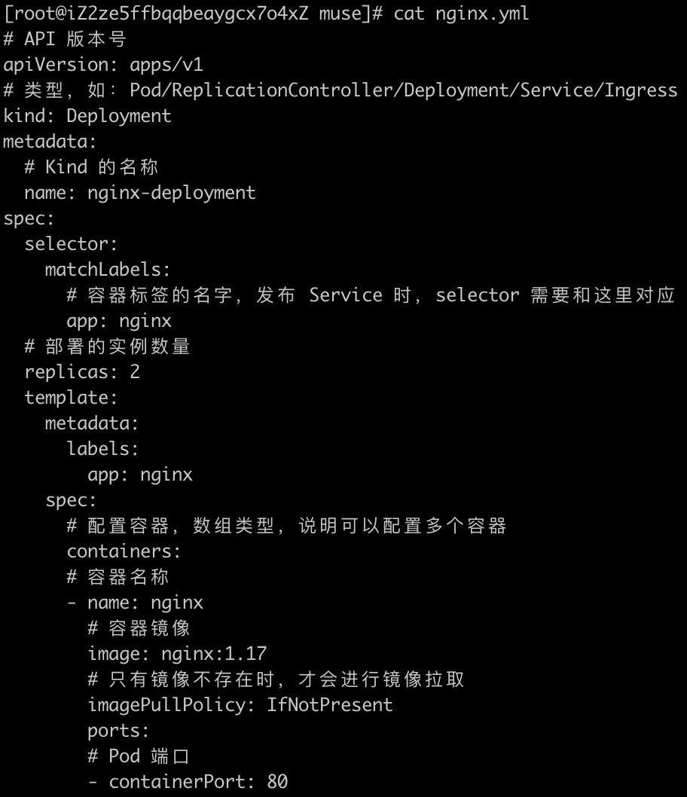

* replicas: 2

部署的副本实例数量，默认为1

- metadata:

  metadata定义Pod的元数据，至少要定义一个 label。label的key和value可以任意指定

- spec:

  描述Pod的规格，此部分定义Pod中每一个容器的属性，name和image是必需的


## 2.构建过程解析

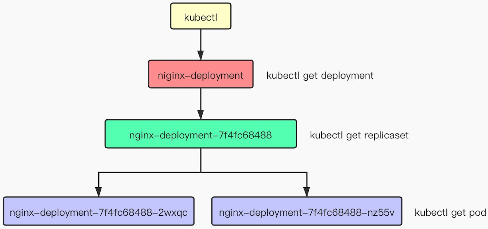

>  用户通过kubectl——\>创建Deployment——\>创建ReplicaSet——\>创建Pod Failover


## **3.Failover**

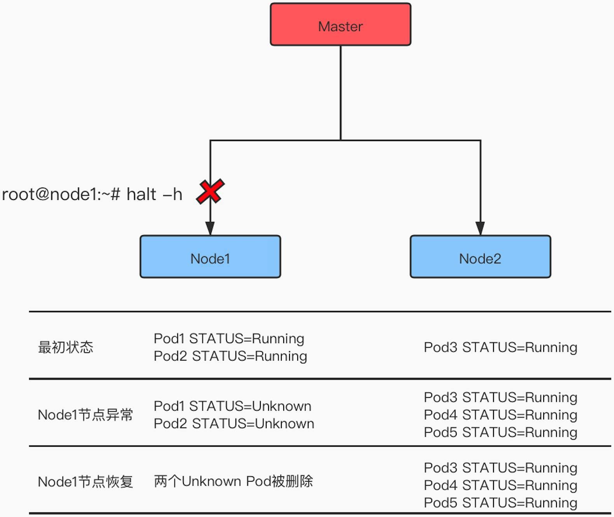

* 设置了pod数为3个

* 当Node1异常的时候，会在Node2上面生成新的Pod来维护总数为3个pod

-   当Node1恢复正常的时候，新创建的pod也依然会在Node2上，并不会做迁移动作。

## 4.label

- 默认配置下，Scheduler会将Pod调度到所有可用的Node。不过有些情况我们可以通过lable将Pod部署到指定的Node，比如将有大量磁盘I/O的Pod部署到配置了SSD的
  Node；或者Pod需要GPU，需要运行在配置了GPU的节点上。

- 给k8s-node1添加标签——disktype=ssd

  kubectl label node k8s-node1disktype=ssd

- 修改nginx.yml配置文件，指定nodeSelector为上一步新建的label。   nodeSelector:
  disktype: ssd

- 重新部署Deployment

  kubectl apply -f nginx.yml

- 查看节点的标签信息

  kubectl get node --show-labels

## 5.删除deployment

-   假设现在配置的是2个pod数。那么如果我们只是删除其中的一个pod，依然会被
    deployment根据配置，再补充为2个pod。

-   当我们删除掉deployment的时候，pod也会随之自动被删除。

-   删除pod

    kubectl delete pod nginx-deployment-7f4fc68488-5v4m7

-   删除deployment

    kubectl delete deployment nginx-deployment

# DaemonSet

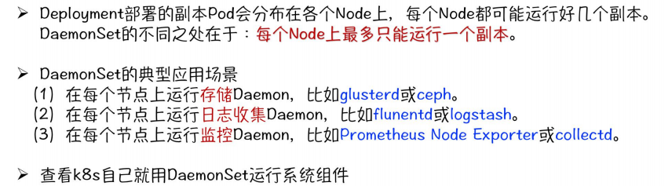

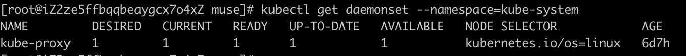


# Job

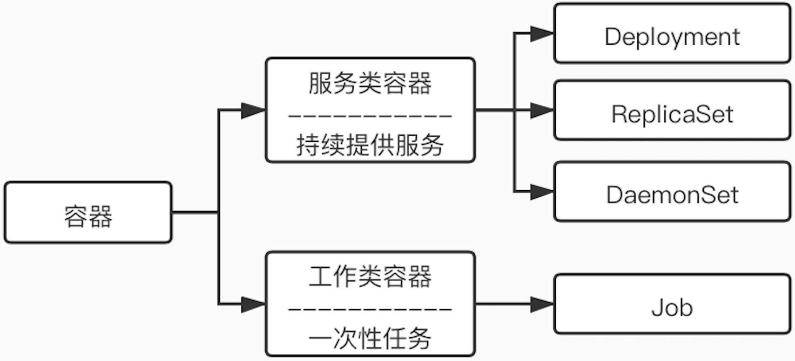

* 容器按照持续运行时间，可以分为服务类容器和工作类容器。

* 服务类容器通常持续提供服务，需要一直运行，比如HTTP Server、
  Daemon等。
* 工作类容器则是一次性任务，比如批处理程序，完成后容器就退出。

-   Kubernetes的Deployment、ReplicaSet和DaemonSet都用于管理服务类容器；

-   对于工作类容器，我们使用Job。


**相关操作待补充：**


# Service

-   我们不应该期望Pod是健壮的，而是要假设Pod中的容器很可能因为各种原因发生故障而死掉。
-   Deployment等Controller会通过动态创建和销毁Pod来保证应用整体的健壮性。换句话说，Pod是脆弱的，但应用是健壮的。
-   Service提供了固定的ip和端口，并且里面包含一组pod，即使Pod的ip发生变化，但是面对客户端的是Service的固定ip和端口。

**相关操作待补充：**

# Rolling Update


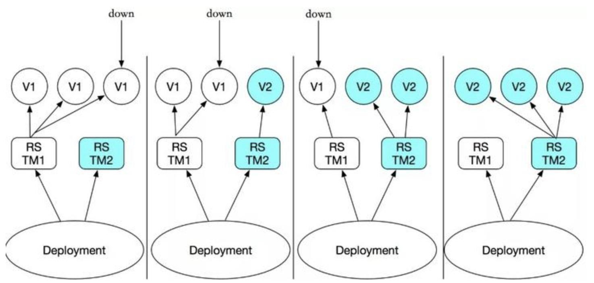

>   滚动更新是一次只更新一小部分副本，成功后再更新更多的副本，最终完成所有副本的更新。滚动更新的最大好处是零停机，整个更新过程始终有副本在运行，从而保证了业务的连续性。


**相关操作待补充：**

