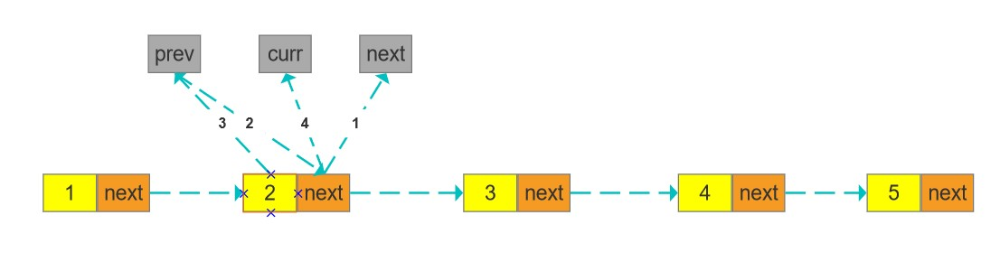
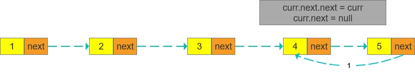
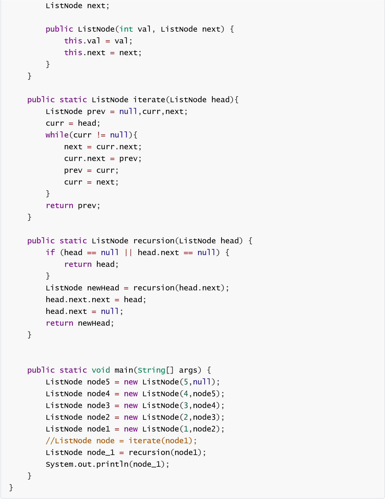
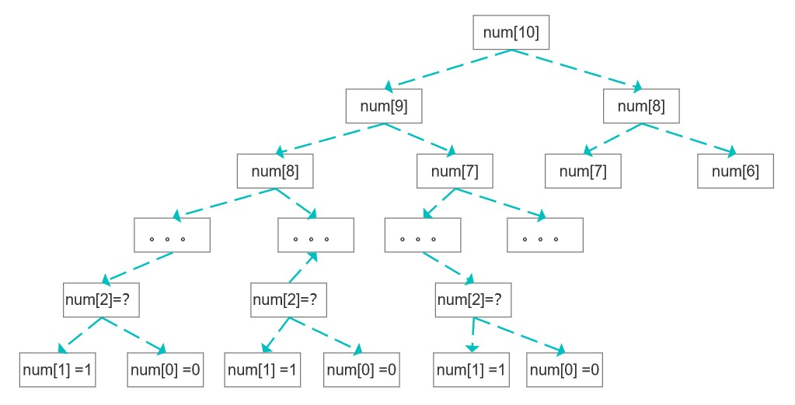
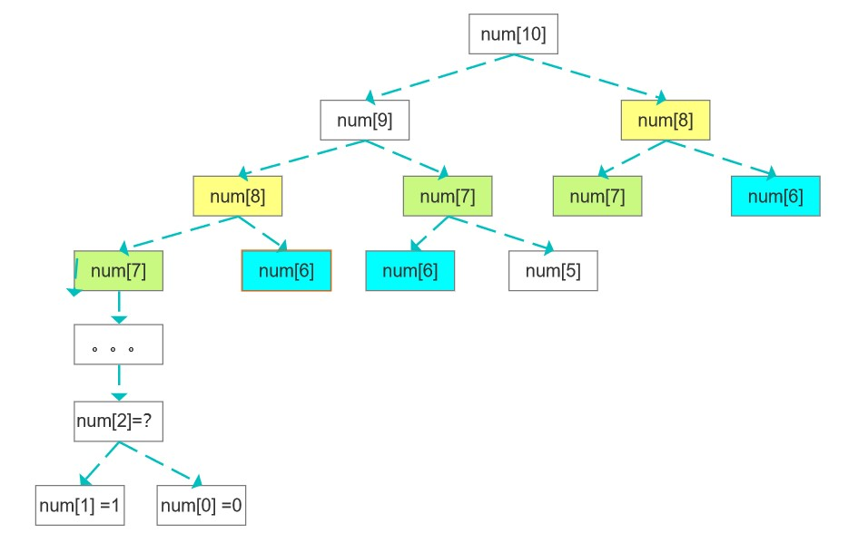
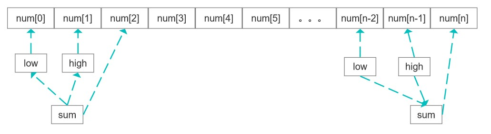
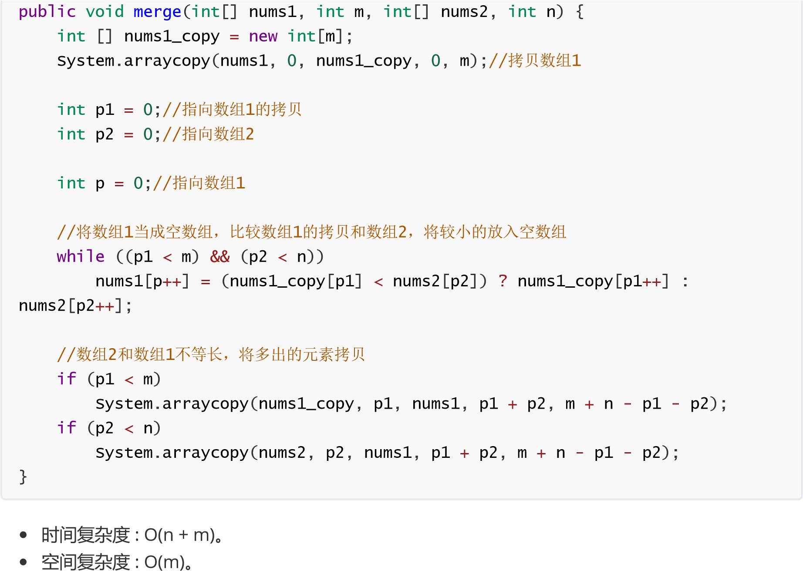
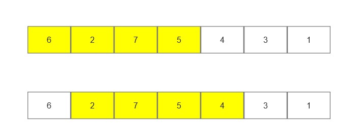
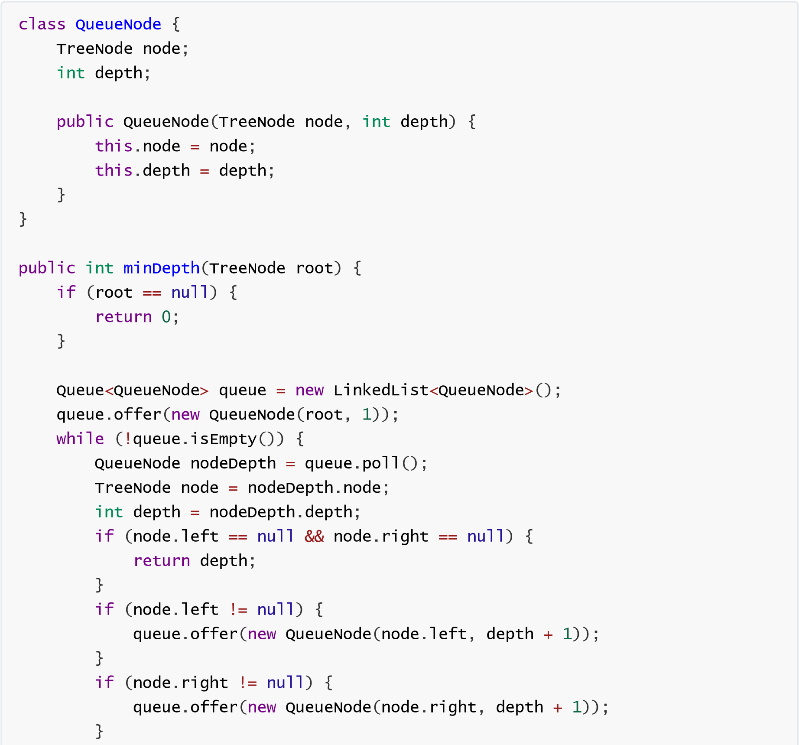

# 反转链表	 

反转一个单链表。

解法1：迭代，重复某一过程，每一次处理结果作为下一次处理的初始值，这些初始值类似于状态、每次处理都会改变状态、直至到达最终状态

从前往后遍历链表，将当前节点的next指向上一个节点，因此需要一个变量存储上一个节点prev，当前节点处理完需要寻找下一个节点，因此需要一个变量保存当前节点curr，处理完后要将当前节点赋值给
prev，并将next指针赋值给curr，因此需要一个变量提前保存下一个节点的指针next

1.  将下一个节点指针保存到next变量 next = curr.next

2.  将下一个节点的指针指向prev，curr.next = prev

3.  准备处理下一个节点，将curr赋值给prev

4.  将下一个节点赋值为curr，处理一个节点

解法2：递归：以相似的方法重复，类似于树结构，先从根节点找到叶子节点，从叶子节点开始遍历大的问题(整个链表反转)拆成性质相同的小问题(两个元素反转)curr.next.next
= curr 将所有的小问题解决，大问题即解决

只需每个元素都执行curr.next.next = curr，curr.next =
null两个步骤即可为了保证链不断，必须从最后一个元素开始

# 统计N以内的素数	 

素数：只能被1和自身整除的数，0、1除外解法一：暴力算法直接从2开始遍历，判断是否能被2到自身之间的数整除

解法2：埃氏筛

利用合数的概念(非素数)，素数\*n必然是合数，因此可以从2开始遍历，将所有的合数做上标记

将合数标记为true，j = i \* i 从 2 \* i 优化而来，系数2会随着遍历递增（j +=
i，相当于递增了系数2），每一个合数都会有两个比本身要小的因子(0,1除外)，2 \* i
必然会遍历到这两个因子

当2递增到大于根号n时，其实后面的已经无需再判断（或者只需判断后面一段），而2到根号n、实际上在
i 递增的过程中已经计算过了，i 实际上就相当于根号n 例如：n = 25 会计算以下

1.  \* 4 = 8

2.  \* 4 = 12

但实际上8和12已经标记过，在n = 17时已经计算了 3 \* 4，2 \* 4

# 寻找数组的中心索引	 

数组中某一个下标，左右两边的元素之后相等，该下标即为中心索引思路：先统计出整个数组的总和，然后从第一个元素开始叠加总和递减当前元素，叠加递增当前元素，知道两个值相等

# 删除排序数组中的重复项	 

一个有序数组 nums ，原地删除重复出现的元素，使每个元素只出现一次
，返回删除后数组的新长度。

不要使用额外的数组空间，必须在原地修改输入数组并在使用 O(1)
额外空间的条件下完成。

双指针算法：

数组完成排序后，我们可以放置两个指针 i 和 j，其中 i 是慢指针，而 j
是快指针。只要 nums[i]=nums[j]，我们就增加 j 以跳过重复项。

当遇到 nums[j] ！=
nums[i]时，跳过重复项的运行已经结束，必须把nums[j]）的值复制到 nums[i +

1]。然后递增 i，接着将再次重复相同的过程，直到 j 到达数组的末尾为止。

# x的平方根	 

在不使用 sqrt(x) 函数的情况下，得到 x的平方根的整数部分解法一：二分查找

x的平方根肯定在0到x之间，使用二分查找定位该数字，该数字的平方一定是最接近x的，m平方值如果大于x、则往左边找，如果小于等于x则往右边找找到0和X的最中间的数m，

如果m \* m \> x，则m取x/2到x的中间数字，直到m \* m \< x，m则为平方根的整数部分

如果m \* m \<=
x，则取0到x/2的中间值，知道两边的界限重合，找到最大的整数，则为x平方根的整数部分

时间复杂度：O(logN)

解法二：牛顿迭代

假设平方根是 i ，则 i 和 x/i 必然都是x的因子，而 x/i 必然等于 i ，推导出 i + x /
i = 2 \* i，得出 i = (i + x / i) / 2

由此得出解法，i 可以任选一个值，只要上述公式成立，i
必然就是x的平方根，如果不成立， (i + x / i) /

2得出的值进行递归，直至得出正确解

# 三个数的最大乘积	 

一个整型数组 nums ，在数组中找出由三个数字组成的最大乘积，并输出这个乘积。

乘积不会越界

如果数组中全是非负数，则排序后最大的三个数相乘即为最大乘积；如果全是非正数，则最大的三个数相乘同样也为最大乘积。

如果数组中有正数有负数，则最大乘积既可能是三个最大正数的乘积，也可能是两个最小负数（即绝对值最大）与最大正数的乘积。

分别求出三个最大正数的乘积，以及两个最小负数与最大正数的乘积，二者之间的最大值即为所求答案。

解法一：排序

解法二：线性扫描

# 两数之和	 

给定一个升序排列的整数数组 numbers ，从数组中找出两个数满足相加之和等于目标数
target 。

假设每个输入只对应唯一的答案，而且不可以重复使用相同的元素。

返回两数的下标值，以数组形式返回暴力解法

时间复杂度：O(N的平方)

空间复杂度：O(1)

哈希表：将数组的值作为key存入map，target - num作为key

时间复杂度：O(N) 空间复杂度：O(N)

解法一：二分查找

先固定一个值(从下标0开始)，再用二分查找查另外一个值，找不到则固定值向右移动，继续二分查找

时间复杂度：O(N \* logN)

空间复杂度：O(1)

解法二：双指针

左指针指向数组head，右指针指向数组tail，head+tail \> target 则tail
左移，否则head右移

时间复杂度：O(N) 空间复杂度：O(1)

# 斐波那契数列	 

求取斐波那契数列第N位的值。

斐波那契数列：每一位的值等于他前两位数字之和。前两位固定 0，1,1,2,3,5,8。。。。

解法一：暴力递归

解法二：去重递归递归得出具体数值之后、存储到一个集合(下标与数列下标一致)，后面递归之前先到该集合查询一次，如果查到则无需递归、直接取值。查不到再进行递归计算

解法三：双指针迭代

基于去重递归优化，集合没有必要保存每一个下标值，只需保存前两位即可，向后遍历，得出N的值

# 环形链表	 

给定一个链表，判断链表中是否有环。

如果链表中有某个节点，可以通过连续跟踪 next
指针再次到达该节点，则链表中存在环如果链表中存在环，则返回 true 。 否则，返回
false 。

解法一：哈希表

解法二：双指针

# 排列硬币	 

总共有 n 枚硬币，将它们摆成一个阶梯形状，第 k 行就必须正好有 k 枚硬币。

给定一个数字 n，找出可形成完整阶梯行的总行数。 n
是一个非负整数，并且在32位有符号整型的范围内解法一：迭代

从第一行开始排列，排完一列、计算剩余硬币数，排第二列，直至剩余硬币数小于或等于行数

解法二：二分查找

假设能排 n 行，计算 n 行需要多少硬币数，如果大于 n，则排 n/2行，再计算硬币数和 n
的大小关系

解法三：牛顿迭代

使用牛顿迭代求平方根，(x + n/x)/2

假设能排 x 行 则 1 + 2 + 3 + ...+ x = n，即  x(x+1)/2 = n 推导出 x = 2n - x

# 合并两个有序数组	 

两个有序整数数组 nums1 和 nums2，将 nums2 合并到 nums1 中，使 nums1
成为一个有序数组。

初始化 nums1 和 nums2 的元素数量分别为 m 和 n 。假设 nums1 的空间大小等于 m +
n，这样它就有足够的空间保存来自 nums2 的元素。

解法二：双指针  从前往后将两个数组按顺序进行比较，放入新的数组

解法三：双指针优化

# 子数组最大平均数	 

给一个整数数组，找出平均数最大且长度为 k
的下标连续的子数组，并输出该最大平均数。

滑动窗口：

窗口移动时，窗口内的和等于sum加上新加进来的值，减去出去的值

# 二叉树的最小深度	 

给定一个二叉树，找出其最小深度。

最小深度是从根节点到最近叶子节点的最短路径上的节点数量。

解法一：深度优先

遍历整颗数，找到每一个叶子节点，从叶子节点往上开始计算，左右子节点都为空则记录深度为1
左右子节点只有一边，深度记录为子节点深度+1
左右两边都有子节点，则记录左右子节点的深度较小值+1

时间复杂度：O(N)

空间复杂度：*O*(log*N*) 取决于树的高度

解法二：广度优先从上往下，找到一个节点时，标记这个节点的深度。查看该节点是否为叶子节点，如果是直接返回深度如果不是叶子节点，将其子节点标记深度(在父节点深度的基础上加1)，再判断该节点是否为叶子节点

时间复杂度：O(N) 空间复杂度：O(N)

# 最长连续递增序列	 

给定一个未经排序的整数数组，找到最长且连续递增的子序列，并返回该序列的长度。

序列的下标是连续的贪心算法

从0开始寻找递增序列，并将长度记录，记录递增序列的最后一个下标，然后从该下标继续寻找，记录长度，取长度最大的即可

# 柠檬水找零	 

在柠檬水摊上，每一杯柠檬水的售价为 5 美元。

顾客排队购买你的产品，一次购买一杯。

每位顾客只买一杯柠檬水，然后向你付 5 美元、10 美元或 20
美元。必须给每个顾客正确找零注意，一开始你手头没有任何零钱。

如果你能给每位顾客正确找零，返回 true ，否则返回 false 。

贪心：

# 三角形的最大周长	 

给定由一些正数（代表长度）组成的数组
A，返回由其中三个长度组成的、面积不为零的三角形的最大周长。

如果不能形成任何面积不为零的三角形，返回 0。

贪心：

先小到大排序，假设最长边是最后下标，另外两条边是倒数第二和第三下标，则此时三角形周长最大

n \< (n-1) +
(n-2)，如果不成立，意味着该数组中不可能有另外两个值之和大于n，此时将n左移，重新计算
