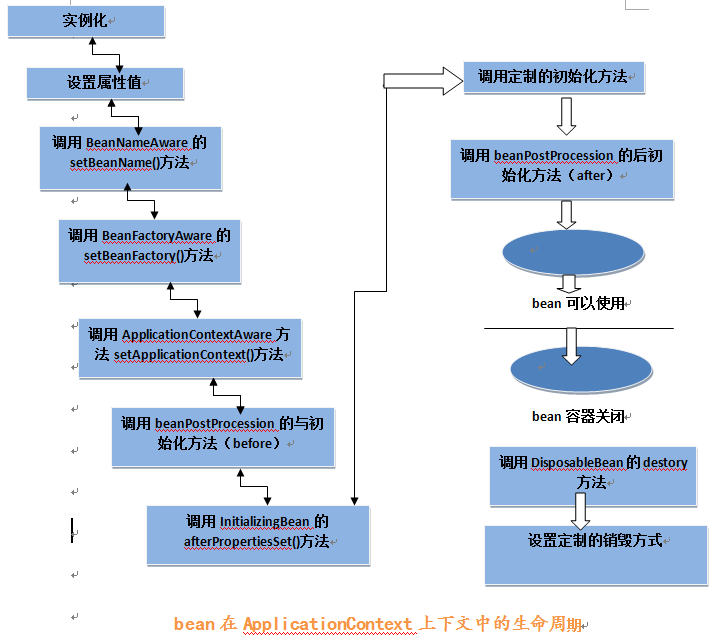
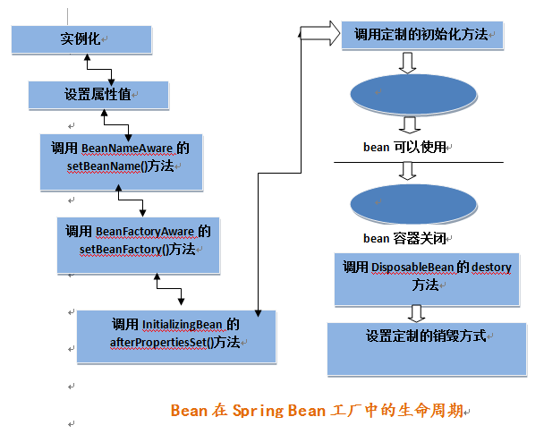

### 一、SpringMVC:

**Spring MVC的工作原理是怎样的**

**在将SpringMVC之前我们先来看一下什么是MVC模式**

MVC：MVC是一种设计模式

#### 1）MVC的原理图：


M-Model 模型（完成业务逻辑：有javaBean构成，service+dao+entity）

V-View 视图（做界面的展示  jsp，html……）

C-Controller 控制器（接收请求—>调用模型—>根据结果派发页面）

#### 2）SpringMVC框架结构


**看到这个图大家可能会有很多的疑惑，现在我们来看一下这个图的步骤：（可以对比MVC的原理图进行理解）**

第一步:用户发起请求到前端控制器（DispatcherServlet）

第二步：前端控制器请求处理器映射器（HandlerMappering）去查找处理器（Handle）：通过xml配置或者注解进行查找

第三步：找到以后处理器映射器（HandlerMappering）像前端控制器返回执行链（HandlerExecutionChain）

第四步：前端控制器（DispatcherServlet）调用处理器适配器（HandlerAdapter）去执行处理器（Handler）

第五步：处理器适配器去执行Handler

第六步：Handler执行完给处理器适配器返回ModelAndView

第七步：处理器适配器向前端控制器返回ModelAndView

第八步：前端控制器请求视图解析器（ViewResolver）去进行视图解析

第九步：视图解析器像前端控制器返回View

第十步：前端控制器对视图进行渲染

第十一步：前端控制器向用户响应结果

**看到这些步骤我相信大家很感觉非常的乱，这是正常的，但是这里主要是要大家理解springMVC中的几个组件：**

前端控制器（DispatcherServlet）：接收请求，响应结果，相当于电脑的CPU。

处理器映射器（HandlerMapping）：根据URL去查找处理器

处理器（Handler）：（需要程序员去写代码处理逻辑的）

处理器适配器（HandlerAdapter）：会把处理器包装成适配器，这样就可以支持多种类型的处理器，类比笔记本的适配器（适配器模式的应用）

视图解析器（ViewResovler）：进行视图解析，多返回的字符串，进行处理，可以解析成对应的页面


3）过滤器和拦截器的区别：

　　**①拦截器是基于java的反射机制的，而过滤器是基于函数回调。
　　②拦截器不依赖与servlet容器，过滤器依赖与servlet容器。
　　③拦截器只能对action请求起作用，而过滤器则可以对几乎所有的请求起作用。
　　④拦截器可以访问action上下文、值栈里的对象，而过滤器不能访问。
　　⑤在action的生命周期中，拦截器可以多次被调用，而过滤器只能在容器初始化时被调用一次。**

　　**⑥拦截器可以获取IOC容器中的各个bean，而过滤器就不行，这点很重要，在拦截器里注入一个service，可以调用业务逻辑。**

 

　　***\*⑥拦截器可以获取IOC容器中的各个bean，而过滤器就不行，这点很重要，在拦截器里注入一个service，可以调用业务逻辑。\****

 

　　**⑥拦截器可以获取IOC容器中的各个bean，而过滤器就不行，这点很重要，在拦截器里注入一个service，可以调用业务逻辑。**

　　***\*⑥拦截器可以获取IOC容器中的各个bean，而过滤器就不行，这点很重要，在拦截器里注入一个service，可以调用业务逻辑。\****

 

***\*拦截器可以获取ioc中的service bean实现业务逻辑，\*\*\*\*拦截器可以获取ioc中的service bean实现业务逻辑，\*\*\*\*\*\*\*\*拦截器可以获取ioc中的service bean实现业务逻辑，\*\*\*\*\****

 

触发时机

触发时机

触发时机

有个专业词语叫触发时机

有个专业词语叫触发时机

有个专业词语叫触发时机

1.过滤器和拦截器触发时机不一样:

　　过滤器是在请求进入容器后，但请求进入servlet之前进行预处理的。请求结束返回也是，是在servlet处理完后，返回给前端之前。

1.过滤器和拦截器触发时间和地点不一样:

　　过滤器是在请求进入容器后，但请求进入servlet之前进行预处理的。请求结束返回也是，是在servlet处理完后，返回给前端之前。

1.过滤器和拦截器触发时间和地点不一样:

　　过滤器是在请求进入容器后，但请求进入servlet之前进行预处理的。请求结束返回也是，是在servlet处理完后，返回给前端之前。

 

总结：过滤器包裹住servlet，servlet包裹住拦截器。

如下图所示：


 

 

2.过滤器的触发时机是容器后，servlet之前，所以过滤器的doFilter(

```java
ServletRequest request, ServletResponse response, FilterChain chain
```

)的入参是ServletRequest ，而不是httpservletrequest。因为过滤器是在httpservlet之前。

2.过滤器的触发时机是容器后，servlet之前，所以过滤器的doFilter(

```java
ServletRequest request, ServletResponse response, FilterChain chain
```

)的入参是ServletRequest ，而不是httpservletrequest。因为过滤器是在httpservlet之前。

 

 

10.过滤器

```java
 @Override
    public void doFilter(ServletRequest request, ServletResponse response, FilterChain chain) throws IOException, ServletException {
        System.out.println("before...");
        chain.doFilter(request, response);
        System.out.println("after...");
    }chain.doFilter(request, response);这个方法的调用作为分水岭。事实上调用Servlet的doService()方法是在chain.doFilter(request, response);这个方法中进行的。
chain.doFilter(request, response);这个方法的调用作为分水岭。事实上调用Servlet的doService()方法是在chain.doFilter(request, response);这个方法中进行的。
事实上调用Servlet的doService()方法是在chain.doFilter(request, response);这个方法中进行的。
事实上调用Servlet的doService()方法是在chain.doFilter(request, response);这个方法中进行的。
事实上调用Servlet的doService()方法是在chain.doFilter(request, response);这个方法中进行的。
事实上调用Servlet的doService()方法是在chain.doFilter(request, response);这个方法中进行的。
```

1.过滤器是JavaEE标准，采用函数回调的方式进行。是在请求进入容器之后，还未进入Servlet之前进行预处理，并且在请求结束返回给前端这之间进行后期处理。

 

```
    @Override
    public void doFilter(ServletRequest request, ServletResponse response, FilterChain chain) throws IOException, ServletException {
        System.out.println("before...");
        chain.doFilter(request, response);
        System.out.println("after...");
    }
```

 

[](javascript:void(0);)

 

　　chain.doFilter(request, response);这个方法的调用作为分水岭。事实上调用Servlet的doService()方法是在chain.doFilter(request, response);这个方法中进行的。

 

　　2.拦截器是被包裹在过滤器之中的。

 

[](javascript:void(0);)

 

```
    @Override
    public boolean preHandle(HttpServletRequest request, HttpServletResponse response, Object handler) throws Exception {
        System.out.println("preHandle");
        return true;
    }

    @Override
    public void postHandle(HttpServletRequest request, HttpServletResponse response, Object handler, ModelAndView modelAndView) throws Exception {
        System.out.println("postHandle");
    }

    @Override
    public void afterCompletion(HttpServletRequest request, HttpServletResponse response, Object handler, Exception ex) throws Exception {
        System.out.println("afterCompletion");
    }
```

 

[](javascript:void(0);)

 

　　a.preHandle()这个方法是在过滤器的chain.doFilter(request, response)方法的前一步执行，也就是在 [System.out.println("before...")][chain.doFilter(request, response)]之间执行。

 

　　b.preHandle()方法之后，在return ModelAndView之前进行，可以操控Controller的ModelAndView内容。

 

　　c.afterCompletion()方法是在过滤器返回给前端前一步执行，也就是在[chain.doFilter(request, response)][System.out.println("after...")]之间执行。

 

　　3.SpringMVC的机制是由同一个Servlet来分发请求给不同的Controller，其实这一步是在Servlet的service()方法中执行的。所以过滤器、拦截器、service()方法，dispatc()方法的执行顺序应该是这样的，大致画了个图：其实非常好测试，自己写一个过滤器，一个拦截器，然后在这些方法中都加个断点，一路F8下去就得出了结论。

 

4.SpringMVC的机制是由同一个Servlet来分发请求给不同的Controller，其实这一步是在Servlet的service()方法中执行的。

5.，SpringMVC的机制是由同一个Servlet来分发请求给不同的Controller，其实这一步是在Servlet的service()方法中执行的。

6.SpringMVC的机制是由同一个Servlet来分发请求给不同的Controller，其实这一步是在Servlet的service()方法中执行的。

 

7.还有，拦截器是spring容器的，是spring支持的，

7.还有，拦截器是spring容器的，是spring支持的，

7.还有，拦截器是spring容器的，是spring支持的，

 


 

**总结：**拦截器功在对请求权限鉴定方面确实很有用处，在我所参与的这个项目之中，第三方的远程调用每个请求都需要参与鉴定，所以这样做非常方便，而且他是很独立的逻辑，这样做让业务逻辑代码很干净。和框架的其他功能一样，原理很简单，使用起来也很简单，大致看了下SpringMVC这一部分的源码，其实还是比较容易理解的。

　　我们项目中仅仅用到了preHandle这个方法，而未用其他的，框架提供了一个已经实现了拦截器接口的适配器类HandlerInterceptorAdapter，继承这个类然后重写一下需要用到的方法就行了，可以少几行代码，这种方式Java中很多地方都有体现。

 

 


### 二、Bean生命周期

4大步骤：实例化 -> 属性赋值 -> 初始化 -> 销毁

1.以ApplocationContext上下文单例模式装配bean为例，深入探讨bean的生命周期：




2.以Spring Factory装配bean为例：




#### 1）可以简述为以下九步

1.实例化bean对象(通过构造方法或者工厂方法)

2.设置对象属性(setter等)（依赖注入）

3.如果Bean实现了BeanNameAware接口，工厂调用Bean的setBeanName()方法传递Bean的ID。（和下面的一条均属于检查Aware接口）

4.如果Bean实现了BeanFactoryAware接口，工厂调用setBeanFactory()方法传入工厂自身

5.将Bean实例传递给Bean的前置处理器的postProcessBeforeInitialization(Object bean, String beanname)方法

6.调用Bean的初始化方法

7.将Bean实例传递给Bean的后置处理器的postProcessAfterInitialization(Object bean, String beanname)方法

8.使用Bean		

9.容器关闭之前，调用Bean的销毁方法

#### **2）线性安全问题：**

对于单例Bean,所有线程都共享一个单例实例Bean,因此是存在资源的竞争。

对于原型(prototype)Bean,每次创建一个新对象，也就是线程之间并不存在Bean共享，自然是不会有线程安全的问题。

bean默认是单例的所以是线程不安全的

Bean 、controller、service和dao层本身都不是线程安全的

 因为默认情况下@Controller没有加上@Scope，没有加@Scope就是默认值singleton，单例的（prototype：多例）。意思就是系统只会初始化一次Controller容器，所以每次请求的都是同一个Controller容器，当然是非线程安全的。 

详细点的文档：https://www.cnblogs.com/myseries/p/11729800.html


#### 3）spring中Bean的作用域

**1. singleton：**Spring IoC容器中只会存在一个共享的Bean实例，无论有多少个Bean引用它，始终指向同一对象。Singleton作用域是Spring中的缺省作用域。

**2. prototype：**每次通过Spring容器获取prototype定义的bean时，容器都将创建一个新的Bean实例，每个Bean实例都有自己的属性和状态，而singleton全局只有一个对象。

**3. request：**在一次Http请求中，容器会返回该Bean的同一实例。而对不同的Http请求则会产生新的Bean，而且该bean仅在当前Http Request内有效。

**4. session：**在一次Http Session中，容器会返回该Bean的同一实例。而对不同的Session请求则会创建新的实例，该bean实例仅在当前Session内有效。

**5. global Session：**在一个全局的Http Session中，容器会返回该Bean的同一个实例，仅在使用portlet context时有效。


## 三、Spring

### 1.说说Spring 里用到了哪些设计模式?

`单例模式`：Spring 中的 Bean 默认情况下都是单例的。无需多说。

`工厂模式`：工厂模式主要是通过 BeanFactory 和 ApplicationContext 来生产 Bean 对象。

`代理模式`：最常见的 AOP 的实现方式就是通过代理来实现，Spring主要是使用 JDK 动态代理和 CGLIB 代理。

`模板方法模式`：主要是一些对数据库操作的类用到，比如 JdbcTemplate、JpaTemplate，因为查询数据库的建立连接、执行查询、关闭连接几个过程，非常适用于模板方法。

### 2.谈谈你对IOC 和 AOP 的理解？他们的实现原理是什么？

IOC 叫做控制反转，指的是通过Spring来管理对象的创建、配置和生命周期，这样相当于把控制权交给了Spring，不需要人工来管理对象之间复杂的依赖关系，这样做的好处就是解耦。在Spring里面，主要提供了 BeanFactory 和 ApplicationContext 两种 IOC 容器，通过他们来实现对 Bean 的管理。

AOP 叫做面向切面编程，他是一个编程范式，目的就是提高代码的模块性。Srping AOP 基于动态代理的方式实现，如果是实现了接口的话就会使用 JDK 动态代理，反之则使用 CGLIB 代理，Spring中 AOP 的应用主要体现在 事务、日志、异常处理等方面，通过在代码的前后做一些增强处理，可以实现对业务逻辑的隔离，提高代码的模块化能力，同时也是解耦。Spring主要提供了 Aspect 切面、JoinPoint 连接点、PointCut 切入点、Advice 增强等实现方式。

### 3. JDK 动态代理和 CGLIB 代理有什么区别？

JDK 动态代理主要是针对类实现了某个接口，AOP 则会使用 JDK 动态代理。他基于反射的机制实现，生成一个实现同样接口的一个代理类，然后通过重写方法的方式，实现对代码的增强。

而如果某个类没有实现接口，AOP 则会使用 CGLIB 代理。他的底层原理是基于 asm 第三方框架，通过修改字节码生成成成一个子类，然后重写父类的方法，实现对代码的增强。

### 4. Spring AOP 和 AspectJ AOP 有什么区别？

Spring AOP 基于动态代理实现，属于运行时增强。

AspectJ 则属于编译时增强，主要有3种方式：

1. 编译时织入：指的是增强的代码和源代码我们都有，直接使用 AspectJ 编译器编译就行了，编译之后生成一个新的类，他也会作为一个正常的 Java 类装载到JVM。
2. 编译后织入：指的是代码已经被编译成 class 文件或者已经打成 jar 包，这时候要增强的话，就是编译后织入，比如你依赖了第三方的类库，又想对他增强的话，就可以通过这种方式。


1. 加载时织入：指的是在 JVM 加载类的时候进行织入。

总结下来的话，就是 Spring AOP 只能在运行时织入，不需要单独编译，性能相比 AspectJ 编译织入的方式慢，而 AspectJ 只支持编译前后和类加载时织入，性能更好，功能更加强大。

### 5. FactoryBean 和 BeanFactory有什么区别？

BeanFactory 是 Bean 的工厂， ApplicationContext 的父类，IOC 容器的核心，负责生产和管理 Bean 对象。

FactoryBean 是 Bean，可以通过实现 FactoryBean 接口定制实例化 Bean 的逻辑，通过代理一个Bean对象，对方法前后做一些操作。

### 6.SpringBean的生命周期说说？

SpringBean 生命周期简单概括为4个阶段：

1. 实例化，创建一个Bean对象

2. 填充属性，为属性赋值

3. 初始化

4. - 如果实现了`xxxAware`接口，通过不同类型的Aware接口拿到Spring容器的资源
   - 如果实现了BeanPostProcessor接口，则会回调该接口的`postProcessBeforeInitialzation`和`postProcessAfterInitialization`方法
   - 如果配置了`init-method`方法，则会执行`init-method`配置的方法

5. 销毁

6. - 容器关闭后，如果Bean实现了`DisposableBean`接口，则会回调该接口的`destroy`方法
   - 如果配置了`destroy-method`方法，则会执行`destroy-method`配置的方法


### 7.Spring是怎么解决循环依赖的？

首先，Spring 解决循环依赖有两个前提条件：

1. 不全是构造器方式的循环依赖
2. 必须是单例

基于上面的问题，我们知道Bean的生命周期，本质上解决循环依赖的问题就是三级缓存，通过三级缓存提前拿到未初始化的对象。

第一级缓存：用来保存实例化、初始化都完成的对象

第二级缓存：用来保存实例化完成，但是未初始化完成的对象

第三级缓存：用来保存一个对象工厂，提供一个匿名内部类，用于创建二级缓存中的对象


假设一个简单的循环依赖场景，A、B互相依赖。


A对象的创建过程：

1. 创建对象A，实例化的时候把A对象工厂放入三级缓存


1. A注入属性时，发现依赖B，转而去实例化B
2. 同样创建对象B，注入属性时发现依赖A，一次从一级到三级缓存查询A，从三级缓存通过对象工厂拿到A，把A放入二级缓存，同时删除三级缓存中的A，此时，B已经实例化并且初始化完成，把B放入一级缓存。


1. 接着继续创建A，顺利从一级缓存拿到实例化且初始化完成的B对象，A对象创建也完成，删除二级缓存中的A，同时把A放入一级缓存
2. 最后，一级缓存中保存着实例化、初始化都完成的A、B对象


因此，由于把实例化和初始化的流程分开了，所以如果都是用构造器的话，就没法分离这个操作，所以都是构造器的话就无法解决循环依赖的问题了。

### 8. 为什么要三级缓存？二级不行吗？

不可以，主要是为了生成代理对象。

因为三级缓存中放的是生成具体对象的匿名内部类，他可以生成代理对象，也可以是普通的实例对象。

使用三级缓存主要是为了保证不管什么时候使用的都是一个对象。

假设只有二级缓存的情况，往二级缓存中放的显示一个普通的Bean对象，`BeanPostProcessor`去生成代理对象之后，覆盖掉二级缓存中的普通Bean对象，那么多线程环境下可能取到的对象就不一致了。


### 9.Spring事务传播机制有哪些？

1. **PROPAGATION_REQUIRED**：如果当前没有事务，就创建一个新事务，如果当前存在事务，就加入该事务，这也是通常我们的默认选择。
2. **PROPAGATION_REQUIRES_NEW**：创建新事务，无论当前存不存在事务，都创建新事务。
3. PROPAGATION_NESTED：如果当前存在事务，则在嵌套事务内执行。如果当前没有事务，则按REQUIRED属性执行。
4. PROPAGATION_NOT_SUPPORTED：以非事务方式执行操作，如果当前存在事务，就把当前事务挂起。
5. PROPAGATION_NEVER：以非事务方式执行，如果当前存在事务，则抛出异常。
6. PROPAGATION_MANDATORY：支持当前事务，如果当前存在事务，就加入该事务，如果当前不存在事务，就抛出异常。
7. PROPAGATION_SUPPORTS：支持当前事务，如果当前存在事务，就加入该事务，如果当前不存在事务，就以非事务执行。‘

### 10.最后，说说Spring Boot 启动流程吧？

这个流程，网上一搜基本都是这张图了，我也不想再画一遍了。那其实主要的流程就几个步骤：

1. 准备环境，根据不同的环境创建不同的Environment
2. 准备、加载上下文，为不同的环境选择不同的Spring Context，然后加载资源，配置Bean
3. 初始化，这个阶段刷新Spring Context，启动应用
4. 最后结束流程


# **五.Spring Boot 还提供了其它的哪些 Starter Project Options？**

Spring Boot 也提供了其它的启动器项目包括，包括用于开发特定类型应用程序的典型依赖项。

spring-boot-starter-web-services - SOAP Web Services

spring-boot-starter-web - Web 和 RESTful 应用程序

spring-boot-starter-test - 单元测试和集成测试

spring-boot-starter-jdbc - 传统的 JDBC

spring-boot-starter-hateoas - 为服务添加 HATEOAS 功能

spring-boot-starter-security - 使用 SpringSecurity 进行身份验证和授权

spring-boot-starter-data-jpa - 带有 Hibeernate 的 Spring Data JPA

spring-boot-starter-data-rest - 使用 Spring Data REST 公布简单的 REST 服务


#### 7.Spring 中使用了哪些设计模式？

好了，话不多说，开始今天的内容。spring中常用的设计模式达到九种，我们举例说明。

**1、简单工厂模式**

又叫做静态工厂方法（StaticFactory Method）模式，但不属于23种GOF设计模式之一。 

简单工厂模式的实质是由一个工厂类根据传入的参数，动态决定应该创建哪一个产品类。 

spring中的BeanFactory就是简单工厂模式的体现，根据传入一个唯一的标识来获得bean对象，但是否是在传入参数后创建还是传入参数前创建这个要根据具体情况来定。如下配置，就是在 HelloItxxz 类中创建一个 itxxzBean。

```
<beans>
  <bean id="singletonBean" class="com.itxxz.HelloItxxz">
     <constructor-arg>
       <value>Hello! 这是singletonBean!value>
     </constructor-arg>
 </ bean>
 <bean id="itxxzBean" class="com.itxxz.HelloItxxz"  singleton="false">
   <constructor-arg>
       <value>Hello! 这是itxxzBean! value>
   </constructor-arg>
 </bean>
</beans>
```

 

**2、工厂方法模式**

通常由应用程序直接使用new创建新的对象，为了将对象的创建和使用相分离，采用工厂模式,即应用程序将对象的创建及初始化职责交给工厂对象。

一般情况下,应用程序有自己的工厂对象来创建bean.如果将应用程序自己的工厂对象交给Spring管理,那么Spring管理的就不是普通的bean,而是工厂Bean。

就以工厂方法中的静态方法为例讲解一下：

```
import java.util.Random;
public class StaticFactoryBean {
 public static Integer createRandom() {
      return new Integer(new Random().nextInt());
  }
}
```

建一个config.xm配置文件，将其纳入Spring容器来管理,需要通过factory-method指定静态方法名称：

```
<bean id="random"
class="example.chapter3.StaticFactoryBean" factory-method="createRandom" 
scope="prototype"
/>
```

测试：

```
public static void main(String[] args) {
//调用getBean()时,返回随机数.如果没有指定factory-method,会返回StaticFactoryBean的实例,即返回工厂Bean的实例       
XmlBeanFactory factory = new XmlBeanFactory(new ClassPathResource("config.xml"));       
System.out.println("我是IT学习者创建的实例:"+factory.getBean("random").toString());
}
```

**3、单例模式**

保证一个类仅有一个实例，并提供一个访问它的全局访问点。 
spring中的单例模式完成了后半句话，即提供了全局的访问点BeanFactory。但没有从构造器级别去控制单例，这是因为spring管理的是是任意的java对象。 

核心提示点：Spring下默认的bean均为singleton，可以通过singleton=“true|false” 或者 scope="?"来指定。

**4、适配器模式**

在Spring的Aop中，使用的Advice（通知）来增强被代理类的功能。Spring实现这一AOP功能的原理就使用代理模式（1、JDK动态代理。2、CGLib字节码生成技术代理。）对类进行方法级别的切面增强，即，生成被代理类的代理类， 并在代理类的方法前，设置拦截器，通过执行拦截器重的内容增强了代理方法的功能，实现的面向切面编程。

Adapter类接口：Target

```
public interface AdvisorAdapter {

boolean supportsAdvice(Advice advice);

 MethodInterceptor getInterceptor(Advisor advisor);

} MethodBeforeAdviceAdapter类，Adapter
class MethodBeforeAdviceAdapter implements AdvisorAdapter, Serializable {

 public boolean supportsAdvice(Advice advice) {
       return (advice instanceof MethodBeforeAdvice);
 }

 public MethodInterceptor getInterceptor(Advisor advisor) {
       MethodBeforeAdvice advice = (MethodBeforeAdvice) advisor.getAdvice();
 return new MethodBeforeAdviceInterceptor(advice);
 }

}
```

**5、包装器模式**

在我们的项目中遇到这样一个问题：我们的项目需要连接多个数据库，而且不同的客户在每次访问中根据需要会去访问不同的数据库。我们以往在spring和hibernate框架中总是配置一个数据源，因而sessionFactory的dataSource属性总是指向这个数据源并且恒定不变，所有DAO在使用sessionFactory的时候都是通过这个数据源访问数据库。

但是现在，由于项目的需要，我们的DAO在访问sessionFactory的时候都不得不在多个数据源中不断切换，问题就出现了：如何让sessionFactory在执行数据持久化的时候，根据客户的需求能够动态切换不同的数据源？我们能不能在spring的框架下通过少量修改得到解决？是否有什么设计模式可以利用呢？ 

首先想到在spring的applicationContext中配置所有的dataSource。这些dataSource可能是各种不同类型的，比如不同的数据库：Oracle、SQL Server、MySQL等，也可能是不同的数据源：比如apache 提供的org.apache.commons.dbcp.BasicDataSource、spring提供的org.springframework.jndi.JndiObjectFactoryBean等。然后sessionFactory根据客户的每次请求，将dataSource属性设置成不同的数据源，以到达切换数据源的目的。

spring中用到的包装器模式在类名上有两种表现：一种是类名中含有Wrapper，另一种是类名中含有Decorator。基本上都是动态地给一个对象添加一些额外的职责。 

**6、代理模式**

为其他对象提供一种代理以控制对这个对象的访问。 从结构上来看和Decorator模式类似，但Proxy是控制，更像是一种对功能的限制，而Decorator是增加职责。 
spring的Proxy模式在aop中有体现，比如JdkDynamicAopProxy和Cglib2AopProxy。 

**7、观察者模式**

定义对象间的一种一对多的依赖关系，当一个对象的状态发生改变时，所有依赖于它的对象都得到通知并被自动更新。
spring中Observer模式常用的地方是listener的实现。如ApplicationListener。 

**8、策略模式**

定义一系列的算法，把它们一个个封装起来，并且使它们可相互替换。本模式使得算法可独立于使用它的客户而变化。 
spring中在实例化对象的时候用到Strategy模式
在SimpleInstantiationStrategy中有如下代码说明了策略模式的使用情况： 


 

**9、模板方法模式**

定义一个操作中的算法的骨架，而将一些步骤延迟到子类中。Template Method使得子类可以不改变一个算法的结构即可重定义该算法的某些特定步骤。

Template Method模式一般是需要继承的。这里想要探讨另一种对Template Method的理解。spring中的JdbcTemplate，在用这个类时并不想去继承这个类，因为这个类的方法太多，但是我们还是想用到JdbcTemplate已有的稳定的、公用的数据库连接，那么我们怎么办呢？我们可以把变化的东西抽出来作为一个参数传入JdbcTemplate的方法中。但是变化的东西是一段代码，而且这段代码会用到JdbcTemplate中的变量。怎么办？那我们就用回调对象吧。

在这个回调对象中定义一个操纵JdbcTemplate中变量的方法，我们去实现这个方法，就把变化的东西集中到这里了。然后我们再传入这个回调对象到JdbcTemplate，从而完成了调用。这可能是Template Method不需要继承的另一种实现方式。 

以下是一个具体的例子： 
JdbcTemplate中的execute方法 


 

JdbcTemplate执行execute方法 


## 四、Mybatis


**1、什么是mybatis？**

（1）mybatis是一个优秀的基于java的持久层框架，它内部封装了jdbc，使开发者只需要关注sql语句本身，而不需要花费精力去处理加载驱动、创建连接、创建statement等繁杂的过程。

（2）mybatis通过xml或注解的方式将要执行的各种statement配置起来，并通过java对象和statement中sql的动态参数进行映射生成最终执行的sql语句，最后由mybatis框架执行sql并将结果映射为java对象并返回。

（3）MyBatis 支持定制化 SQL、存储过程以及高级映射。MyBatis 避免了几乎所有的 JDBC 代码和手动设置参数以及获取结果集。MyBatis 可以使用简单的 XML 或注解来配置和映射原生信息，将接口和 Java 的 POJO映射成数据库中的记录。

 

**2、Mybait的优点：**

（1）简单易学，容易上手（相比于Hibernate） —- 基于SQL编程；

（2）JDBC相比，减少了50%以上的代码量，消除了JDBC大量冗余的代码，不需要手动开关连接；

（3）很好的与各种数据库兼容（因为MyBatis使用JDBC来连接数据库，所以只要JDBC支持的数据库MyBatis都支持，而JDBC提供了可扩展性，所以只要这个数据库有针对Java的jar包就可以就可以与MyBatis兼容），开发人员不需要考虑数据库的差异性。

（4）提供了很多第三方插件（分页插件 / 逆向工程）；

（5）能够与Spring很好的集成；

（6）MyBatis相当灵活，不会对应用程序或者数据库的现有设计强加任何影响，SQL写在XML里，从程序代码中彻底分离，解除sql与程序代码的耦合，便于统一管理和优化，并可重用。

（7）提供XML标签，支持编写动态SQL语句。

（8） 提供映射标签，支持对象与数据库的ORM字段关系映射。

（9）提供对象关系映射标签，支持对象关系组建维护。

 

**3、MyBatis框架的缺点：**

（1）SQL语句的编写工作量较大，尤其是字段多、关联表多时，更是如此，对开发人员编写SQL语句的功底有一定要求。

（2）SQL语句依赖于数据库，导致数据库移植性差，不能随意更换数据库。

 

**4、MyBatis框架适用场合：**

（1）MyBatis专注于SQL本身，是一个足够灵活的DAO层解决方案。

（2）对性能的要求很高，或者需求变化较多的项目，如互联网项目，MyBatis将是不错的选择。

 

**5、MyBatis与Hibernate有哪些不同？**

（1）Mybatis和hibernate不同，它不完全是一个ORM框架，因为MyBatis需要程序员自己编写Sql语句，不过mybatis可以通过XML或注解方式灵活配置要运行的sql语句，并将java对象和sql语句映射生成最终执行的sql，最后将sql执行的结果再映射生成java对象。 

（2）Mybatis学习门槛低，简单易学，程序员直接编写原生态sql，可严格控制sql执行性能，灵活度高，非常适合对关系数据模型要求不高的软件开发，例如互联网软件、企业运营类软件等，因为这类软件需求变化频繁，一但需求变化要求成果输出迅速。但是灵活的前提是mybatis无法做到数据库无关性，如果需要实现支持多种数据库的软件则需要自定义多套sql映射文件，工作量大。 

（3）Hibernate对象/关系映射能力强，数据库无关性好，对于关系模型要求高的软件（例如需求固定的定制化软件）如果用hibernate开发可以节省很多代码，提高效率。但是Hibernate的缺点是学习门槛高，要精通门槛更高，而且怎么设计O/R映射，在性能和对象模型之间如何权衡，以及怎样用好Hibernate需要具有很强的经验和能力才行。 

 

**6、#{}和${}的区别是什么？**

\#{}是预编译处理，${}是字符串替换。

Mybatis在处理#{}时，会将sql中的#{}替换为?号，调用PreparedStatement的set方法来赋值；

Mybatis在处理${}时，就是把${}替换成变量的值。

使用#{}可以有效的防止SQL注入，提高系统安全性。

 

**7、当实体类中的属性名和表中的字段名不一样 ，怎么办 ？**

第1种： 通过在查询的sql语句中定义字段名的别名，让字段名的别名和实体类的属性名一致。

   select order_id id, order_no orderno ,order_price price form orders where order_id=#{id};

第2种： 通过来映射字段名和实体类属性名的一一对应的关系

select * from orders where order_id=#{id}

```
    <!–用result属性来映射非主键字段，property为实体类属性名，column为数据表中的属性–>
    <result property = “orderno” column =”order_no”/>
    <result property=”price” column=”order_price” />
</reslutMap>
```

**8、 模糊查询like语句该怎么写?**

第1种：在Java代码中添加sql通配符。

```
string wildcardname = “%smi%”;
list<name> names = mapper.selectlike(wildcardname);

<select id=”selectlike”>
 select * from foo where bar like #{value}
</select>
```

第2种：在sql语句中拼接通配符，会引起sql注入

```
string wildcardname = “smi”;
list<name> names = mapper.selectlike(wildcardname);

<select id=”selectlike”>
     select * from foo where bar like "%"#{value}"%"
</select>
```

第3种：使用sql中的字符串拼接函数

```
<select id="searchStudents" resultType="com.example.entity.StudentEntity"
        parameterType="com.example.entity.StudentEntity">
        SELECT * FROM test_student
        <where>
            <if test="age != null and age != '' and compare != null and compare != ''">
                age
                ${compare}
                #{age}
            </if>
            <if test="name != null and name != ''">
                AND name LIKE CONCAT(CONCAT('%',#{name},'%'))
            </if>
            <if test="address != null and address != ''">
                AND address LIKE CONCAT(CONCAT('%',#{address},'%'))
            </if>
        </where>
        ORDER BY id
    </select>
```

**9、通常一个Xml映射文件，都会写一个Dao接口与之对应，请问，这个Dao接口的工作原理是什么？Dao接口里的方法，参数不同时，方法能重载吗？**

Dao接口，就是人们常说的Mapper接口，接口的全限名，就是映射文件中的namespace的值，接口的方法名，就是映射文件中MappedStatement的id值，接口方法内的参数，就是传递给sql的参数。Mapper接口是没有实现类的，当调用接口方法时，接口全限名+方法名拼接字符串作为key值，可唯一定位一个MappedStatement，
Dao接口里的方法，是不能重载的，因为是全限名+方法名的保存和寻找策略。
Dao接口的工作原理是JDK动态代理，Mybatis运行时会使用JDK动态代理为Dao接口生成代理proxy对象，代理对象proxy会拦截接口方法，转而执行MappedStatement所代表的sql，然后将sql执行结果返回。

**10、Mybatis是如何进行分页的？分页插件的原理是什么？**
Mybatis使用RowBounds对象进行分页，它是针对ResultSet结果集执行的内存分页，而非物理分页，可以在sql内直接书写带有物理分页的参数来完成物理分页功能，也可以使用分页插件来完成物理分页。
分页插件的基本原理是使用Mybatis提供的插件接口，实现自定义插件，在插件的拦截方法内拦截待执行的sql，然后重写sql，根据dialect方言，添加对应的物理分页语句和物理分页参数。

 **11、Mybatis是如何将sql执行结果封装为目标对象并返回的？都有哪些映射形式？**
第一种是使用标签，逐一定义列名和对象属性名之间的映射关系。第二种是使用sql列的别名功能，将列别名书写为对象属性名，比如T_NAME AS NAME，对象属性名一般是name，小写，但是列名不区分大小写，Mybatis会忽略列名大小写，智能找到与之对应对象属性名，你甚至可以写成T_NAME AS NaMe，Mybatis一样可以正常工作。
有了列名与属性名的映射关系后，Mybatis通过反射创建对象，同时使用反射给对象的属性逐一赋值并返回，那些找不到映射关系的属性，是无法完成赋值的。

 

**12、如何执行批量插入?**

第1种：在java代码中反复调用

首先,创建一个简单的insert语句:

```
  <insert id=”insertname”>
       insert into names (name) values (#{value})
  </insert>
```
  然后在java代码中像下面这样执行批处理插入:
​```java
list<string> names = new arraylist();
  names.add(“fred”);
  names.add(“barney”);
  names.add(“betty”);
  names.add(“wilma”);

  // 注意这里 executortype.batch
  sqlsession sqlsession = sqlsessionfactory.opensession(executortype.batch);
  try {
   namemapper mapper = sqlsession.getmapper(namemapper.class);
   for (string name : names) {
       mapper.insertname(name);
   }
   sqlsession.commit();
  }catch(Exception e){
   e.printStackTrace();
   sqlSession.rollback(); 
   throw e; 
    }
    finally {
       sqlsession.close();
  }
```

第2种：使用foreach进行批量插入

```
 <!-- 批量导入设备（从Excel表中导入设备列表） -->
   <insert id="batchAddDevice">
   	INSERT INTO hk_device ( mac_address,device_type_id,descript, device_group_id,
   	receive_num,is_delete,device_status,create_time,create_user,update_time ) VALUES
<!--//index表示在迭代过程中，每次迭代到的位置，-->
   	 <foreach collection="devices" item="device" index="index" separator=",">
          ( #{device.macAddress},#{device.deviceTypeId},#{device.descript},
   		 #{device.deviceGroupId},#{device.receiveNum},#{device.isDelete},#{device.devStatus},
   		 #{device.createTime},#{device.createUser},#{device.updateTime} ) 
       </foreach>
   	
   </insert>


	<!-- foreach标签，进行遍历 -->
   	<!-- collection：遍历的集合，这里是QueryVo的ids属性 -->
   	<!-- item：遍历的项目，可以随便写，，但是和后面的#{}里面要一致 -->
   	<!-- open：在前面添加的sql片段 -->
   	<!-- close：在结尾处添加的sql片段 -->
   	<!-- separator：指定遍历的元素之间使用的分隔符 -->
```

**13、如何获取自动生成的(主)键值?**

insert 方法总是返回一个int值 - 这个值代表的是插入的行数。

而自动生成的键值在 insert 方法执行完后可以被设置到传入的参数对象中。

useGeneratedKeys true，需要你表主键自动增长 keyProperty id，主键名称为id 示例:

```
<insert id=”insertname” usegeneratedkeys=”true” keyproperty=”id”>
     insert into names (name) values (#{name})
</insert>
    name name = new name();
    name.setname(“fred”);

    int rows = mapper.insertname(name);
    // 完成后,id已经被设置到对象中
    system.out.println(“rows inserted = ” + rows);
    system.out.println(“generated key value = ” + name.getid());
```

**14、在mapper中如何传递多个参数?**

（1）第一种： //DAO层的函数 Public UserselectUser(String name,String area);

//对应的xml,#{0}代表接收的是dao层中的第一个参数，#{1}代表dao层中第二参数，更多参数一致往后加即可。

```
<select id="selectUser"resultMap="BaseResultMap">  
    select *  fromuser_user_t   whereuser_name = #{0} anduser_area=#{1}  
</select>  
```

（2）第2种： 使用 @param 注解:

```
  import org.apache.ibatis.annotations.param;
      public interface usermapper {
       user selectuser(@param(“username”) string username,
       @param(“hashedpassword”) string hashedpassword);
      }
      
    ```  
然后,就可以在xml像下面这样使用(推荐封装为一个map,作为单个参数传递给mapper):

```java
  <select id=”selectuser” resulttype=”user”>
       select id, username, hashedpassword
       from some_table
       where username = #{username}
       and hashedpassword = #{hashedpassword}
</select>
```

（3）第三种：多个参数封装成map

```
try{
```

//映射文件的命名空间.SQL片段的ID，就可以调用对应的映射文件中的SQL /**

- 由于我们的参数超过了两个，而方法中只有一个Object参数收集
- 因此我们使用Map集合来装载我们的参数 */

```
Map<String, Object> map = new HashMap();
    map.put("start", start);
    map.put("end", end);
    return sqlSession.selectList("StudentID.pagination", map);
}catch(Exception e){
    e.printStackTrace();
    sqlSession.rollback();
   throw e; }
finally{
MybatisUtil.closeSqlSession();
}
```

**15、Mybatis动态sql是做什么的？都有哪些动态sql？能简述一下动态sql的执行原理不？**

Mybatis动态sql可以让我们在Xml映射文件内，以标签的形式编写动态sql，完成逻辑判断和动态拼接sql的功能。

Mybatis提供了9种动态sql标签：trim|where|set|foreach|if|choose|when|otherwise|bind。

其执行原理为，使用OGNL从sql参数对象中计算表达式的值，根据表达式的值动态拼接sql，以此来完成动态sql的功能。

**16、Xml映射文件中，除了常见的select|insert|updae|delete标签之外，还有哪些标签？**

答：还有很多其他的标签，、、、、，加上动态sql的9个标签，trim|where|set|foreach|if|choose|when|otherwise|bind等，其中为sql片段标签，通过标签引入sql片段，为不支持自增的主键生成策略标签。

 **17、Mybatis的Xml映射文件中，不同的Xml映射文件，id是否可以重复？**

 不同的Xml映射文件，如果配置了namespace，那么id可以重复；如果没有配置namespace，那么id不能重复；毕竟namespace不是必须的，只是最佳实践而已。

 原因就是namespace+id是作为Map<String, MappedStatement>的key使用的，如果没有namespace，就剩下id，那么，id重复会导致数据互相覆盖。有了namespace，自然id就可以重复，namespace不同，namespace+id自然也就不同。

 

**18、为什么说Mybatis是半自动ORM映射工具？它与全自动的区别在哪里？**

Hibernate属于全自动ORM映射工具，使用Hibernate查询关联对象或者关联集合对象时，可以根据对象关系模型直接获取，所以它是全自动的。而Mybatis在查询关联对象或关联集合对象时，需要手动编写sql来完成，所以，称之为半自动ORM映射工具。

 

**19、 一对一、一对多的关联查询 ？**

```
<mapper namespace="com.lcb.mapping.userMapper">  
    <!--association  一对一关联查询 -->  
    <select id="getClass" parameterType="int" resultMap="ClassesResultMap">  
        select * from class c,teacher t where c.teacher_id=t.t_id and c.c_id=#{id}  
    </select>  

    <resultMap type="com.lcb.user.Classes" id="ClassesResultMap">  
        <!-- 实体类的字段名和数据表的字段名映射 -->  
        <id property="id" column="c_id"/>  
        <result property="name" column="c_name"/>  
        <association property="teacher" javaType="com.lcb.user.Teacher">  
            <id property="id" column="t_id"/>  
            <result property="name" column="t_name"/>  
        </association>  
    </resultMap>  

 

    <!--collection  一对多关联查询 -->  
    <select id="getClass2" parameterType="int" resultMap="ClassesResultMap2">  
        select * from class c,teacher t,student s where c.teacher_id=t.t_id and c.c_id=s.class_id and c.c_id=#{id}  
    </select>  
     
    <resultMap type="com.lcb.user.Classes" id="ClassesResultMap2">  
        <id property="id" column="c_id"/>  
        <result property="name" column="c_name"/>  
        <association property="teacher" javaType="com.lcb.user.Teacher">  
            <id property="id" column="t_id"/>  
            <result property="name" column="t_name"/>  
        </association>  
     
        <collection property="student" ofType="com.lcb.user.Student">  
            <id property="id" column="s_id"/>  
            <result property="name" column="s_name"/>  
        </collection>  
    </resultMap>  
</mapper> 
```

**20、MyBatis实现一对一有几种方式?具体怎么操作的？**

​    有联合查询和嵌套查询,联合查询是几个表联合查询,只查询一次, 通过在resultMap里面配置association节点配置一对一的类就可以完成; 嵌套查询是先查一个表,根据这个表里面 的结果的外键id,去再另外一个表里面查询数据,也是通过association配置,但另外一个表的查询通过select属性配置。

**21、MyBatis实现一对多有几种方式,怎么操作的？**

​    有联合查询和嵌套查询,联合查询是几个表联合查询,只查询一次,通过在resultMap里面配 置collection节点配置一对多的类就可以完成; 嵌套查询是先查一个表,根据这个表里面的 结果的外键id,去再另外一个表里面查询数据,也是通过配置collection,但另外一个表的查询通过select节点配置。

**22、简述Mybatis的插件运行原理，以及如何编写一个插件。**

答：Mybatis仅可以编写针对ParameterHandler、ResultSetHandler、StatementHandler、Executor这4种接口的插件，Mybatis使用JDK的动态代理，为需要拦截的接口生成代理对象以实现接口方法拦截功能，每当执行这4种接口对象的方法时，就会进入拦截方法，具体就是InvocationHandler的invoke()方法，当然，只会拦截那些你指定需要拦截的方法。

编写插件：实现Mybatis的Interceptor接口并复写intercept()方法，然后在给插件编写注解，指定要拦截哪一个接口的哪些方法即可，记住，别忘了在配置文件中配置你编写的插件。

 

**23、Mybatis是否支持延迟加载？如果支持，它的实现原理是什么？**

答：Mybatis仅支持association关联对象和collection关联集合对象的延迟加载，association指的就是一对一，collection指的就是一对多查询。在Mybatis配置文件中，可以配置是否启用延迟加载lazyLoadingEnabled=true|false。

它的原理是，使用CGLIB创建目标对象的代理对象，当调用目标方法时，进入拦截器方法，比如调用a.getB().getName()，拦截器invoke()方法发现a.getB()是null值，那么就会单独发送事先保存好的查询关联B对象的sql，把B查询上来，然后调用a.setB(b)，于是a的对象b属性就有值了，接着完成a.getB().getName()方法的调用。这就是延迟加载的基本原理。

当然了，不光是Mybatis，几乎所有的包括Hibernate，支持延迟加载的原理都是一样的。

 

 **24、Mybatis的一级、二级缓存:**

1）一级缓存: 基于 PerpetualCache 的 HashMap 本地缓存，其存储作用域为 Session，当 Session flush 或 close 之后，该 Session 中的所有 Cache 就将清空，默认打开一级缓存。

2）二级缓存与一级缓存其机制相同，默认也是采用 PerpetualCache，HashMap 存储，不同在于其存储作用域为 Mapper(Namespace)，并且可自定义存储源，如 Ehcache。默认不打开二级缓存，要开启二级缓存，使用二级缓存属性类需要实现Serializable序列化接口(可用来保存对象的状态),可在它的映射文件中配置 ；

3）对于缓存数据更新机制，当某一个作用域(一级缓存 Session/二级缓存Namespaces)的进行了C/U/D 操作后，默认该作用域下所有 select 中的缓存将被 clear。

**25、什么是MyBatis的接口绑定,有什么好处？**

​    接口映射就是在MyBatis中任意定义接口,然后把接口里面的方法和SQL语句绑定, 我们直接调用接口方法就可以,这样比起原来了SqlSession提供的方法我们可以有更加灵活的选择和设置.

 **26、接口绑定有几种实现方式,分别是怎么实现的? **

​    接口绑定有两种实现方式,一种是通过注解绑定,就是在接口的方法上面加上 @Select、@Update等注解，里面包含Sql语句来绑定；另外一种就是通过xml里面写SQL来绑定, 在这种情况下,要指定xml映射文件里面的namespace必须为接口的全路径名.

 

**27、什么情况下用注解绑定,什么情况下用xml绑定 ？**

当Sql语句比较简单时候,用注解绑定, 当SQL语句比较复杂时候,用xml绑定,一般用xml绑定的比较多。

**28、使用MyBatis的mapper接口调用时有哪些要求？**

① Mapper接口方法名和mapper.xml中定义的每个sql的id相同 
② Mapper接口方法的输入参数类型和mapper.xml中定义的每个sql 的parameterType的类型相同 
③ Mapper接口方法的输出参数类型和mapper.xml中定义的每个sql的resultType的类型相同 
④ Mapper.xml文件中的namespace即是mapper接口的类路径。

 

**29、Mapper编写有哪几种方式？**

第一种：接口实现类继承SqlSessionDaoSupport： 
使用此种方法需要编写mapper接口，mapper接口实现类、mapper.xml文件 
（1）在sqlMapConfig.xml中配置mapper.xml的位置

```
<mappers>
    <mapper resource="mapper.xml文件的地址" />
    <mapper resource="mapper.xml文件的地址" />
</mappers>
```

（2）定义mapper接口
（3）实现类集成SqlSessionDaoSupport
mapper方法中可以this.getSqlSession()进行数据增删改查。
（4）spring 配置

```
<bean id=" " class="mapper接口的实现">
    <property name="sqlSessionFactory" ref="sqlSessionFactory"></property>
</bean>
```

第二种：使用org.mybatis.spring.mapper.MapperFactoryBean：
（1）在sqlMapConfig.xml中配置mapper.xml的位置
如果mapper.xml和mappre接口的名称相同且在同一个目录，这里可以不用配置

```
<mappers>
    <mapper resource="mapper.xml文件的地址" />
    <mapper resource="mapper.xml文件的地址" />
</mappers>
```

（2）定义mapper接口
注意
①mapper.xml中的namespace为mapper接口的地址
②mapper接口中的方法名和mapper.xml中的定义的statement的id保持一致
③Spring中定义

```
<bean id="" class="org.mybatis.spring.mapper.MapperFactoryBean">
    <property name="mapperInterface"   value="mapper接口地址" /> 
    <property name="sqlSessionFactory" ref="sqlSessionFactory" /> 
</bean>

```

第三种：使用mapper扫描器：
（1）mapper.xml文件编写：
注意：
mapper.xml中的namespace为mapper接口的地址
mapper接口中的方法名和mapper.xml中的定义的statement的id保持一致
如果将mapper.xml和mapper接口的名称保持一致则不用在sqlMapConfig.xml中进行配置
（2）定义mapper接口
注意mapper.xml的文件名和mapper的接口名称保持一致，且放在同一个目录
（3）配置mapper扫描器

```
<bean class="org.mybatis.spring.mapper.MapperScannerConfigurer">
    <property name="basePackage" value="mapper接口包地址"></property>
    <property name="sqlSessionFactoryBeanName" value="sqlSessionFactory"/> 
</bean>
```

（4）使用扫描器后从spring容器中获取mapper的实现对象

**30、Mybatis比IBatis比较大的几个改进是什么？**

（1）有接口绑定,包括注解绑定sql和xml绑定Sql ,

（2）动态sql由原来的节点配置变成OGNL表达式,

（3）在一对一,一对多的时候引进了association,在一对多的时候引入了collection 节点,不过都是在resultMap里面配置。

 

**31、IBatis和MyBatis在核心处理类分别叫什么？**

IBatis里面的核心处理类交SqlMapClient, MyBatis里面的核心处理类叫做SqlSession

 

**32、IBatis和MyBatis在细节上的不同有哪些？**

（1）在sql里面变量命名有原来的#变量# 变成了#{变量} 原来的$变量$变成了${变量},；

（2）原来在sql节点里面的class都换名字交type；

（3）原来的queryForObject、queryForList 变成了selectOne、selectList；

（4）原来的别名设置在映射文件里面放在了核心配置文件

## 五、mysql

#### 1）sql优化

1.对查询进行优化，应尽量避免全表扫描，首先应考虑在 where 及 order by 涉及的列上建立索引。   

2.应尽量避免在 where 子句中对字段进行 null 值判断，否则将导致引擎放弃使用索引而进行全表扫描，如：   
select id from t where num is null   
可以在num上设置默认值0，确保表中num列没有null值，然后这样查询：   
select id from t where num=0   

3.应尽量避免在 where 子句中使用!=或<>操作符，否则将引擎放弃使用索引而进行全表扫描。   

4.应尽量避免在 where 子句中使用 or 来连接条件，否则将导致引擎放弃使用索引而进行全表扫描，如：   
select id from t where num=10 or num=20   
可以这样查询：   
select id from t where num=10   
union all   
select id from t where num=20   

5.in 和 not in 也要慎用，否则会导致全表扫描，如：   
select id from t where num in(1,2,3)   
对于连续的数值，能用 between 就不要用 in 了：   
select id from t where num between 1 and 3   

6.下面的查询也将导致全表扫描：   
select id from t where name like '%abc%'   

7.应尽量避免在 where 子句中对字段进行表达式操作，这将导致引擎放弃使用索引而进行全表扫描。如：   
select id from t where num/2=100   
应改为:   
select id from t where num=100*2   

8.应尽量避免在where子句中对字段进行函数操作，这将导致引擎放弃使用索引而进行全表扫描。如：   
select id from t where substring(name,1,3)='abc'--name以abc开头的id   
应改为:   
select id from t where name like 'abc%'   

9.不要在 where 子句中的“=”左边进行函数、算术运算或其他表达式运算，否则系统将可能无法正确使用索引。   

10.在使用索引字段作为条件时，如果该索引是复合索引，那么必须使用到该索引中的第一个字段作为条件时才能保证系统使用该索引，否则该索引将不会被使用，并且应尽可能的让字段顺序与索引顺序相一致。   

11.不要写一些没有意义的查询，如需要生成一个空表结构：   
select col1,col2 into #t from t where 1=0   
这类代码不会返回任何结果集，但是会消耗系统资源的，应改成这样：   
create table #t(...)   

12.很多时候用 exists 代替 in 是一个好的选择：   
select num from a where num in(select num from b)   
用下面的语句替换：   
select num from a where exists(select 1 from b where num=a.num)   

13.并不是所有索引对查询都有效，SQL是根据表中数据来进行查询优化的，当索引列有大量数据重复时，SQL查询可能不会去利用索引，如一表中有字段sex，male、female几乎各一半，那么即使在sex上建了索引也对查询效率起不了作用。   

14.索引并不是越多越好，索引固然可以提高相应的 select 的效率，但同时也降低了 insert 及 update 的效率，   
因为 insert 或 update 时有可能会重建索引，所以怎样建索引需要慎重考虑，视具体情况而定。   
一个表的索引数最好不要超过6个，若太多则应考虑一些不常使用到的列上建的索引是否有必要。   

15.尽量使用数字型字段，若只含数值信息的字段尽量不要设计为字符型，这会降低查询和连接的性能，并会增加存储开销。   
这是因为引擎在处理查询和连接时会逐个比较字符串中每一个字符，而对于数字型而言只需要比较一次就够了。   

16.尽可能的使用 varchar 代替 char ，因为首先变长字段存储空间小，可以节省存储空间，   
其次对于查询来说，在一个相对较小的字段内搜索效率显然要高些。   

17.任何地方都不要使用 select * from t ，用具体的字段列表代替“*”，不要返回用不到的任何字段。   

18.避免频繁创建和删除临时表，以减少系统表资源的消耗。

19.临时表并不是不可使用，适当地使用它们可以使某些例程更有效，例如，当需要重复引用大型表或常用表中的某个数据集时。但是，对于一次性事件，最好使用导出表。   

20.在新建临时表时，如果一次性插入数据量很大，那么可以使用 select into 代替 create table，避免造成大量 log ，   
以提高速度；如果数据量不大，为了缓和系统表的资源，应先create table，然后insert。

21.如果使用到了临时表，在存储过程的最后务必将所有的临时表显式删除，先 truncate table ，然后 drop table ，这样可以避免系统表的较长时间锁定。   

22.尽量避免使用游标，因为游标的效率较差，如果游标操作的数据超过1万行，那么就应该考虑改写。   

23.使用基于游标的方法或临时表方法之前，应先寻找基于集的解决方案来解决问题，基于集的方法通常更有效。

24.与临时表一样，游标并不是不可使用。对小型数据集使用 FAST_FORWARD 游标通常要优于其他逐行处理方法，尤其是在必须引用几个表才能获得所需的数据时。
在结果集中包括“合计”的例程通常要比使用游标执行的速度快。如果开发时间允许，基于游标的方法和基于集的方法都可以尝试一下，看哪一种方法的效果更好。

25.尽量避免大事务操作，提高系统并发能力。

26.尽量避免向客户端返回大数据量，若数据量过大，应该考虑相应需求是否合理。

#### 2）sql执行顺序

    这一条语句包含我们经常用到的一些关键字，select，from，where，group by，order by，它的执行顺序如下：

先执行from关键字后面的语句，明确数据的来源，它是从哪张表取来的。

接着执行where关键字后面的语句，对数据进行筛选。

再接着执行group by后面的语句，对数据进行分组分类。

然后执行select后面的语句，也就是对处理好的数据，具体要取哪一部分。

最后执行order by后面的语句，对最终的结果进行排序。

from > where > group by > select > order by。这就是一条基本sql的执行顺序。


###  3.SQL语句中 left join 后用 on 还是 where，区别大了！

前天写SQL时本想通过 A left B join on and 后面的条件来使查出的两条记录变成一条，奈何发现还是有两条。

后来发现 join on and 不会过滤结果记录条数，只会根据and后的条件是否显示 B表的记录，A表的记录一定会显示。

不管and 后面的是A.id=1还是B.id=1,都显示出A表中所有的记录，并关联显示B中对应A表中id为1的记录或者B表中id为1的记录。

运行sql :

```
select * from student s left join class c on s.classId=c.id order by s.id
```


运行sql :

```
select * from student s left join class c on s.classId=c.id and s.name="张三" order by s.id
```


运行sql :

```
select * from student s left join class c on s.classId=c.id and c.name="三年级三班" order by s.id
```


数据库在通过连接两张或多张表来返回记录时，都会生成一张中间的临时表，然后再将这张临时表返回给用户。

在使用left join时，`on` 和 `where` 条件的区别如下：

1. on条件是在生成临时表时使用的条件，它不管on中的条件是否为真，都会返回左边表中的记录。
2. where条件是在临时表生成好后，再对临时表进行过滤的条件。这时已经没有left join的含义（必须返回左边表的记录）了，条件不为真的就全部过滤掉。

假设有两张表：

表1：tab1

| id   | size |
| :--- | :--- |
| 1    | 10   |
| 2    | 20   |
| 3    | 30   |

表2：tab2

| size | name |
| :--- | :--- |
| 10   | AAA  |
| 20   | BBB  |
| 20   | CCC  |

两条SQL:

```
select * form tab1 left join tab2 on (tab1.size = tab2.size) where tab2.name=’AAA’
select * form tab1 left join tab2 on (tab1.size = tab2.size and tab2.name=’AAA’)
```

**第一条SQL的过程**：

1、中间表on条件:

```
tab1.size = tab2.size
```


2、再对中间表过滤where 条件：

```
tab2.name=’AAA’
```


**第二条SQL的过程**：

1、中间表on条件:

```
tab1.size = tab2.size and tab2.name=’AAA’
```

(条件不为真也会返回左表中的记录)


其实以上结果的关键原因就是left join,right join,full join的特殊性，不管on上的条件是否为真都会返回left或right表中的记录，full则具有left和right的特性的并集。而inner jion没这个特殊性，则条件放在on中和where中，返回的结果集是相同的。