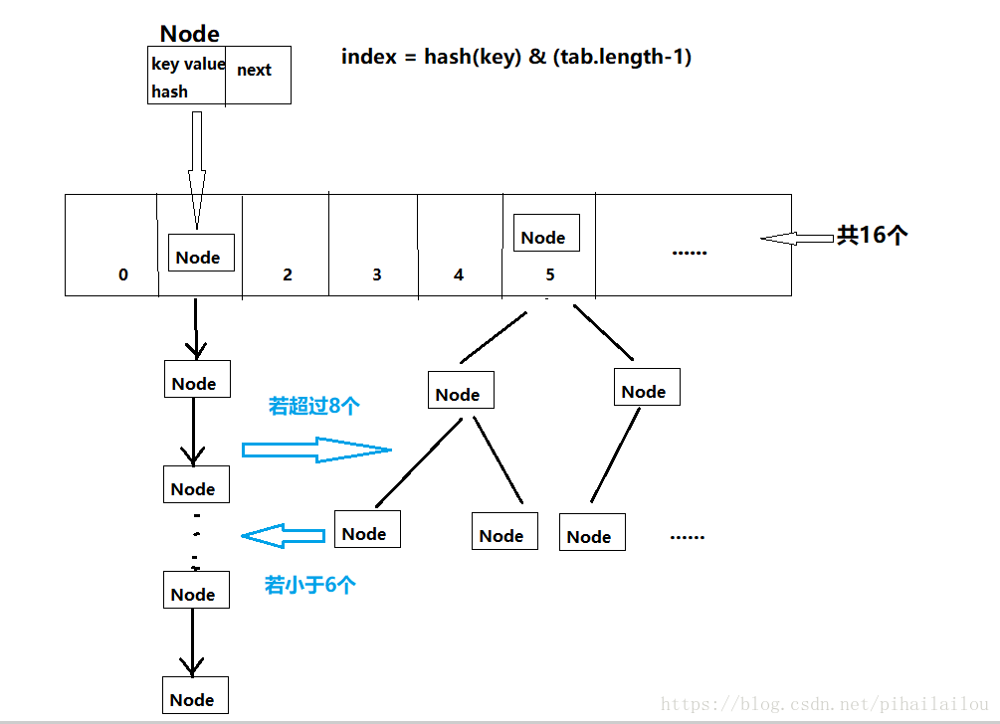

# 一，写在前面

在日常开发中，HashMap因其可以存储键值对的特点经常被使用，仅仅知道如何使用HashMap是远远不够的。以知其然知其所以然的钻研态度，本篇文章将以图文，源码的方式去解析HashMap的实现原理。

# 二，栗子

首先咱们来看一段代码，比较简单，就不多解释啦~

代码如下：

```java
import java.util.HashMap;
 
public class Test {
 
	public static void main(String[] args) {
		HashMap<Person, Integer> map = new HashMap<Person, Integer>();
		map.put(new Person(5, "bryant"), 8);
		map.put(new Person(3, "james"), 23);
		
		System.out.println(map.get(new Person(5, "kobe")));//8
		System.out.println(map.get(new Person(3, "lebron")));//23
	}
}
 
class Person {
	private int _id;
	private String name;
	public Person(int _id, String name) {
		super();
		this._id = _id;
		this.name = name;
	}
	
	@Override
	public int hashCode() {
		return new Integer(_id).hashCode();
	}
	
	@Override
	public boolean equals(Object obj) {
		if (obj == null) return false;
		return this._id == ((Person)obj)._id;
	}
	
}
```

​	


定义了一个Person类，里面有两个字段_id，name，分别重写hashCode，equals方法，都是_id相同则返回true。

打印结果如下：

8
23

对上述代码做一下简单的修改，删掉hashCode方法，打印结果如下：

null
null

想必大家都知道一个这样的知识点：在重写一个类的equals方法时，需要去重写hashCode方法。那么为啥需要重写hashCode方法呢？在下面的HashMap的原理解析中，就可以很好回答这个问题。之所以展示一个上述的栗子，是为了让读者有兴趣跟着笔者的脚步，去一步步探索HashMap内部实现的奥秘。

# 三，HashMap设计思路

为了让大家更好的理解HashMap的实现原理，下面会先介绍其设计思路。阅读下面的内容，对照下图会更易从整体上理解HashMap的设计思路。




为了实现高效的查询，插入，删除元素，HashMap底层采用数组+链表+红黑树的数据结构。

数组的特点：查询操作效率较高，根据索引查询只需要一次，但插入和删除操作效率较低，会移动整个数组。

链表的特点：查询操作效率较低，需要遍历整个链表，但插入删除的效率较高，只需要改变其next引用即可。

为了高效的执行查询，插入和删除操作，HashMap采用了数组+链表配合使用的方式，并在一定条件下将链表转化为红黑树（会面会讲到）。我们知道在put一个键值对时，包含有key，value两个数据，在HashMap中提供了Node类来封装键值对的数据。

Node类源码如下：

```java
static class Node<K,V> implements Map.Entry<K,V> {
        final int hash; //哈希函数的值
        final K key;    //key
        V value;        //value
        Node<K,V> next; //链表结构上的下一个元素
 
        Node(int hash, K key, V value, Node<K,V> next) {
            this.hash = hash;
            this.key = key;
            this.value = value;
            this.next = next;
        }
 
    // ...
}
```


 

查看Node的源码可知，是一个典型的链表结构，并实现了Entry接口，Entry是Map集合里一个内部接口。

上面提到HashMap中采用了数组的数据结构，因为它里面维护了一个数组table，源码如下：

    /**
     * The table, initialized on first use, and resized as
     * necessary. When allocated, length is always a power of two.
     * (We also tolerate length zero in some operations to allow
     * bootstrapping mechanics that are currently not needed.)
     */
    transient Node<K,V>[] table;
HashMap的构造函数中并没有初始化table数组，那么它是在哪里初始化的呢，下面会一一解答。table数组第一次初始化默认容量是16，在调用put方法存放一个键值对时，会做如下操作：

1.首先会调用哈希函数去计算key对应的hash；
2.然后执行位运算hash&（table.length-1），得到结点Node在数组中的存储位置index；
3.若数组的index位置没有结点，则直接将该结点存入数组；若该index位置有结点，又分如下两种情况：

该位置存放着一个链表（见上面的设计图），在链表结构上插入元素，若key相同则替换其value值，不插入新的结点

该位置存放着一个红黑树（见上面的设计图），在红黑树上插入元素，若key相同则替换其value值，不插入新的结点


链表存在的目的？

在步骤1中，调用哈希函数去计算key对应的hash，有可能存在多个不同的对象hash的值相同，也叫“哈希碰撞”，“哈希冲突”。在出现哈希冲突时，多个key对应的存储位置index是相同的，链表的next引用就是解决这种情况的。

红黑树存在的目的？

如果咱们要查询的结点刚在链表的最下面，那么每次都需要遍历完整个链表，在链表的长度比较短的时候还可以。若任由链表长	度无限的增加下去，势必会使查询操作的效率大大降低。因此，在HashMap底层规定当链表的结点数大于8时，会将链表转化为红黑树。

红黑树是二叉树的一种，它有左子树小于根结点，右子树大于根结点等特点。红黑树的查询，插入删除操作都比较高效，其层级比链表少方便查询。关于红黑树的具体介绍，可参考文章初恋红黑树。

HashMap中规定，在红黑树的结点个数小于6个时，会将红黑树转化为链表结构。

 

位运算hash&（table.length-1）的原因？

hash变量是调用hash函数得到的值，查看hash函数的源码：

    static final int hash(Object key) {
        int h;
        return (key == null) ? 0 : (h = key.hashCode()) ^ (h >>> 16);
    }
如果key是null，则返回0；如果不为0，首先计算出key的hashCode值，再执行hashCode值的低16位和高16位的异或运算。

从设计原则上来说，更多的使用数组的空间，不管是查询，插入删除都是很方便的，只需要根据Key对应的index值，并执行相关操作即可。越少的出现哈希冲突，链表的长度越短，数组的空间越被充分利用，HashMap操作数据的效率越高。

那么如何减少哈希冲突呢？

那么需要key对应的存储位置index尽可能的不同。

首先调用hash函数，将key的hashCode值的低16位于高16位进行异或运算，充分的使用hashCode的32个二进制数据进行运算（int是4个字节），得到变量hash。

然后执行位运算hash&（table.length-1），由于数组长度是16，那么table.length-1是15，二进制表示：1111。我们思考这样的一个问题，当数组是16时，hash变量与的是1111，最后会得到hash变量最低4位的值，其范围是0~15。当数组是15时，hash变量与的是1110，那么不管hash变量的最低1位是0或1，得到的值都是0。也就是说，1010，1011与上1110都是1010，两个不同的hash变量有得到同一个存储位置index的可能，这样会更大概率出现哈希冲突。因此，HashMap在设计数组的初始长度为16，数组的扩容也是乘以2。

小结：hash函数利用key的hashCode的高16位和低16位的异或运算，减少了哈希冲突。设计数组长度是16，在执行hash&（table.length-1）运算时，减少了哈希冲突。减少了哈希冲突，充分利用数组空间，HashMap的查询，插入和删除操作会更高效。

# 四，边界变量


代码中有具体解释，这里就不带大家一行行分析putVal方法的源码了。

初次调用put方法，会调用resize方法初始化table数组，执行hash&(tab.length-1)获取结点在数组的存储位置，并直接将Node存入数组。后面继续调用put方法，先处理数组中结点的Key与插入结点相同的情况，然后处理数组中结点是红黑树，链表的情况。若数组的结点是链表结构，遍历链表并插入新的结点，并处理新旧结点的key相同的情况。若链表的长度大于8，则转化为红黑树。新旧结点的key相同的情况，使用临时变量e存储旧结点，并返回e.value。当集合中键值对大于12时，调用resize方法扩容数组。

六，resize方法
	
			
```java
	final Node<K, V>[] resize() {
		Node<K, V>[] oldTab = table;  //临时变量，指向数组table
		int oldCap = (oldTab == null) ? 0 : oldTab.length;
		int oldThr = threshold;
		int newCap, newThr = 0;
		if (oldCap > 0) { //数组有结点的情况
			if (oldCap >= MAXIMUM_CAPACITY) {  //处理数组容量超过临界值的情况
				threshold = Integer.MAX_VALUE;
				return oldTab;
			} else if ((newCap = oldCap << 1) < MAXIMUM_CAPACITY
					&& oldCap >= DEFAULT_INITIAL_CAPACITY) //处理扩容后的数组大小临界值情况
				newThr = oldThr << 1; // double threshold  //修改边界值，扩大集合中允许的结点个数
		} else if (oldThr > 0) // initial capacity was placed in threshold
			newCap = oldThr;
		else { // zero initial threshold signifies using defaults	//第一次调用put方法，数组没初始化的情况
		newCap = DEFAULT_INITIAL_CAPACITY;  //16
		newThr = (int) (DEFAULT_LOAD_FACTOR * DEFAULT_INITIAL_CAPACITY);  //16 * 0.75 = 12
	}
	if (newThr == 0) {
		float ft = (float) newCap * loadFactor;
		newThr = (newCap < MAXIMUM_CAPACITY
				&& ft < (float) MAXIMUM_CAPACITY ? (int) ft
				: Integer.MAX_VALUE);
	}
	threshold = newThr; //修改threshold变量的值
	@SuppressWarnings({ "rawtypes", "unchecked" })
	Node<K, V>[] newTab = (Node<K, V>[]) new Node[newCap]; //初始化数组，或创建扩容后的数组
	table = newTab;  //修改table变量
	if (oldTab != null) { //处理数组扩容的情况
		for (int j = 0; j < oldCap; ++j) { //遍历旧数组的结点
			Node<K, V> e;
			if ((e = oldTab[j]) != null) { //临时遍历e, 指向旧数组中结点
				oldTab[j] = null;  //旧数组结点置空
				if (e.next == null)
					//在新数组中重新确定结点的位置，算法与数组大小为16时相同
					newTab[e.hash & (newCap - 1)] = e; 
				else if (e instanceof TreeNode) //处理结点是红黑树的情况
					((TreeNode<K, V>) e).split(this, newTab, j, oldCap);
				else { // preserve order
					//处理结点是链表的情况
					Node<K, V> loHead = null, loTail = null;
					Node<K, V> hiHead = null, hiTail = null;
					Node<K, V> next;
					do {
						next = e.next;
						if ((e.hash & oldCap) == 0) { //若hash变量的第5位二进制值为0
							if (loTail == null)
								loHead = e;
							else
								loTail.next = e;
							loTail = e;
						} else { //若hash变量的第5位二进制值为1
							if (hiTail == null)
								hiHead = e;
							else
								hiTail.next = e;
							hiTail = e;
						}
					} while ((e = next) != null);
					if (loTail != null) {
						loTail.next = null;
						newTab[j] = loHead; //hash变量的第5位二进制值为0的情况
					}
					if (hiTail != null) {
						hiTail.next = null;
						newTab[j + oldCap] = hiHead; //hash变量的第5位二进制值为1的情况
					}
				}
			}
		}
	}
	return newTab;
}
```
代码中有具体解释，这里就不带大家一行行分析resize方法的源码了。

resize方法做了两件事，一个是初始化数组，一个是数组扩容。在数组扩容时，会重新创建新的数组，由于数组的长度tab.length发生变化，hash&(tab.length-1)得到的值发生变化。例如数组大小从16扩容到32时，tab.length-1是31，二进制表示是11111。hash变量在进行与运算时，第5位二进制会参与运算。若第5位二进制是0，则位置不变；若是1，则数组存放位置增加16，刚好是旧数组的大小。

因此，遍历链表重新确定结点的位置时，需要判断(e.hash & oldCap) == 0，就是判断hash的第5位二进制是0还是1，从而确定链表中的结点在新数组中的存储位置。HashMap在扩容时，可能会改变结点在数组中存储位置，蛋糕重分，由此可知HashMap存储元素的位置并不稳定。

七，get方法
    public V get(Object key) {
        Node<K,V> e;
        return (e = getNode(hash(key), key)) == null ? null : e.value;
    }
    

    final Node<K,V> getNode(int hash, Object key) {
        Node<K,V>[] tab; Node<K,V> first, e; int n; K k;
        if ((tab = table) != null && (n = tab.length) > 0 &&
            (first = tab[(n - 1) & hash]) != null) {  //table数组该位置有结点
            if (first.hash == hash && // always check first node
                ((k = first.key) == key || (key != null && key.equals(k))))
            	//key相同的情况
                return first;
            if ((e = first.next) != null) {
                if (first instanceof TreeNode) //数组中结点是红黑树的情况
                    return ((TreeNode<K,V>)first).getTreeNode(hash, key);
                do { //数组中结点是链表的情况
                    if (e.hash == hash &&
                        ((k = e.key) == key || (key != null && key.equals(k))))
                        return e;
                } while ((e = e.next) != null); //遍历链表，直到找到相同的key
            }
        }
        return null;
    }
代码中有具体解释，这里就不带大家一行行分析get方法的源码了。

首先通过key获取其在数组中的存储位置index，分三种情况寻找相同的key：

数组中的结点的key是否相同；
数组中的结点的key不相同，处理是链表的情况，并遍历链接找到符合条件的Key；
数组中的结点的key不相同，处理是红黑树的情况；


HashMap是如何判断key是否相同呢？

if (e.hash == hash && ((k = e.key) == key || (key != null && key.equals(k))))
e.hash == hash，hash变量的值取决于key的hashCode的值，因此需要key的hashCode相同，也就是hashCode方法返回值要相同；
(k = e.key) == key，判断两个对象是否相同，则判定key相同；
key != null && key.equals(k) ，调用equals方法返回true，则判定key相同；
小结：想正确的获取HashMap中集合的元素，判定key是否相同，要同时重写的hashCode方法和equals方法。

# 五 关于HashMap实现原理的问答题

1），HashMap的实现原理，内部数据结构？

底层使用哈希表，也就是数组+链表，当链表长度超过8个时会转化为红黑树，以实现查找的时间复杂度为log n。

2），HashMap中put方法的过程？


**put源码：**

```java
public V put(K key, V value) {
        //在JDK1.8中，实际上调用的putVal方法
        return putVal(hash(key), key, value, false, true);
    }
```

```java
final V putVal(int hash, K key, V value, boolean onlyIfAbsent,boolean evict) {
        Node<K,V>[] tab;
        Node<K,V> p; 
        int n, i;
        //1.判断tab是否为空，是否还有剩余空间，是否需要扩容操作
        if ((tab = table) == null || (n = tab.length) == 0)
            n = (tab = resize()).length;
        //给p赋值，为一个节点的位置，若为空，创建一个新节点,调用的LinkedHashMap的newNode方法
        if ((p = tab[i = (n - 1) & hash]) == null)
            tab[i] = newNode(hash, key, value, null);
        else {
            Node<K,V> e; 
            K k;
            //1.比较哈希值是否相同；2.比较key实例是否相同；3.比较key的值
            if (p.hash == hash &&((k = p.key) == key || (key != null && key.equals(k))))
            //若值已经存在，直接覆盖
                e = p;
            //若p是一个TreeNode对象
            else if (p instanceof TreeNode)
            //在红黑树中直接插入键值对
                e = ((TreeNode<K,V>)p).putTreeVal(this, tab, hash, key, value);
            else {
                //开始遍历链表，准备插入
                for (int binCount = 0; ; ++binCount) {
                    if ((e = p.next) == null) {
                        //创建要进行插入的节点
                        p.next = newNode(hash, key, value, null);
                        //如果链表的长度大于8了，进行链表->红黑树的转换操作
                        if (binCount >= TREEIFY_THRESHOLD - 1) // -1 for 1st
                            treeifyBin(tab, hash);
                        break;
                    }
                    //如果存在KEY值,直接赋值覆盖value
                    if (e.hash == hash && ((k = e.key) == key || (key != null && key.equals(k))))
                        break;
                    p = e;
                }
            }
            //上面过程为给e这个Node<K,V>对象赋值
            if (e != null) { // existing mapping for key
                V oldValue = e.value;
                if (!onlyIfAbsent || oldValue == null)
                    e.value = value;
                afterNodeAccess(e);
                return oldValue;
            }
        }
        ++modCount;
        //判断是否超过最大容量，需要扩容
        if (++size > threshold)
            resize();
        afterNodeInsertion(evict);
        return null;
    }
```


1. 对key做null检查。如果key是null，会被存储到table[0]，因为null的hash值总是0。

2. key的hashcode()方法会被调用，然后计算hash值。hash值用来找到存储Entry对象的数组的索引。

3. indexFor(hash,table.length)用来计算在table数组中存储Entry对象的精确的索引。

4. 在我们的例子中已经看到，如果两个key有相同的hash值(也叫冲突)，他们会以链表的形式来存储。所以，这里我们就迭代链表。

*如果在刚才计算出来的索引位置没有元素，直接把Entry对象放在那个索引上。

*如果索引上有元素，然后会进行迭代，一直到Entry->next是null。当前的Entry对象变成链表的下一个节点。

（这也是为什么上面的例子中，放了8个元素，却显示了6个。）


put方法的思路：

1.对 key 的 hashCode()做 hash，然后再计算 index;

2.如果没碰撞直接放到 bucket 里；

3.如果碰撞了，以链表的形式存在 buckets 后；

4.如果碰撞导致链表过长(大于等于 TREEIFY_THRESHOLD)，就把链表转换成红黑树；

5.如果节点已经存在就替换 old value(保证 key 的唯一性)

6.如果 bucket 满了(超过 load factor * current capacity)，就要 resize。


 如果我们再次放入同样的key会怎样呢？逻辑上，它应该替换老的value。事实上，它确实是这么做的。在迭代的过程中，会调用equals()方法来检查key的相等性(key.equals(k))，如果这个方法返回true，它就会用当前Entry的value来替换之前的value。

 get源码：


 2），HashMap中get方法的过程？

**get源码：**

```java
public V get(Object key) {
        Node<K,V> e;
        return (e = getNode(hash(key), key)) == null ? null : e.value;
    }
```

## getNode()方法源码解析

```java
final HashMap.Node<K, V> getNode ( int hash, Object key){
//            定义临时变量
            HashMap.Node<K, V>[] tab;
            HashMap.Node<K, V> first, e;
            int n;
            K k;
//            现判断HashMap的数组是否为空 且 根据hash值判断数组对应的位置是否为空
//            如果为空则直接返回null
            if ((tab = table) != null && (n = tab.length) > 0 &&
                    (first = tab[(n - 1) & hash]) != null) {
//                不为空则进行判断数组上的第一个节点是否是传入的key对应的节点
                if (first.hash == hash && // always check first node
                        ((k = first.key) == key || (key != null && key.equals(k))))
//                    如果是直接返回数组上的节点
                    return first;
//                如果不是数组上的节点 且 节点后续有值则继续执行
                if ((e = first.next) != null) {
//                    先判断节点是否属于TreeNode节点 
                    if (first instanceof HashMap.TreeNode)
//                        如果是则调用TreeNode.getTreeNode()方法
                        return ((HashMap.TreeNode<K, V>) first).getTreeNode(hash, key);
//                    不是则循环遍历链表直到找到对应节点 或 到链表的尾部
                    do {
                        if (e.hash == hash &&
                                ((k = e.key) == key || (key != null && key.equals(k))))
//                            当传入的hash值与链表上的某节点hash值相等 或
//                            传入的key值相等时
//                            返回节点e
                            return e;
                    } while ((e = e.next) != null);//循环持续到e节点后没有节点位置
                }
            }
            return null;
        }
```


get工作原理分析：

当你传递一个key从hashmap总获取value的时候：

 1. 对key进行null检查。如果key是null，table[0]这个位置的元素将被返回。

 2. key的hashcode()方法被调用，然后计算hash值。

 3. indexFor(hash,table.length)用来计算要获取的Entry对象在table数组中的精确的位置，使用刚才计算的hash值。

 4. 在获取了table数组的索引之后，会迭代链表，调用equals()方法检查key的相等性，如果equals()方法返回true，get方法返回         Entry对象的value，否则，返回null。

HashMap中两个重要的参数：

容量(Capacity)和负载因子(Load factor)

简单的说，Capacity就是buckets的数目，Load factor就是buckets填满程度的最大比例。如果对迭代性能要求很高的话不要把capacity设置过大，也不要把load factor设置过小。当bucket填充的数目（即hashmap中元素的个数）大于capacity*load factor时就需要调整buckets的数目为当前的2倍。

3，哈希函数怎么实现的？

调用Key的hashCode方法获取hashCode值，并将该值的高16位和低16位进行异或运算。

4，哈希冲突怎么解决？

将新结点添加在链表后面

5，数组扩容的过程？

创建一个新的数组，其容量为旧数组的两倍，并重新计算旧数组中结点的存储位置。结点在新数组中的位置只有两种，原下标位置或原下标+旧数组的大小。

6，除了链地址法，哈希冲突的其他解决方案？

开放定址法：发生哈希冲突，寻找另一个未被占用的数组地址

再哈希法：提供多个哈希函数，直到不再产生冲突；

建立公共溢出区：将哈希表分为基本表和溢出表，产生哈希冲突的结点放入溢出表
