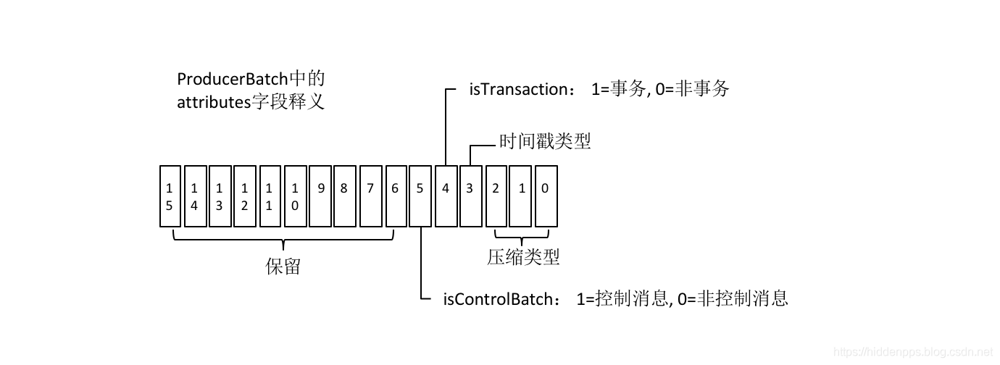
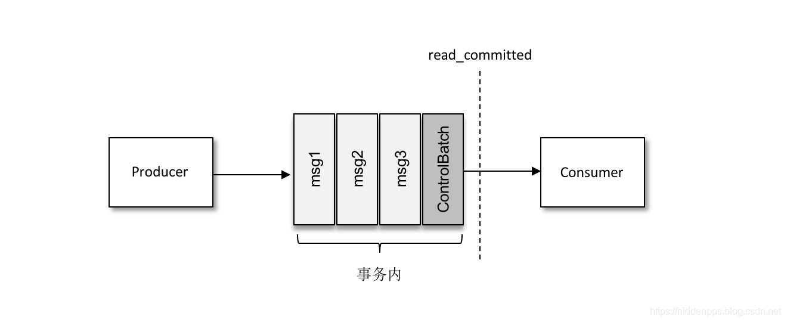
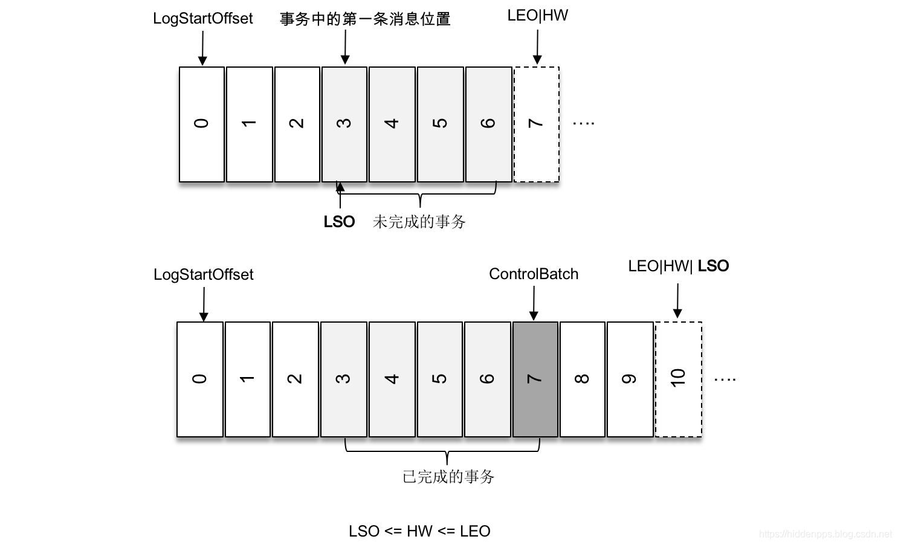
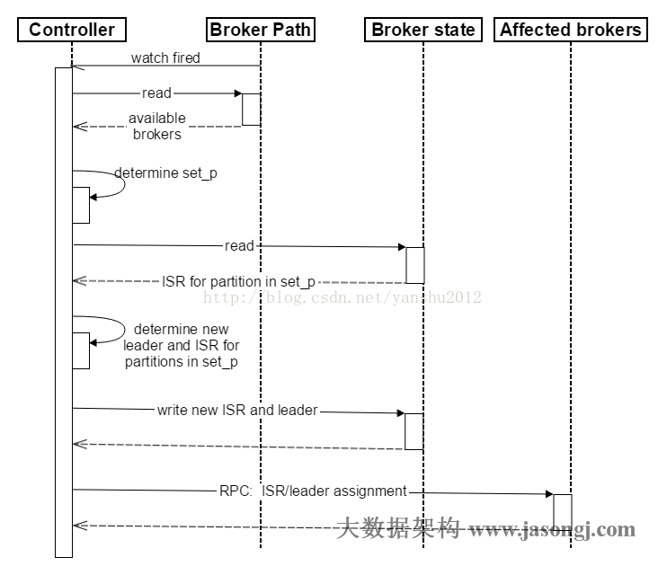
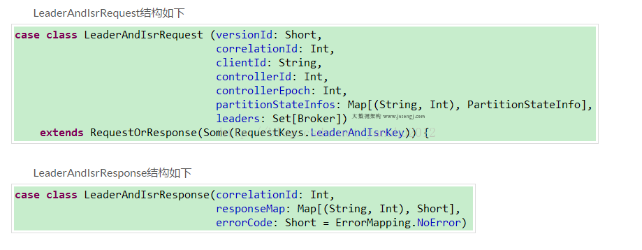
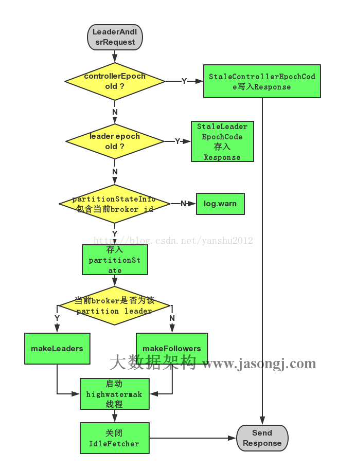

# Kafka的生成者、消费者、broker的基本概念


  kafka是一款基于发布与订阅的消息系统。它一般被称为“分布式提交日志”或者“分布式流平台”。文件系统或者数据库提交日志用来提供所有事物的持久化记录，通过重建这些日志可以重建系统的状态。同样地，kafka的数据是按照一定顺序持久化保存的，可以按需读取。


- ## 1、kafka拓扑结构


- ## 2、Kafka的特点

  1.同时为分布和订阅提供高吞吐量。据了解，Kafka每秒可以生产约25万条消息（50MB），每秒处理55万条消息（110MB）这里说条数，可能不上特别准确，因为消息的大小可能不一致；
   2.可进行持久化操作，将消息持久化到到磁盘，以日志的形式存储，因此可用于批量消费，例如ETL，以及实时应用程序。 通过将数据持久化到硬盘以及replication防止数据丢失。
  3.分布式系统，易于向外拓展。所有的Producer、broker和consumer都会有多个，均为分布式。无需停机即可拓展机器。
  4.消息被处理的状态是在consumer端维护，而不是由server端维护，当失败时能自动平衡。
  5.支持Online和offline的场景。

- ## 3、Kafka的核心概念


| **名词**      | **解释**                                                     |
| ------------- | ------------------------------------------------------------ |
| Producer      | 消息的生成者                                                 |
| Consumer      | 消息的消费者                                                 |
| ConsumerGroup | 消费者组，可以并行消费Topic中的partition的消息               |
| Broker        | 缓存代理，Kafka集群中的一台或多台服务器统称broker.           |
| Topic         | Kafka处理资源的消息源(feeds of messages)的不同分类           |
| Partition     | Topic物理上的分组，一个topic可以分为多个partion,每个partion是一个有序的队列。partion中每条消息都会被分                配一个 有序的Id(offset) |
| Message       | 消息，是通信的基本单位，每个producer可以向一个topic（主题）发布一些消息 |
| Producers     | 消息和数据生成者，向Kafka的一个topic发布消息的 过程叫做producers |
| Consumers     | 消息和数据的消费者，订阅topic并处理其发布的消费过程叫做consumers |

- ###  3.1 Producers的概念

  1.消息和数据生成者，向Kafka的一个topic发布消息的过程叫做producers  
 2.Producer将消息发布到指定的Topic中，同时Producer也能决定将此消息归属于哪个partition；比如基于round-robin方式         或者通过其他的一些算法等；
3.异步发送批量发送可以很有效的提高发送效率。kafka producer的异步发送模式允许进行批量发送，先将消息缓存到内存中，然后一次请求批量发送出去。

- ###   3.2 broker的概念:

  1.Broker没有副本机制，一旦broker宕机，该broker的消息将都不可用。
 2.Broker不保存订阅者的状态，由订阅者自己保存。
 3.无状态导致消息的删除成为难题（可能删除的消息正在被订阅），Kafka采用基于时间的SLA（服务保证），消息保存一定时间（通常7天）后会删除。
 4.消费订阅者可以rewind back到任意位置重新进行消费，当订阅者故障时，可以选择最小的offset(id)进行重新读取消费消息


- ###   3.3 Message组成

​    1.Message消息：是通信的基本单位，每个producer可以向一个topic发布消息。

2. Kafka中的Message是以topic为基本单位组织的，不同的topic之间是相互独立的，每个topic又可以分成不同的partition每个partition储存一部分
   3.partion中的每条Message包含以下三个属性：


| offset      | long               |
| ----------- | ------------------ |
| MessageSize | int32              |
| data        | messages的具体内容 |


- ###   3.4 Consumers的概念

  消息和数据消费者，订阅topic并处理其发布的消息的过程叫做consumers.
      在kafka中，我们可以认为一个group是一个“订阅者”，一个topic中的每个partions只会被一个“订阅者”中的一个consumer
      消费，不过一个consumer可以消费多个partitions中的消息
      注:
       Kafka的设计原理决定，对于一个topic，同一个group不能多于partition个数的consumer同时消费，否则将意味着某些                      consumer无法得到消息


关键术语

**主题，分区和偏移**

主题是特定的数据流。它与NoSQL数据库中的表非常相似。与NoSQL数据库中的表一样，该主题被拆分为分区，使主题能够分布在各个节点上。与表中的主键一样，主题具有每个分区的偏移量。您可以使用其主题，分区和偏移量唯一标识消息。

 


分区

分区使主题可以在群集中分布。分区是水平可伸缩性的并行度单位。一个主题可以跨节点进行多个分区扩展。


消息根据分区键分配给分区; 如果没有分区键，则随机分配该分区。使用正确的密钥来避免热点非常重要。


分区中的每个消息都被分配一个称为偏移量的增量ID。每个分区的偏移量是唯一的，消息只在分区内排序。写入分区的消息是不可变的。

**Kafka架构图**


ZooKeeper

ZooKeeper是一种用于管理分布式系统的集中式服务。它为其管理的分布式系统提供分层键值存储，配置，同步和名称注册服务。ZooKeeper充当集合层（将事物联系在一起）并确保Kafka集群的高可用性。Kafka节点也称为代理。重要的是要理解Kafka在没有ZooKeeper的情况下无法工作。

从ZooKeeper节点列表中，其中一个节点被选为领导者，其余节点跟随领导者。在ZooKeeper节点发生故障的情况下，其中一个关注者被选为领导者。强烈建议使用多个节点以实现高可用性，不建议使用超过7个节点。

ZooKeeper存储元数据和Kafka集群的当前状态。例如，主题名称，分区数量，复制，请愿的领导者详细信息以及消费者组详细信息等详细信息存储在ZooKeeper中。您可以将ZooKeeper视为项目经理，他负责管理项目中的资源并记住项目的状态。


关键事项：

管理经纪人名单。

当经纪人破产时选举经纪人领导。

发送有关新代理、新主题、已删除主题、丢失代理等的通知。

从Kafka0.10开始，消费者偏移不存储在ZooKeeper中，只有集群的元数据存储在ZooKeepr中。

ZooKeepr中的领导者处理所有写入和跟随者ZooKeepr只处理读取。

Broker

一个broker是由ZooKeeper管理的单个Kafka节点。一组brokers组成了Kafka集群。在Kaka中创建的主题基于分区，复制和其他因素分布在broker中。当broker节点基于ZooKeeper中存储的状态失败时，它会自动重新平衡群集，如果领导分区丢失，则其中一个跟随者请求被选为领导者。


您可以将broker视为负责分配任务的团队负责人。如果团队负责人不可用，那么经理负

责将任务分配给其他团队成员。

复制


复制使Kafka即使在代理关闭时也具有容错能力。例如，主题B分区0存储在代理0和代理1中。生产者和消费者都只由领导者提供服务。在代理失败的情况下，来自另一个代理的分区被选为领导者，并且它开始为生产者和消费者群体提供服务。与领导同步的副本分区标记为ISR（同步副本）。


**IT团队和Kafka集群类比**

下图描绘了IT团队和Kafka集群的类比。


**摘要**

以下是Kafka核心组件的摘要。


ZooKeeper管理Kafka经纪人及其元数据。

代理是可水平扩展的Kafka节点，包含主题和复制。

主题是具有一个或多个分区的消息流。

分区包含每个分区具有唯一偏移量的消息。

复制使Kafka能够使用跟随分区进行容错。


4. Kafka为什么速度那么快？
Kafka的消息是保存或缓存在磁盘上的，一般认为在磁盘上读写数据是会降低性能的，因为寻址会比较消耗时间，但是实际上，Kafka的特性之一就是高吞吐率。

即使是普通的服务器，Kafka也可以轻松支持每秒百万级的写入请求，超过了大部分的消息中间件，这种特性也使得Kafka在日志处理等海量数据场景广泛应用。

针对Kafka的基准测试可以参考，Apache Kafka基准测试：每秒写入2百万（在三台廉价机器上）

 

下面从数据写入和读取两方面分析，为什么Kafka速度这么快。

  一、写入数据
Kafka会把收到的消息都写入到硬盘中，它绝对不会丢失数据。为了优化写入速度Kafka采用了两个技术， 顺序写入和MMFile 

 1、顺序写入

磁盘读写的快慢取决于你怎么使用它，也就是顺序读写或者随机读写。在顺序读写的情况下，磁盘的顺序读写速度和内存持平。

因为硬盘是机械结构，每次读写都会寻址->写入，其中寻址是一个“机械动作”，它是最耗时的。所以硬盘最讨厌随机I/O，最喜欢顺序I/O。为了提高读写硬盘的速度，Kafka就是使用顺序I/O。

而且Linux对于磁盘的读写优化也比较多，包括read-ahead和write-behind，磁盘缓存等。如果在内存做这些操作的时候，一个是JAVA对象的内存开销很大，另一个是随着堆内存数据的增多，JAVA的GC时间会变得很长，使用磁盘操作有以下几个好处：

1、顺序写入磁盘顺序读写速度超过内存随机读写

2、顺序写入JVM的GC效率低，内存占用大。使用磁盘可以避免这一问题

3、顺序写入系统冷启动后，磁盘缓存依然可用

 

下图就展示了Kafka是如何写入数据的， 每一个Partition其实都是一个文件 ，收到消息后Kafka会把数据插入到文件末尾（虚框部分）：


这种方法有一个缺陷——没有办法删除数据 ，所以Kafka是不会删除数据的，它会把所有的数据都保留下来，每个消费者（Consumer）对每个Topic都有一个offset用来表示读取到了第几条数据 。


两个消费者：

1、顺序写入Consumer1有两个offset分别对应Partition0、Partition1（假设每一个Topic一个Partition）；

2、顺序写入Consumer2有一个offset对应Partition2。

这个offset是由客户端SDK负责保存的，Kafka的Broker完全无视这个东西的存在；一般情况下SDK会把它保存到Zookeeper里面，所以需要给Consumer提供zookeeper的地址。

 

如果不删除硬盘肯定会被撑满，所以Kakfa提供了两种策略来删除数据：

1、顺序写入一是基于时间。

2、顺序写入二是基于partition文件大小。

具体配置可以参看它的配置文档

 

 2、Memory Mapped Files

即便是顺序写入硬盘，硬盘的访问速度还是不可能追上内存。所以Kafka的数据并不是实时的写入硬盘 ，它充分利用了现代操作系统分页存储来利用内存提高I/O效率。

Memory Mapped Files(后面简称mmap)也被翻译成 内存映射文件 ，在64位操作系统中一般可以表示20G的数据文件，它的工作原理是直接利用操作系统的Page来实现文件到物理内存的直接映射。

完成映射之后你对物理内存的操作会被同步到硬盘上（操作系统在适当的时候）。

通过mmap，进程像读写硬盘一样读写内存（当然是虚拟机内存），也不必关心内存的大小有虚拟内存为我们兜底。

使用这种方式可以获取很大的I/O提升，省去了用户空间到内核空间复制的开销（调用文件的read会把数据先放到内核空间的内存中，然后再复制到用户空间的内存中。）

但也有一个很明显的缺陷——不可靠，写到mmap中的数据并没有被真正的写到硬盘，操作系统会在程序主动调用flush的时候才把数据真正的写到硬盘。

Kafka提供了一个参数——producer.type来控制是不是主动flush，如果Kafka写入到mmap之后就立即flush然后再返回Producer叫 同步 (sync)；写入mmap之后立即返回Producer不调用flush叫异步 (async)。

 

 二、读取数据
Kafka在读取磁盘时做了哪些优化？

 1、基于sendfile实现Zero Copy

传统模式下，当需要对一个文件进行传输的时候，其具体流程细节如下：

1、基于sendfile实现Zero Copy调用read函数，文件数据被copy到内核缓冲区

2、read函数返回，文件数据从内核缓冲区copy到用户缓冲区

3、write函数调用，将文件数据从用户缓冲区copy到内核与socket相关的缓冲区。

4、数据从socket缓冲区copy到相关协议引擎。

 

以上细节是传统read/write方式进行网络文件传输的方式，我们可以看到，在这个过程当中，文件数据实际上是经过了四次copy操作：

硬盘—>内核buf—>用户buf—>socket相关缓冲区—>协议引擎

而sendfile系统调用则提供了一种减少以上多次copy，提升文件传输性能的方法。

在内核版本2.1中，引入了sendfile系统调用，以简化网络上和两个本地文件之间的数据传输。sendfile的引入不仅减少了数据复制，还减少了上下文切换。

sendfile(socket, file, len);

运行流程如下：

1、sendfile系统调用，文件数据被copy至内核缓冲区

2、再从内核缓冲区copy至内核中socket相关的缓冲区

3、最后再socket相关的缓冲区copy到协议引擎

 

相较传统read/write方式，2.1版本内核引进的sendfile已经减少了内核缓冲区到user缓冲区，再由user缓冲区到socket相关缓冲区的文件copy，而在内核版本2.4之后，文件描述符结果被改变，sendfile实现了更简单的方式，再次减少了一次copy操作。

在Apache、Nginx、lighttpd等web服务器当中，都有一项sendfile相关的配置，使用sendfile可以大幅提升文件传输性能。

Kafka把所有的消息都存放在一个一个的文件中，当消费者需要数据的时候Kafka直接把文件发送给消费者，配合mmap作为文件读写方式，直接把它传给sendfile。

 

 2、批量压缩

在很多情况下，系统的瓶颈不是CPU或磁盘，而是网络IO，对于需要在广域网上的数据中心之间发送消息的数据流水线尤其如此。进行数据压缩会消耗少量的CPU资源,不过对于kafka而言,网络IO更应该需要考虑。

1、如果每个消息都压缩，但是压缩率相对很低，所以Kafka使用了批量压缩，即将多个消息一起压缩而不是单个消息压缩

2、Kafka允许使用递归的消息集合，批量的消息可以通过压缩的形式传输并且在日志中也可以保持压缩格式，直到被消费者解压缩

3、Kafka支持多种压缩协议，包括Gzip和Snappy压缩协议

 

 三、总结
Kafka速度的秘诀在于，它把所有的消息都变成一个批量的文件，并且进行合理的批量压缩，减少网络IO损耗，通过mmap提高I/O速度，写入数据的时候由于单个Partion是末尾添加所以速度最优；读取数据的时候配合sendfile直接暴力输出。


# Kafka常见面试题

# Kafka发送端：如何保证发送数据不丢失

##### 设置如下三个参数值，方可保证发送数据不丢失

1.unclean.leader.election.enable=false （在server.properties文件中配置）

2.min.insync.replicas=总副本数-1 ，即最小同步副本个数=总副本个数-1（在server.properties文件中配置）

3.acks=-1/all，即当所有isr副本数全部收到消费之后再提交ack （在producer端代码里配置）

**结论**：unclean.leader.election.enable=false,Kafka 会在该分区所有副本代理都下线的情况下，从 ISR 中选择第一个上线的代理作为 leader。ack=-1 和 min.insync.replicas= 总副本数-1共同作用：要求生产时，需要得到该分区所有在线副本代理的确认，并且确认在线副本数要大于等于（副本数-1），这样就保证了每次生产，有绝大多数副本代理确认收到消息后才认为消息已成功写入 Kafka。这样如果在非常情况下进行 leader 选举，Kafka 既能很快恢复，也保障了数据不丢失。


 

 

#### 1 什么是kafka

> Kafka是分布式发布-订阅消息系统，它最初是由LinkedIn公司开发的，之后成为Apache项目的一部分，Kafka是一个分布式，可划分的，冗余备份的持久性的日志服务，它主要用于处理流式数据。

#### 2 为什么要使用 kafka，为什么要使用消息队列

> **缓冲和削峰**：上游数据时有突发流量，下游可能扛不住，或者下游没有足够多的机器来保证冗余，kafka在中间可以起到一个缓冲的作用，把消息暂存在kafka中，下游服务就可以按照自己的节奏进行慢慢处理。

> **解耦和扩展性**：项目开始的时候，并不能确定具体需求。消息队列可以作为一个接口层，解耦重要的业务流程。只需要遵守约定，针对数据编程即可获取扩展能力。

> **冗余**：可以采用一对多的方式，一个生产者发布消息，可以被多个订阅topic的服务消费到，供多个毫无关联的业务使用。

> **健壮性**：消息队列可以堆积请求，所以消费端业务即使短时间死掉，也不会影响主要业务的正常进行。

> **异步通信**：很多时候，用户不想也不需要立即处理消息。消息队列提供了异步处理机制，允许用户把一个消息放入队列，但并不立即处理它。想向队列中放入多少消息就放多少，然后在需要的时候再去处理它们。

#### 3.Kafka中的ISR、AR又代表什么？ISR的伸缩又指什么

ISR:In-Sync Replicas 副本同步队列
AR:Assigned Replicas 所有副本
ISR是由leader维护，follower从leader同步数据有一些延迟（包括延迟时间replica.lag.time.max.ms和延迟条数replica.lag.max.messages两个维度, 当前最新的版本0.10.x中只支持replica.lag.time.max.ms这个维度），任意一个超过阈值都会把follower剔除出ISR, 存入OSR（Outof-Sync Replicas）列表，新加入的follower也会先存放在OSR中。AR=ISR+OSR。

#### 4.kafka中的broker 是干什么的

broker 是消息的代理，Producers往Brokers里面的指定Topic中写消息，Consumers从Brokers里面拉取指定Topic的消息，然后进行业务处理，broker在中间起到一个代理保存消息的中转站。

#### 5.kafka中的 zookeeper 起到什么作用，可以不用zookeeper么

zookeeper 是一个分布式的协调组件，早期版本的kafka用zk做meta信息存储，consumer的消费状态，group的管理以及 offset的值。考虑到zk本身的一些因素以及整个架构较大概率存在单点问题，新版本中逐渐弱化了zookeeper的作用。新的consumer使用了kafka内部的group coordination协议，也减少了对zookeeper的依赖，

但是broker依然依赖于ZK，zookeeper 在kafka中还用来选举controller 和 检测broker是否存活等等。

#### 6.kafka follower如何与leader同步数据

Kafka的复制机制既不是完全的同步复制，也不是单纯的异步复制。完全同步复制要求All Alive Follower都复制完，这条消息才会被认为commit，这种复制方式极大的影响了吞吐率。而异步复制方式下，Follower异步的从Leader复制数据，数据只要被Leader写入log就被认为已经commit，这种情况下，如果leader挂掉，会丢失数据，kafka使用ISR的方式很好的均衡了确保数据不丢失以及吞吐率。Follower可以批量的从Leader复制数据，而且Leader充分利用磁盘顺序读以及send file(zero copy)机制，这样极大的提高复制性能，内部批量写磁盘，大幅减少了Follower与Leader的消息量差。

#### 7.什么情况下一个 broker 会从 isr中踢出去

leader会维护一个与其基本保持同步的Replica列表，该列表称为ISR(in-sync Replica)，每个Partition都会有一个ISR，而且是由leader动态维护 ，如果一个follower比一个leader落后太多，或者超过一定时间未发起数据复制请求，则leader将其重ISR中移除 。

#### 8.kafka 为什么那么快

1.Cache Filesystem Cache PageCache缓存

2.顺序写 由于现代的操作系统提供了预读和写技术，磁盘的顺序写大多数情况下比随机写内存还要快。

3.Zero-copy 零拷技术减少拷贝次数

```
“零拷贝技术”只用将磁盘文件的数据复制到页面缓存中一次，然后将数据从页面缓存直接发送到网络中（发送给不同的订阅者时，都可以使用同一个页面缓存），避免了重复复制操作。
```


4.Batching of Messages 批量量处理。合并小的请求，然后以流的方式进行交互，直顶网络上限。

5.Pull 拉模式 使用拉模式进行消息的获取消费，与消费端处理能力相符。

6.批量压缩

```
在很多情况下，系统的瓶颈不是CPU或磁盘，而是网络IO，对于需要在广域网上的数据中心之间发送消息的数据流水线尤其如此。进行数据压缩会消耗少量的CPU资源,不过对于kafka而言,网络IO更应该需要考虑
1.如果每个消息都压缩，但是压缩率相对很低，所以Kafka使用了批量压缩，即将多个消息一起压缩而不是单个消息压缩
2.Kafka允许使用递归的消息集合，批量的消息可以通过压缩的形式传输并且在日志中也可以保持压缩格式，直到被消费者解压缩
3.Kafka支持多种压缩协议，包括Gzip和Snappy压缩协议
```


#### 9.kafka producer如何优化打入速度

增加线程

提高 batch.size

增加更多 producer 实例

增加 partition 数

设置 acks=-1 时，如果延迟增大：可以增大 num.replica.fetchers（follower 同步数据的线程数）来调解；

跨数据中心的传输：增加 socket 缓冲区设置以及 OS tcp 缓冲区设置。

#### 10.kafka producer 打数据，ack  为 0， 1， -1 的时候代表啥， 设置 -1 的时候，什么情况下，leader 会认为一条消息 commit了

1（默认）  数据发送到Kafka后，经过leader成功接收消息的的确认，就算是发送成功了。在这种情况下，如果leader宕机了，则会丢失数据。
0 生产者将数据发送出去就不管了，不去等待任何返回。这种情况下数据传输效率最高，但是数据可靠性确是最低的。
-1 producer需要等待ISR中的所有follower都确认接收到数据后才算一次发送完成，可靠性最高。当ISR中所有Replica都向Leader发送ACK时，leader才commit，这时候producer才能认为一个请求中的消息都commit了。

#### 11.kafka  unclean 配置代表啥，会对 spark streaming 消费有什么影响

unclean.leader.election.enable 为true的话，意味着非ISR集合的broker 也可以参与选举，这样有可能就会丢数据，spark streaming在消费过程中拿到的 end offset 会突然变小，导致 spark streaming job挂掉。如果unclean.leader.election.enable参数设置为true，就有可能发生数据丢失和数据不一致的情况，Kafka的可靠性就会降低；而如果unclean.leader.election.enable参数设置为false，Kafka的可用性就会降低。

#### 12.如果leader crash时，ISR为空怎么办

kafka在Broker端提供了一个配置参数：unclean.leader.election,这个参数有两个值：
true（默认）：允许不同步副本成为leader，由于不同步副本的消息较为滞后，此时成为leader，可能会出现消息不一致的情况。
false：不允许不同步副本成为leader，此时如果发生ISR列表为空，会一直等待旧leader恢复，降低了可用性。

#### 13.kafka的message格式是什么样的

一个Kafka的Message由一个固定长度的header和一个变长的消息体body组成

header部分由一个字节的magic(文件格式)和四个字节的CRC32(用于判断body消息体是否正常)构成。

当magic的值为1的时候，会在magic和crc32之间多一个字节的数据：attributes(保存一些相关属性，

比如是否压缩、压缩格式等等);如果magic的值为0，那么不存在attributes属性

body是由N个字节构成的一个消息体，包含了具体的key/value消息

#### 14.kafka中consumer group 是什么概念

同样是逻辑上的概念，是Kafka实现单播和广播两种消息模型的手段。同一个topic的数据，会广播给不同的group；同一个group中的worker，只有一个worker能拿到这个数据。换句话说，对于同一个topic，每个group都可以拿到同样的所有数据，但是数据进入group后只能被其中的一个worker消费。group内的worker可以使用多线程或多进程来实现，也可以将进程分散在多台机器上，worker的数量通常不超过partition的数量，且二者最好保持整数倍关系，因为Kafka在设计时假定了一个partition只能被一个worker消费（同一group内）。

#### 15.Kafka中的消息是否会丢失和重复消费？

要确定Kafka的消息是否丢失或重复，从两个方面分析入手：消息发送和消息消费。

1、消息发送

         Kafka消息发送有两种方式：同步（sync）和异步（async），默认是同步方式，可通过producer.type属性进行配置。Kafka通过配置request.required.acks属性来确认消息的生产：

0---表示不进行消息接收是否成功的确认；
1---表示当Leader接收成功时确认；
-1---表示Leader和Follower都接收成功时确认；
综上所述，有6种消息生产的情况，下面分情况来分析消息丢失的场景：

（1）acks=0，不和Kafka集群进行消息接收确认，则当网络异常、缓冲区满了等情况时，消息可能丢失；

（2）acks=1、同步模式下，只有Leader确认接收成功后但挂掉了，副本没有同步，数据可能丢失；

2、消息消费

Kafka消息消费有两个consumer接口，Low-level API和High-level API：

Low-level API：消费者自己维护offset等值，可以实现对Kafka的完全控制；

High-level API：封装了对parition和offset的管理，使用简单；

如果使用高级接口High-level API，可能存在一个问题就是当消息消费者从集群中把消息取出来、并提交了新的消息offset值后，还没来得及消费就挂掉了，那么下次再消费时之前没消费成功的消息就“诡异”的消失了；

解决办法：

        针对消息丢失：同步模式下，确认机制设置为-1，即让消息写入Leader和Follower之后再确认消息发送成功；异步模式下，为防止缓冲区满，可以在配置文件设置不限制阻塞超时时间，当缓冲区满时让生产者一直处于阻塞状态；
    
        针对消息重复：将消息的唯一标识保存到外部介质中，每次消费时判断是否处理过即可。

消息重复消费及解决参考：https://www.javazhiyin.com/22910.html

#### 16.为什么Kafka不支持读写分离？

在 Kafka 中，生产者写入消息、消费者读取消息的操作都是与 leader 副本进行交互的，从 而实现的是一种主写主读的生产消费模型。

Kafka 并不支持主写从读，因为主写从读有 2 个很明 显的缺点:

(1)数据一致性问题。数据从主节点转到从节点必然会有一个延时的时间窗口，这个时间 窗口会导致主从节点之间的数据不一致。某一时刻，在主节点和从节点中 A 数据的值都为 X， 之后将主节点中 A 的值修改为 Y，那么在这个变更通知到从节点之前，应用读取从节点中的 A 数据的值并不为最新的 Y，由此便产生了数据不一致的问题。

(2)延时问题。类似 Redis 这种组件，数据从写入主节点到同步至从节点中的过程需要经 历网络→主节点内存→网络→从节点内存这几个阶段，整个过程会耗费一定的时间。而在 Kafka 中，主从同步会比 Redis 更加耗时，它需要经历网络→主节点内存→主节点磁盘→网络→从节 点内存→从节点磁盘这几个阶段。对延时敏感的应用而言，主写从读的功能并不太适用。

#### 17.Kafka中是怎么体现消息顺序性的？

kafka每个partition中的消息在写入时都是有序的，消费时，每个partition只能被每一个group中的一个消费者消费，保证了消费时也是有序的。
整个topic不保证有序。如果为了保证topic整个有序，那么将partition调整为1.

#### 18.消费者提交消费位移时提交的是当前消费到的最新消息的offset还是offset+1?

offset+1

#### 19.kafka如何实现延迟队列？

Kafka并没有使用JDK自带的Timer或者DelayQueue来实现延迟的功能，而是基于时间轮自定义了一个用于实现延迟功能的定时器（SystemTimer）。JDK的Timer和DelayQueue插入和删除操作的平均时间复杂度为O(nlog(n))，并不能满足Kafka的高性能要求，而基于时间轮可以将插入和删除操作的时间复杂度都降为O(1)。时间轮的应用并非Kafka独有，其应用场景还有很多，在Netty、Akka、Quartz、Zookeeper等组件中都存在时间轮的踪影。

底层使用数组实现，数组中的每个元素可以存放一个TimerTaskList对象。TimerTaskList是一个环形双向链表，在其中的链表项TimerTaskEntry中封装了真正的定时任务TimerTask.

Kafka中到底是怎么推进时间的呢？Kafka中的定时器借助了JDK中的DelayQueue来协助推进时间轮。具体做法是对于每个使用到的TimerTaskList都会加入到DelayQueue中。Kafka中的TimingWheel专门用来执行插入和删除TimerTaskEntry的操作，而DelayQueue专门负责时间推进的任务。再试想一下，DelayQueue中的第一个超时任务列表的expiration为200ms，第二个超时任务为840ms，这里获取DelayQueue的队头只需要O(1)的时间复杂度。如果采用每秒定时推进，那么获取到第一个超时的任务列表时执行的200次推进中有199次属于“空推进”，而获取到第二个超时任务时有需要执行639次“空推进”，这样会无故空耗机器的性能资源，这里采用DelayQueue来辅助以少量空间换时间，从而做到了“精准推进”。Kafka中的定时器真可谓是“知人善用”，用TimingWheel做最擅长的任务添加和删除操作，而用DelayQueue做最擅长的时间推进工作，相辅相成。

参考：https://blog.csdn.net/u013256816/article/details/80697456

#### 20.Kafka中的事务是怎么实现的？

事务，对于大家来说可能并不陌生，比如数据库事务、分布式事务，那么Kafka中的事务是什么样子的呢？

在说Kafka的事务之前，先要说一下Kafka中幂等的实现。幂等和事务是Kafka 0.11.0.0版本引入的两个特性，以此来实现EOS（exactly once semantics，精确一次处理语义）。

幂等，简单地说就是对接口的多次调用所产生的结果和调用一次是一致的。生产者在进行重试的时候有可能会重复写入消息，而使用Kafka的幂等性功能之后就可以避免这种情况。

开启幂等性功能的方式很简单，只需要显式地将生产者客户端参数enable.idempotence设置为true即可（这个参数的默认值为false）。

Kafka是如何具体实现幂等的呢？Kafka为此引入了producer id（以下简称PID）和序列号（sequence number）这两个概念。每个新的生产者实例在初始化的时候都会被分配一个PID，这个PID对用户而言是完全透明的。

对于每个PID，消息发送到的每一个分区都有对应的序列号，这些序列号从0开始单调递增。生产者每发送一条消息就会将对应的序列号的值加1。

broker端会在内存中为每一对维护一个序列号。对于收到的每一条消息，只有当它的序列号的值（SN_new）比broker端中维护的对应的序列号的值（SN_old）大1（即SN_new = SN_old + 1）时，broker才会接收它。

如果SN_new< SN_old + 1，那么说明消息被重复写入，broker可以直接将其丢弃。如果SN_new> SN_old + 1，那么说明中间有数据尚未写入，出现了乱序，暗示可能有消息丢失，这个异常是一个严重的异常。

引入序列号来实现幂等也只是针对每一对而言的，也就是说，Kafka的幂等只能保证单个生产者会话（session）中单分区的幂等。幂等性不能跨多个分区运作，而事务可以弥补这个缺陷。

事务可以保证对多个分区写入操作的原子性。操作的原子性是指多个操作要么全部成功，要么全部失败，不存在部分成功、部分失败的可能。

为了使用事务，应用程序必须提供唯一的transactionalId，这个transactionalId通过客户端参数transactional.id来显式设置。事务要求生产者开启幂等特性，因此通过将transactional.id参数设置为非空从而开启事务特性的同时需要将enable.idempotence设置为true（如果未显式设置，则KafkaProducer默认会将它的值设置为true），如果用户显式地将enable.idempotence设置为false，则会报出ConfigException的异常。

transactionalId与PID一一对应，两者之间所不同的是transactionalId由用户显式设置，而PID是由Kafka内部分配的。

另外，为了保证新的生产者启动后具有相同transactionalId的旧生产者能够立即失效，每个生产者通过transactionalId获取PID的同时，还会获取一个单调递增的producer epoch。如果使用同一个transactionalId开启两个生产者，那么前一个开启的生产者会报错。

从生产者的角度分析，通过事务，Kafka可以保证跨生产者会话的消息幂等发送，以及跨生产者会话的事务恢复。

前者表示具有相同transactionalId的新生产者实例被创建且工作的时候，旧的且拥有相同transactionalId的生产者实例将不再工作。

后者指当某个生产者实例宕机后，新的生产者实例可以保证任何未完成的旧事务要么被提交（Commit），要么被中止（Abort），如此可以使新的生产者实例从一个正常的状态开始工作。

KafkaProducer提供了5个与事务相关的方法，详细如下：

```java
void initTransactions();
void beginTransaction() throws ProducerFencedException;
void sendOffsetsToTransaction(Map<TopicPartition, OffsetAndMetadata> offsets,
                              String consumerGroupId)
        throws ProducerFencedException;
void commitTransaction() throws ProducerFencedException;
void abortTransaction() throws ProducerFencedException;
```

initTransactions()方法用来初始化事务；beginTransaction()方法用来开启事务；sendOffsetsToTransaction()方法为消费者提供在事务内的位移提交的操作；commitTransaction()方法用来提交事务；abortTransaction()方法用来中止事务，类似于事务回滚。

在消费端有一个参数isolation.level，与事务有着莫大的关联，这个参数的默认值为“read_uncommitted”，意思是说消费端应用可以看到（消费到）未提交的事务，当然对于已提交的事务也是可见的。

这个参数还可以设置为“read_committed”，表示消费端应用不可以看到尚未提交的事务内的消息。

举个例子，如果生产者开启事务并向某个分区值发送3条消息msg1、msg2和msg3，在执行commitTransaction()或abortTransaction()方法前，设置为“read_committed”的消费端应用是消费不到这些消息的，不过在KafkaConsumer内部会缓存这些消息，直到生产者执行commitTransaction()方法之后它才能将这些消息推送给消费端应用。反之，如果生产者执行了abortTransaction()方法，那么KafkaConsumer会将这些缓存的消息丢弃而不推送给消费端应用。



日志文件中除了普通的消息，还有一种消息专门用来标志一个事务的结束，它就是控制消息（ControlBatch）。控制消息一共有两种类型：COMMIT和ABORT，分别用来表征事务已经成功提交或已经被成功中止。

RecordBatch中attributes字段的第6位用来标识当前消息是否是控制消息。如果是控制消息，那么这一位会置为1，否则会置为0，如上图所示。

attributes字段中的第5位用来标识当前消息是否处于事务中，如果是事务中的消息，那么这一位置为1，否则置为0。由于控制消息也处于事务中，所以attributes字段的第5位和第6位都被置为1。


KafkaConsumer可以通过这个控制消息来判断对应的事务是被提交了还是被中止了，然后结合参数isolation.level配置的隔离级别来决定是否将相应的消息返回给消费端应用，如上图所示。注意ControlBatch对消费端应用不可见。

我们在上一篇Kafka科普系列中还讲过LSO——《Kafka科普系列 | 什么是LSO》，它与Kafka的事务有着密切的联系，看着下图，你回忆起来了嘛。



#### 21.Kafka中有那些地方需要选举？这些地方的选举策略又有哪些？

kafka在所有broker中选出一个controller，所有Partition的Leader选举都由controller决定。controller会将Leader的改变直接通过RPC的方式（比Zookeeper Queue的方式更高效）通知需为此作出响应的Broker。同时controller也负责增删Topic以及Replica的重新分配。
当有broker fari over controller的处理过程如下：
1.Controller在Zookeeper注册Watch，一旦有Broker宕机（这是用宕机代表任何让系统认为其die的情景，包括但不限于机器断电，网络不可用，GC导致的Stop The World，进程crash等），其在Zookeeper对应的znode会自动被删除，Zookeeper会fire Controller注册的watch，Controller读取最新的幸存的Broker

2.Controller决定set_p，该集合包含了宕机的所有Broker上的所有Partition

3.对set_p中的每一个Partition

3.1 从/brokers/topics/[topic]/partitions/[partition]/state读取该Partition当前的ISR

3.2 决定该Partition的新Leader。如果当前ISR中有至少一个Replica还幸存，则选择其中一个作为新Leader，新的ISR则包含当前ISR中所有幸存的Replica（选举算法的实现类似于微软的PacificA）。否则选择该Partition中任意一个幸存的Replica作为新的Leader以及ISR（该场景下可能会有潜在的数据丢失）。如果该Partition的所有Replica都宕机了，则将新的Leader设置为-1。

3.3 将新的Leader，ISR和新的leader_epoch及controller_epoch写入/brokers/topics/[topic]/partitions/[partition]/state。注意，该操作只有其version在3.1至3.3的过程中无变化时才会执行，否则跳转到3.1

4. 直接通过RPC向set_p相关的Broker发送LeaderAndISRRequest命令。Controller可以在一个RPC操作中发送多个命令从而提高效率。





LeaderAndIsrRequest响应过程
1.若请求中controllerEpoch小于当前最新的controllerEpoch，则直接返回ErrorMapping.StaleControllerEpochCode。2.对于请求中partitionStateInfos中的每一个元素，即（(topic, partitionId), partitionStateInfo)：

2.1 若partitionStateInfo中的leader epoch大于当前ReplicManager中存储的(topic, partitionId)对应的partition的leader epoch，则：

2.1.1 若当前brokerid（或者说replica id）在partitionStateInfo中，则将该partition及partitionStateInfo存入一个名为partitionState的HashMap中

2.1.2否则说明该Broker不在该Partition分配的Replica list中，将该信息记录于log中2.2否则将相应的Error code（ErrorMapping.StaleLeaderEpochCode）存入Response中

3.筛选出partitionState中Leader与当前Broker ID相等的所有记录存入partitionsTobeLeader中，其它记录存入partitionsToBeFollower中。

4.若partitionsTobeLeader不为空，则对其执行makeLeaders方。

5.若partitionsToBeFollower不为空，则对其执行makeFollowers方法

6.若highwatermak线程还未启动，则将其启动，并将hwThreadInitialized设为true。

7.关闭所有Idle状态的Fetcher。

LeaderAndIsrRequest处理过程如下图所示



如何处理所有Replica都不工作
　　上文提到，在ISR中至少有一个follower时，Kafka可以确保已经commit的数据不丢失，但如果某个Partition的所有Replica都宕机了，就无法保证数据不丢失了。这种情况下有两种可行的方案：

1.等待ISR中的任一个Replica“活”过来，并且选它作为Leader

2.选择第一个“活”过来的Replica（不一定是ISR中的）作为Leader

　　这就需要在可用性和一致性当中作出一个简单的折衷。如果一定要等待ISR中的Replica“活”过来，那不可用的时间就可能会相对较长。而且如果ISR中的所有Replica都无法“活”过来了，或者数据都丢失了，这个Partition将永远不可用。选择第一个“活”过来的Replica作为Leader，而这个Replica不是ISR中的Replica，那即使它并不保证已经包含了所有已commit的消息，它也会成为Leader而作为consumer的数据源（前文有说明，所有读写都由Leader完成）。Kafka0.8.*使用了第二种方式。根据Kafka的文档，在以后的版本中，Kafka支持用户通过配置选择这两种方式中的一种，从而根据不同的使用场景选择高可用性还是强一致性。 unclean.leader.election.enable 参数决定使用哪种方案，默认是true，采用第二种方案


#### 22.kafka的50道面试题

https://www.cnblogs.com/x-x-736880382/p/11511221.html